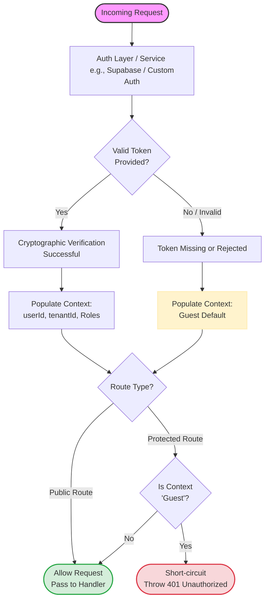

## Understanding User and Tenant Context (Guest Fallback Strategy)

A common misconception in backend architecture is that `userId` and `tenantId`
exist solely to protect individual HTTP routes via authentication middlewares.
In **Xeno Core**, the security context is designed as a foundational,
thread-safe boundary managed via `AsyncLocalStorage`.

### Why Authentication Yields a "Guest" Instead of Undefined

When a request hits your application, Xeno's auth layer attempts to resolve the
identity.

- **If credentials are valid:** The context is populated with the verified
  `userId`, `tenantId`, and assigned roles.
- **If no credentials are provided or validation fails:** The context **does not
  fail or return undefined**. Instead, it gracefully falls back to a **`Guest`**
  context.

### Token Verification and Trust Boundaries (Preventing Identity Spoofing)

A legitimate concern is whether a malicious actor could forge a fake identity
header or payload to trick the system.

In Xeno Core, **you never trust client-supplied identity claims directly**. Xeno
delegates token decoding and cryptographic signature verification entirely to a
dedicated **Auth Service** (such as
[Supabase Auth](https://www.xeno-js.it/core/security/authentication)).

- If a user sends a manipulated or invalid token, the auth service rejects it
  cryptographically.
- If no token is present, the system defaults securely to `Guest`.

Furthermore, if your stack requires a different identity provider instead of
Supabase, Xeno's architecture allows you to plug in a
[Custom Authentication Service](https://www.xeno-js.it/core/security/custom-authentication)
to implement your own validation rules and token-parsing logic.

### How Protection and Authorization Work

Because the security context is _always_ present (either as an authenticated
user or a `Guest`), your business logic, query handlers, and command pipelines
don't need to check for null references or scattered boolean flags.

The authorization flow is handled deterministically:

1. Public routes allow `Guest` contexts to pass through.
2. Protected routes evaluate the active context. As detailed in the
   [Authorization Guide](https://www.xeno-js.it/core/security/authorization), if
   a route requires an authenticated identity and detects a `Guest` state, it
   immediately short-circuits and throws a standardized **`401 Unauthorized`**.
3. For advanced permission rules beyond standard tenant checks, you can easily
   wire up
   [Custom Authorizations](https://www.xeno-js.it/core/security/custom-authorization).

This design guarantees that security is handled declaratively and
deterministically at the architectural level, preventing accidental data leaks
or unauthorized access while offering total freedom over your authentication
stack.

## Security Flow in Xeno.JS

The following flowchart illustrates the security flow in Xeno.JS:

