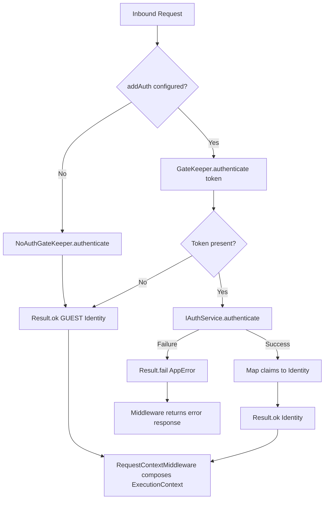

# Authentication & Identity Subsystem

## Definition

This chapter documents how Xeno resolves request identity through IGateKeeper,
IAuthService, and provider adapters such as SupabaseAuthService.

## What It Is

Definition: The Authentication and Identity subsystem is the boundary that
translates transport credentials into an Identity object used by middleware and
pipelines.

Behavior:

- MiddlewareModule registers NoAuthGateKeeper by default
- addAuth(config) registers Auth service dependencies and GateKeeper
- GateKeeper.authenticate(token) returns ResultType`<Identity/>`
- Missing token or empty claims resolve to the GUEST identity
- Valid claims are mapped to Identity through a mapper

Effect: Application flows can consume a consistent identity model without
directly depending on provider SDKs.

## How It Works

Definition: Identity resolution follows two runtime modes depending on bootstrap
configuration.

Behavior:

- Default mode (without addAuth):
  - NoAuthGateKeeper is active
  - authenticate always returns GUEST identity
- Auth-enabled mode (with addAuth):
  - AuthUtils.addAuthN registers AUTH_SERVICE and GateKeeper
  - SupabaseAuthService (or custom service) validates token
  - On provider failure: returns Result.fail(AppError authentication failed)
  - On success: claims are mapped to Identity
  - If token is missing: GateKeeper returns GUEST identity
- Middleware integration:
  - RequestContextMiddleware uses IGateKeeper output to compose
    ExecutionContext.identity

Effect: Identity is resolved once at request entry and propagated consistently
across handlers.

## Why It Exists

Definition: The subsystem is designed to isolate authentication concerns from
business logic.

Behavior: Token parsing, provider interaction, and claim mapping are centralized
in infrastructure and gatekeeper components.

Effect: Command and Query handlers remain transport-agnostic and easier to test.

## Example

Definition: The flow below summarizes the identity resolution path.

Behavior:

- Public/default mode yields GUEST via NoAuthGateKeeper
- Auth mode delegates token validation to configured Auth service
- Result is mapped into Identity and attached to request context

Effect: Every request enters the pipeline with a defined identity state.



## Subsystem Document Directory

Read this chapter in order:

### 1. [How the Gatekeeper Operates](./how-works-gate-keeper)

Definition: Detailed behavior of NoAuthGateKeeper and GateKeeper.

Behavior: Token path evaluation, guest fallback, and Result handling.

Effect: Clarifies how identity is produced for each request mode.

### 2. [Supabase Client & Auth Configuration](./supabase-configuration)

Definition: Provider setup using AuthClientConfig and SupabaseAuthService.

Behavior: Configures url, key, options, and optional customAuthService token.

Effect: Enables provider-backed authentication with the same IGateKeeper
contract.

## Configuration Reference

Definition: addAuth expects AuthClientConfig.

Behavior:

- `url`: authentication provider URL
- `key`: provider API key
- `options`: optional provider client options
- `customAuthService`: optional token for a custom IAuthService

Effect: Teams can keep gatekeeper behavior stable while changing provider
details.

## Setup Example

Definition: This bootstrap enables context, middleware, authentication, and
authorization pipeline evaluation.

Behavior:

- addMiddlewares registers RequestContextMiddleware and default gatekeeper
- addAuth overrides gatekeeper wiring with provider-backed authentication
- addPipeline enables authorization evaluation

Effect: Requests enter handlers with authenticated identity when credentials are
valid.

```typescript
import { AppBuilder } from '@xeno/core'
import type { IServiceContainer } from '@xeno/core'

export async function bootstrap(): Promise<IServiceContainer> {
  const builder = new AppBuilder()

  builder
    .addContext()
    .addMiddlewares()
    .addAuth((opts) => {
      opts.url = process.env.SUPABASE_URL ?? 'https://your-project.supabase.co'
      opts.key = process.env.SUPABASE_ANON_KEY ?? 'your-anon-key-string'
      opts.options = {
        auth: {
          persistSession: false,
          autoRefreshToken: false,
        },
      }
    })
    .addPipeline((opts) => {
      opts.authorization.isEnabled = true
    })

  return await builder.build()
}
```

## Constraints / Limitations

Definition: The current implementation has explicit identity lifecycle
constraints.

Behavior:

- Missing token resolves to GUEST identity in GateKeeper
- NoAuthGateKeeper always resolves to GUEST identity
- addAuth can be queued once in AppBuilder
- Authentication failures are returned as Result.fail and surfaced by middleware

Effect: Protected routes should rely on authorization strategies instead of
assuming a missing token automatically aborts request execution.

## Next Step

Continue with [How the Gatekeeper Operates](./how-works-gate-keeper).
