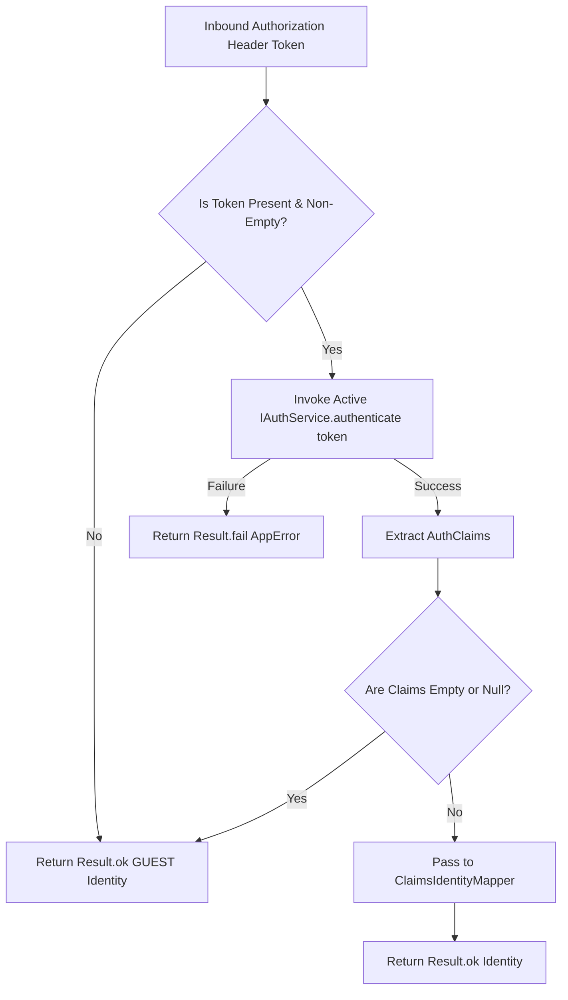

# How the Gatekeeper Operates

## Definition

IGateKeeper is the authentication boundary that resolves request identity from
an optional token and returns `ResultType<Identity>`.

## What It Is

Definition: The Gatekeeper subsystem includes two runtime implementations:
`GateKeeper` and `NoAuthGateKeeper`.

Behavior:

- `NoAuthGateKeeper.authenticate` always returns `Result.ok(GUEST)`
- `GateKeeper.authenticate` evaluates token presence, provider result, and
  claims mapping
- Both implementations return a Result container, not raw transport responses

Effect: Middleware and pipelines receive a consistent identity contract
independent of provider-specific SDK details.

## How It Works

Definition: The authentication path depends on whether provider-backed auth is
configured.

Behavior:

- Default mode (without `addAuth`):
  - `NoAuthGateKeeper` is active
  - every request resolves to GUEST identity
- Auth mode (with `addAuth`):
  - `GateKeeper` is active
  - if token is null/empty: returns GUEST identity
  - if token is present: calls `IAuthService.authenticate(token)`
  - on auth failure: returns `Result.fail(error)`
  - on success with empty claims: returns GUEST identity
  - on success with claims: maps claims to Identity and returns
    `Result.ok(identity)`

Effect: Request identity is resolved early and can be consumed consistently by
Authorization Pipeline and handlers.

## Why It Exists

Definition: The subsystem is designed to keep authentication logic out of
Command and Query handlers.

Behavior: Token validation and claims mapping occur at the edge through
IGateKeeper and IAuthService, while authorization checks remain in pipeline
strategies.

Effect: Business handlers stay transport-agnostic and test-friendly.

## Example

Definition: The sequence below reflects the current `GateKeeper.authenticate`
decision model.

Behavior:

- Guest fallback is explicit for missing token and empty claims
- Provider failures are propagated through `Result.fail`
- Valid claims are mapped to typed Identity

Effect: Consumers can branch with `isOk()` and avoid implicit control flow.



### Consumption Pattern

Definition: Handlers should read identity from request context and branch on
business rules.

Behavior: Guest-aware behavior can be implemented without direct token parsing.

Effect: Handler logic remains focused on use-case behavior.

```typescript
import type { ExecutionContext, IRequestContext } from '@xeno/core'
import { GUEST } from '@xeno/core'

export class GetProductDetailsHandler {
  constructor(
    private readonly _requestContext: IRequestContext<ExecutionContext>,
  ) {}

  public async handle(query: { basePrice: number }) {
    const ctx = this._requestContext.getContext()
    const identity = ctx?.context.identity

    if (!identity || identity.userId === GUEST.userId) {
      return { price: query.basePrice, tier: 'Public Guest' }
    }

    return { price: query.basePrice * 0.9, tier: 'Registered Member' }
  }
}
```

### Authorization Configuration Pattern

Definition: Route protection should be expressed through pipeline authorization
settings.

Behavior: Pipeline strategies evaluate identity and policy requirements.

Effect: Access control remains centralized and consistent.

```typescript
import { AppBuilder } from '@xeno/core'

export async function bootstrap() {
  const builder = new AppBuilder()

  builder
    .addContext()
    .addMiddlewares()
    .addAuth((opts) => {
      opts.url = process.env.SUPABASE_URL ?? ''
      opts.key = process.env.SUPABASE_ANON_KEY ?? ''
    })
    .addPipeline((opts) => {
      opts.authorization.isEnabled = true
      opts.authorization.policy.policyRegistry = {
        SubmitFinancialAuditCommand: {
          roles: ['ComplianceOfficer'],
          permissions: ['finance:audit'],
        },
      }
      opts.authorization.policy.role = true
      opts.authorization.policy.permission = true
    })

  return await builder.build()
}
```

## Constraints / Limitations

Definition: Gatekeeper behavior is intentionally narrow in scope.

Behavior:

- Gatekeeper resolves identity only; it does not enforce authorization policy
- Missing token does not automatically block a request
- Middleware and pipeline configuration determine final access behavior
- Detached asynchronous work may not carry request context automatically

Effect: Protected endpoints must enable authorization strategies and should not
rely on gatekeeper fallback behavior alone.

## Next Step

Continue with
[Supabase Client & Auth Configuration](./supabase-configuration.md).
