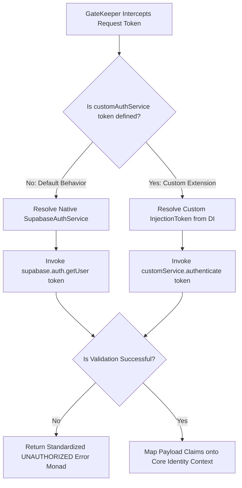

# Supabase Client & Auth Configuration

## Definition

This page explains how to configure provider-backed authentication through
`AppBuilder.addAuth`, using either the native `SupabaseAuthService` or a custom
`IAuthService` implementation.

## What It Is

Definition: The provider configuration layer maps bootstrap auth settings into
runtime dependencies used by GateKeeper.

Behavior:

- `addAuth(setup)` receives `AuthClientConfig`
- By default, auth provider wiring uses SupabaseAuthService
- A custom auth implementation can be injected through
  `AuthClientConfig.customAuthService`
- GateKeeper consumes `IAuthService` through the same contract

Effect: Authentication provider logic is replaceable without changing
middleware, handlers, or authorization strategy wiring.

## How It Works

Definition: At startup, Auth wiring chooses a provider path based on config.

Behavior:

- Native Supabase path:
  - Configure `url`, `key`, and optional `options`
  - SupabaseAuthService calls `supabase.auth.getUser(token)`
  - On failure returns `Result.fail(AppError)` with unauthorized status
  - On success maps provider user to `AuthClaims`
- Custom provider path:
  - Set `customAuthService` with an injection token
  - Container resolves that service as `IAuthService`
  - GateKeeper continues to consume only `IAuthService`

Effect: Provider choice is decided at bootstrap time while runtime identity flow
remains stable.

## Why It Exists

Definition: The layer isolates external identity SDK details from core
application logic.

Behavior: Provider-specific token validation, user retrieval, and error
normalization are kept in infrastructure services.

Effect: Application code remains provider-agnostic and easier to evolve.

## Example

Definition: The diagram below summarizes provider selection and token validation
flow.

Behavior:

- `customAuthService` toggles custom provider resolution
- Both paths end in the same `IAuthService.authenticate` contract

Effect: GateKeeper receives consistent auth outcomes regardless of provider.



## Native Supabase Setup

Definition: Use this path when Supabase is your authentication provider.

Behavior:

- Configure `opts.url` and `opts.key`
- Optionally configure `opts.options`
- Enable context and middleware so identity is propagated per request

Effect: Incoming tokens are validated through SupabaseAuthService.

```typescript
import { AppBuilder } from '@xeno/core'
import type { IServiceContainer } from '@xeno/core'

export async function bootstrap(): Promise<IServiceContainer> {
  const builder = new AppBuilder()

  builder
    .addContext()
    .addMiddlewares()
    .addPipeline((opts) => {
      opts.authorization.isEnabled = true
    })
    .addAuth((opts) => {
      opts.url =
        process.env.SUPABASE_URL ?? 'https://your-project-id.supabase.co'
      opts.key = process.env.SUPABASE_ANON_KEY ?? 'your-anon-key-string'
      opts.options = {
        auth: {
          persistSession: false,
          autoRefreshToken: false,
        },
      }
    })

  return await builder.build()
}
```

## Custom Auth Service

Definition: Use this path when you need a non-Supabase provider.

Behavior:

- Implement `IAuthService`
- Return `Result.ok(claims)` on success
- Return `Result.fail(AppError)` on validation failures
- Register service in DI and assign token to `opts.customAuthService`

Effect: GateKeeper can validate identities through custom provider logic without
contract changes.

### Custom Service Example

```typescript
import type { IAuthService, ResultType } from '@xeno/core'
import {
  AppError,
  Result,
  ERROR_CODES,
  ERROR_CODE_MESSAGES,
  STATUS_CODES,
} from '@xeno/core'

interface CustomClaims {
  sub?: string
  roles?: string[]
  permissions?: string[]
}

export class CustomAuthService implements IAuthService {
  public async authenticate(token: string): Promise<ResultType<CustomClaims>> {
    try {
      const claims = this.verifyToken(token)
      return Result.ok(claims)
    } catch (error) {
      return Result.fail(
        AppError.create({
          name: 'CustomAuthService',
          code: ERROR_CODES.AUTHENTICATION_FAILED,
          status: STATUS_CODES.UNAUTHORIZED,
          message: ERROR_CODE_MESSAGES[ERROR_CODES.AUTHENTICATION_FAILED],
          cause: error instanceof Error ? error.message : String(error),
        }),
      )
    }
  }

  public async isAuthenticated(): Promise<boolean> {
    return true
  }

  private verifyToken(token: string): CustomClaims {
    if (!token) {
      throw new Error('Missing token')
    }

    return {
      sub: 'user-123',
      roles: ['Developer'],
      permissions: ['orders:read'],
    }
  }
}
```

### Bootstrap Wiring Example

```typescript
import { AppBuilder, TokenHelper } from '@xeno/core'
import type { IAuthService, IServiceContainer } from '@xeno/core'
import { CustomAuthService } from './infrastructure/services/auth/custom-auth.service.js'

const CUSTOM_AUTH_SERVICE_TOKEN = TokenHelper.createToken<IAuthService>(
  'CUSTOM_AUTH_SERVICE',
)

export async function bootstrap(): Promise<IServiceContainer> {
  const builder = new AppBuilder()

  builder
    .addContext()
    .addMiddlewares()
    .addServices((container) => {
      container.addSingleton(CUSTOM_AUTH_SERVICE_TOKEN, CustomAuthService, [])
    })
    .addAuth((opts) => {
      opts.customAuthService = CUSTOM_AUTH_SERVICE_TOKEN
      opts.url = ''
      opts.key = ''
    })
    .addPipeline((opts) => {
      opts.authorization.isEnabled = true
    })

  return await builder.build()
}
```

## Configuration Reference

Definition: `AuthClientConfig` drives provider wiring.

Behavior:

- `url`: provider URL
- `key`: provider API key
- `options`: optional provider client options
- `customAuthService`: optional custom `IAuthService` token

Effect: Configuration remains explicit and centralized in bootstrap.

## Constraints / Limitations

Definition: The current implementation includes explicit setup constraints.

Behavior:

- `addAuth` queues once per builder instance
- Native path requires valid `url` and `key`
- Custom service must return `Result` values instead of throwing for expected
  auth failures
- Route protection still depends on authorization pipeline configuration

Effect: Reliable auth behavior requires consistent bootstrap and pipeline setup.

## Next Step

Continue with [Pipeline Behavior](../cqrs-pipeline-architecture/README).
