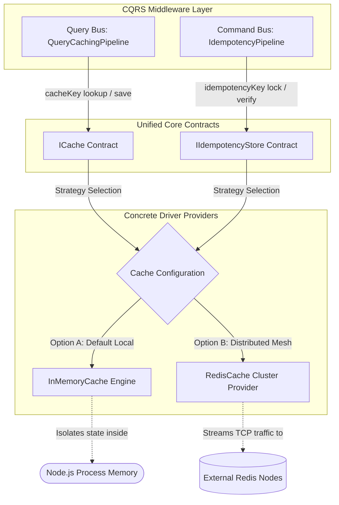

# Caching & Idempotency Store Layer

The Caching & Idempotency Store Layer documentation defines the transient data
structures, distributed state tracking engines, and key-space management
patterns implemented within the high-speed storage fabric.

---

## Direct Definition Block

The Caching & Idempotency Store Layer is the shared high-speed storage fabric of
the Xeno runtime kernel. Managed globally through the programmatic
`CacheModule`, it handles abstract data management interfaces (`ICache`,
`IIdempotencyStore`) across the messaging pipelines, enabling developers to
route read-optimization caches and command deduplication locks interchangeably
through single-process memory matrices or distributed database clusters.

---

## The Transient State Paradigm

### What it is

The transient state paradigm is a decoupled storage architecture that separates
volatile performance caching and concurrency locking from application use-case
logic and primary relational databases.

### How it works

The execution infrastructure maps transient queries and locking actions onto
unified core contracts. At application initialization, the container evaluates
configuration parameters and attaches either the local `InMemoryCache` engine or
the distributed `RedisCache` driver, enabling pipeline behaviors to execute key
lookups and register state locks agnostically.

### Why it exists

Modern enterprise distributed systems require strict protection boundaries
around both read performance optimization and state-mutating command workflows.
Frequently querying complex data structures directly from the primary relational
database introduces severe index latency and exhausts pooling capacity. On the
write side, network retries, client timing anomalies, or user retransmissions
can dispatch duplicate transaction intents, causing database record corruption
or double-allocation errors (such as debiting an account twice for a singular
transaction).

---

## Storage Layer Architectural Topology

### What it is

The Technical Architectural Topology is the integration matrix illustrating how
the unified storage contracts route data operations from the middleware layer
down to physical hardware or cloud instances.

### How it works

Transactions flow through a multi-tier decoupling loop:

1. **Pipeline Ingress**: The `QueryCachingPipeline` or `IdempotencyPipeline`
   monitors request payloads, triggering lookup or lock operations via the
   `ICache` or `IIdempotencyStore` contracts.
2. **Strategy Evaluation**: The underlying factory resolves active configuration
   parameters, determining the destination driver route.
3. **Physical Persistency**: Data writes are processed either within the local
   V8 Node.js heap allocation boundaries or streamed over encrypted TCP
   connections to an out-of-process Redis cluster.



---

## Subsystem Document Directory

Navigate through the transient storage configurations and implementation models
sequentially:

### 1. [In-Memory Cache Provider](in-memory-provider)

- **What it covers:** Leveraging the framework's native, zero-dependency
  process-memory engine, understanding default lifecycle parameters, and using
  it for local development environments.

### 2. [Distributed Redis Cache Configuration](redis-provider)

- **What it covers:** Establishing secure connections to external Redis
  deployments, handling TLS encryption parameters, and managing automatic
  connection-recovery limits.

### 3. [Idempotency Key Storage Engine](../cqrs-pipeline-architecture/cross-cutting-pipeline-behaviors/idempotency-pipeline-behavior)

- **What it covers:** How the framework utilizes transient storage to maintain
  atomic locks for command deduplication, manage lease durations, and ensure
  execution safety.

---

## Configuration Reference: `CacheConfig` Options

When initializing transient storage via the fluent `.addCache()` option block,
you manage settings through the **`CacheConfig`** interface parameters:

- **`inMemory`**: A boolean flag indicating whether the framework should
  allocate local process memory to store transient data cache states. **Defaults
  to `true**` when no configuration is passed.
- **`redis`**: An optional configuration object block used to establish
  connection pooling parameters to an external distributed Redis cluster.
- **`redis.host`**: The network host address string identifying the remote cache
  server.
- **`redis.port`**: The target port integer for the cache connection.
- **`redis.tls`**: A boolean flag indicating whether to use TLS/SSL for secure,
  encrypted connections to the cache server.
- **`redis.maxRetriesPerRequest`**: Caps the maximum number of reconnection
  attempts allowed before declaring a connection failure.

---

## Practical Setup Blueprint: Choosing Your Storage Mode

### Mode A: Zero-Dependency Local Caching (Default In-Memory Mode)

Calling `.addCache()` without parameter overrides implicitly initializes the
framework's optimized in-memory cache engine, requiring no external docker
containers or network setup:

```typescript
// src/bootstrap.ts
import { AppBuilder } from '@xeno/core'
import type { IServiceContainer } from '@xeno/core'

export async function bootstrap(): Promise<IServiceContainer> {
  const builder = new AppBuilder()

  builder
    // Instantly activates the high-speed local memory caching backend module
    .addCache()

  return await builder.build()
}
```

### Mode B: Enterprise Scalability (Distributed Redis Cluster Mode)

For horizontally scaled cloud container networks, local memory allocation must
be deactivated to route transaction tokens to an external distributed Redis
cluster:

```typescript
// src/bootstrap.ts
import { AppBuilder } from '@xeno/core'
import type { IServiceContainer } from '@xeno/core'

export async function bootstrap(): Promise<IServiceContainer> {
  const builder = new AppBuilder()

  builder
    .addContext()
    .addMiddlewares()
    .addCache((opts) => {
      // 1. Deactivate single-process in-memory isolation
      opts.inMemory = false

      // 2. Hydrate connection parameters for the external distributed data node
      opts.redis = {
        host: process.env.REDIS_HOST ?? '127.0.0.1',
        port: Number(process.env.REDIS_PORT ?? 6379),
        password: process.env.REDIS_PASSWORD,
        username: undefined, // Add ACL username credentials if required by your cloud provider
        tls: true, // Enforce safe TLS communication pathways
        maxRetriesPerRequest: 3,
      }
    })

  return await builder.build()
}
```

---

## Architectural Constraints & Trade-offs

- **Overuse of In-Memory Storage inside Distributed Clusters Prohibited**: The
  native in-memory provider allocates records strictly within the local running
  process heap boundaries. Deploying single-process memory tracking inside
  horizontally scaled, auto-balanced container clusters fragments data keys,
  resulting in random cache-miss waves and rendering idempotency locking useless
  across distinct worker instances. Production clusters must route traffic
  through external shared `redis` states.
- **Compulsory Initialization Verification for Type-Cast Options**: When
  deactivating the local cache model via `opts.inMemory = false`, setup scripts
  must provide robust parameter parsing fallbacks (`process.env.URL || 'mock'`).
  Registering undefined properties inside the physical host connection
  definitions causes connection failures or runtime method resolution faults on
  downstream paths.

---

## Next Steps

Now that the caching and idempotency storage foundations are established,
explore how to configure the zero-dependency in-memory cache provider:

- **[Proceed to In-Memory Cache Provider](in-memory-provider)**
