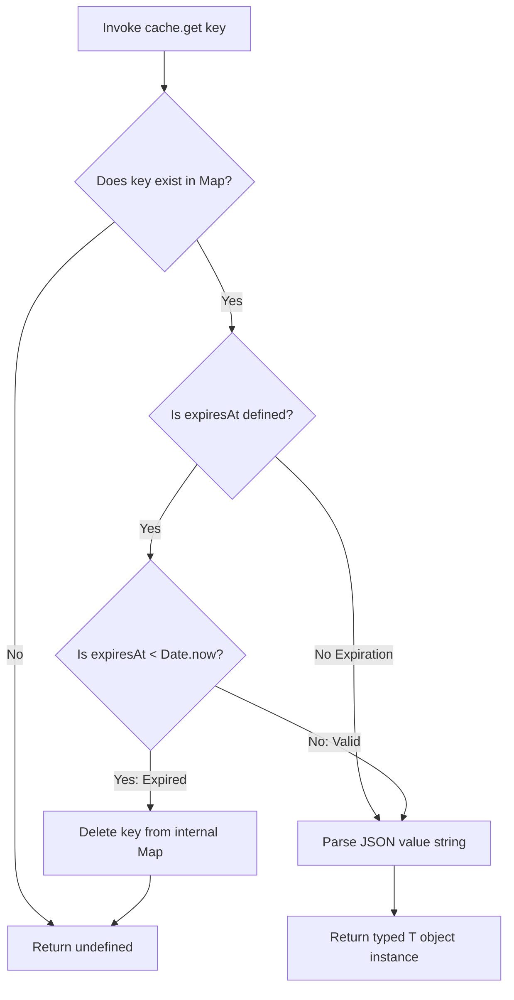

# In-Memory Cache Provider

The In-Memory Cache Provider documentation defines the single-process data
structures, time-to-live expiration logic, and thread-safe lookup mechanisms
managed by the local transient storage engine.

---

## Direct Definition Block

The `InMemoryCache` engine is the native, zero-dependency process-memory
transient storage provider for Xeno. Operating within the V8 heap allocation
boundaries of the local running process thread, it implements the core `ICache`
contract to service high-speed key lookups and manage atomic idempotency locks
during local development, integration testing, and single-instance deployments.

---

## The Local Memory Paradigm

### What it is

The local memory paradigm is an in-process caching system that isolates volatile
record storage inside the active execution boundaries of a singular Node.js
runtime thread.

### How it works

The provider bypasses network socket overhead and external transport layers,
writing data items programmatically to an encapsulated dictionary registry. When
a component triggers a read query, the engine matches the string key, evaluates
structural lease parameters, and updates memory references directly.

### Why it exists

Deploying external out-of-process distributed cache infrastructure (such as
Redis cluster nodes) complicates local development, blocks continuous
integration pipelines, and introduces latency and configuration overhead for
non-critical transient data. Providing a zero-dependency in-process storage
engine enables developers to run isolated automated tests, verify caching
policies, and handle local query optimization paths without infrastructure
prerequisites.

---

## Active Cache Operations Lifecycle

### What it is

The active cache operations lifecycle represents the validation and pruning
checkpoints executed during a `.get()` or `.has()` query to identify and destroy
stale cache records.

### How it works

The `InMemoryCache` class executes a deterministic evaluation loop upon record
ingress:

- **Presence Check**: Scans the internal data map for the requested signature.
  If missing, it returns `undefined`.
- **Lease Verification**: Inspects the presence of an `expiresAt` timestamp. If
  unassigned, the item is processed as a persistent primitive.
- **Lazy Expiration Pruning**: Compares the `expiresAt` marker with the active
  system clock (`Date.now()`). If the clock value exceeds the expiration
  timestamp, the engine executes a hard deletion command on the map, evicting
  the data and returning `undefined` to the caller.



### Why it exists

Performing lazy expiration pruning avoids running persistent background interval
timers across the application loop, protecting CPU thread scheduling cycles and
optimizing memory cleanup actions during active request spikes.

---

## Bootstrapping Activation

The `InMemoryCache` engine initializes as the default fallback component of the
transient storage tier. Invoking `.addCache()` without parameter additions
registers the provider under the global `ICache` injection token handles
automatically:

```typescript
// src/bootstrap.ts
import { AppBuilder } from '@xeno/core'
import type { IServiceContainer } from '@xeno/core'

export async function bootstrap(): Promise<IServiceContainer> {
  const builder = new AppBuilder()

  builder
    // Registers the InMemoryCache instance under the appropriate container tokens automatically
    .addCache()

  return await builder.build()
}
```

---

## Interacting with the Cache API

### 1. Storing and Retrieving Values

Data items are serialized to JSON text signatures on storage and
programmatically parsed back into structural type configurations upon retrieval
via `.set()` and `.get<T>()`:

```typescript
import type { ICache } from '@xeno/core'

export class LocalCatalogService {
  constructor(private readonly _cacheService: ICache) {}

  public async fetchCachedProduct(productId: string): Promise<ProductData> {
    const cacheKey = `catalog:product:${productId}`

    const cachedItem = await this._cacheService.get<ProductData>(cacheKey)
    if (cachedItem) {
      return cachedItem
    }

    const freshData = await this.fetchFromDatabase(productId)

    // Save back to memory cache with a 5-minute TTL (300 seconds)
    await this._cacheService.set(cacheKey, freshData, 300)

    return freshData
  }
}
```

### 2. Concurrency Safety and Atomic Locks

The `.setIfAbsent()` primitive provides a check-and-set operation, writing
values only if the target key description is currently free:

```typescript
// Safely claim an execution lease
const wasLeaseAcquired = await this._cacheService.setIfAbsent(
  'lock:process-batch-logs',
  { status: 'locked' },
  60, // Engage a 60-second lease window
)

if (!wasLeaseAcquired) {
  throw new Error(
    'Operation aborted: Parallel batch pipeline is currently processing.',
  )
}
```

### 3. Structural Eviction Matrix

The API provides explicit programmatic control hooks to inspect keys, remove
distinct fields, or clear the storage matrix:

```typescript
// A. Verify if a key is tracked and unexpired without parsing data
const isKeyActive = await this._cacheService.has('user:session:123')

// B. Explicitly eject a distinct record from the container
await this._cacheService.remove('user:session:123')

// C. Erase all entries from the internal map registry
await this._cacheService.clear()
```

---

## Architectural Constraints & Trade-offs

- **Volatile Volumetric State Loss Invariants**: Because data rows are retained
  strictly within the running process memory heap, **terminating or restarting
  the Node.js process erases the cached state**. It is prohibited to leverage
  this provider to host persistent corporate metrics, user tokens, or
  transaction states requiring long-term durability across cluster updates.
- **Risk of Heap Inflation and Out-of-Memory (OOM) Failures**: Registering
  dynamic lookups or high-volume datasets without passing an explicit
  `cacheTtlSeconds` integer value forces records to persist indefinitely. This
  accumulation degrades garbage collection execution performance and can lead to
  process crashes due to heap memory exhaustion, necessitating reasonable time
  limits.

---

## Next Steps

Now that the local in-memory provider is configured, explore how to scale your
transient storage capabilities to support highly available, horizontally
distributed environment architectures:

- **[Proceed to Distributed Redis Cache Configuration](./redis-provider.md)**
