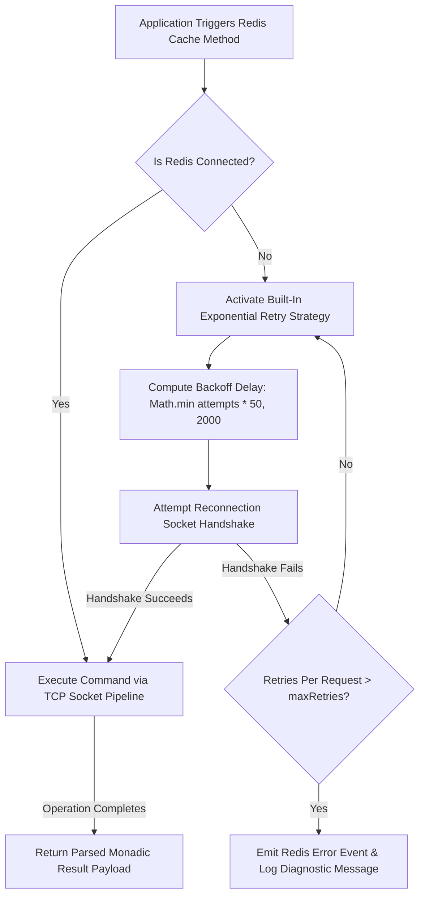

# Distributed Redis Cache Configuration

The Distributed Redis Cache Configuration documentation defines the
out-of-process data structures, connection pooling topologies, and cross-node
execution state locks managed by the distributed storage adapter.

---

## Direct Definition Block

The `RedisCache` provider is the enterprise-grade distributed transient storage
engine for Xeno, implementing the core `ICache` contract. Operating over TCP
connection boundaries via native IoRedis integrations, it handles high-frequency
data projections, multi-tenant key-space separations, and atomic idempotency
locks across horizontally scaled application container runtimes.

---

## The Distributed Storage Paradigm

### What it is

The distributed storage paradigm is an out-of-process caching infrastructure
that aggregates transient application states within an independent database
cluster rather than inside local application runtimes.

### How it works

The storage layer decouples memory lookups from the application process thread.
Pipeline behaviors trigger caching commands by streaming serialized JSON strings
across a dedicated network wireframe, querying external Redis memory partitions
to retrieve or commit state flags uniformly.

### Why it exists

Deploying single-process in-memory caching solutions across horizontally scaled
cloud topologies introduces severe key fragmentation, where concurrent container
instances lack access to adjacent thread states. This fragmentation yields
duplicate database reads and breaks command deduplication locks. Transitioning
to a centralized Redis architecture establishes an absolute data integrity
baseline, ensuring consistency across all application microservices.

---

## Technical Connection and Error Lifecycle

### What it is

The technical connection lifecycle represents the validation loops, socket
monitoring patterns, and automated exponential reconnection algorithms managed
by the `RedisCacheFactory` during transient network outages.

### How it works

The execution infrastructure encapsulates connection states through a stateful
recovery engine:

- **Connectivity Audit**: Before parsing any operation payload, the engine
  checks socket connectivity flags. If online, it streams commands directly via
  the active TCP socket pipeline.
- **Staggered Reconnection Loop**: If a network drop occurs, the engine
  initializes an automated recovery strategy. It calculates an exponential
  backoff pause duration using a deterministic delay algorithm
  (`Math.min(attempts * 50, 2000)`), delaying subsequent handshake retries.
- **Failure Interception**: If the reconnection loop counter crosses the
  `maxRetriesPerRequest` threshold, the engine blocks propagation, emits a
  definitive diagnostic error event, and transfers control to the primary
  exception pipeline.



### Why it exists

External network fabrics inside multi-node cloud meshes are inherently untrusted
and exposed to packet losses. Implementing a stateful reconnection loop ensures
that the application degrades gracefully during infrastructure failovers,
preventing socket drops from freezing active thread worker pools.

---

## Canonical Configuration and Operation Defaults

The framework applies specific default parameters inside the initialization
factories when options are left unassigned by the bootstrap configuration
scripts:

| Parameter Domain       | Configuration Object Handle       | Default Fallback Value      | Architectural Purpose                                                     |
| ---------------------- | --------------------------------- | --------------------------- | ------------------------------------------------------------------------- |
| **Network Host**       | `opts.redis.host`                 | **`'localhost'`**           | Target host address for standalone or local development environments.     |
| **Network Port**       | `opts.redis.port`                 | **`6379`**                  | Standard network port allocation for Redis TCP socket communications.     |
| **Max Retry Limit**    | `opts.redis.maxRetriesPerRequest` | **`3`**                     | Caps consecutive query attempts during transient infrastructure dropouts. |
| **Secure TLS**         | `opts.redis.tls`                  | **`false`**                 | Toggles SSL wireframe encryption for private cloud network clusters.      |
| **Standard Write TTL** | Passed inside `.set()`            | **`86400` seconds** (1 Day) | Fallback expiration threshold applied to standard cache storage records.  |
| **Absent Locking TTL** | Passed inside `.setIfAbsent()`    | **`300` seconds** (5 Mins)  | Baseline lease ceiling applied to safeguard atomic command locks.         |

---

## Bootstrapping Activation Blueprint

### Definition

Bootstrapping Activation represents the configuration phase where single-process
memory mapping is deactivated to wire the remote cluster credentials into the
container registry.

### Behavior

The setup logic acts through a programmatic fluent layout inside
`src/bootstrap.ts`, binding connection properties and encryption keys to the
`CacheModule` context maps.

```typescript
// src/bootstrap.ts
import { AppBuilder } from '@xeno/core'
import type { IServiceContainer } from '@xeno/core'

export async function bootstrap(): Promise<IServiceContainer> {
  const builder = new AppBuilder()

  builder
    .addContext()
    .addMiddlewares()
    .addCache((opts) => {
      // 1. Deactivate single-process local in-memory execution
      opts.inMemory = false

      // 2. Provision network credentials for the out-of-process cluster
      opts.redis = {
        host: process.env.REDIS_HOST ?? 'redis-cluster.internal',
        port: Number(process.env.REDIS_PORT ?? 6379),
        password: process.env.REDIS_PASSWORD,
        username: process.env.REDIS_USER,
        tls: true, // Enforce secure TLS/SSL data transmission wireframes
        maxRetriesPerRequest: 5, // Allow up to 5 attempts during heavy cloud failovers
      }
    })

  return await builder.build()
}
```

#### Effect

This forces all downstream pipeline behaviors, idempotency validators, and
lookup queries to route their transient data payloads through the external cache
cluster uniformly.

---

## Interacting with the Redis Cache API

### 1. Data Write and Retrieval Lifecycles

#### Definition

Data Write and Retrieval Lifecycles cover the serialization, transmission, and
structural parsing of application payload records across external cache
boundaries.

#### Behavior

Objects pass through a dual transformation loop: inputs are compressed into
serialized JSON string keys upon storage, and returned values are
programmatically parsed back into structural type contracts on a cache hit.

```typescript
import type { ICache } from '@xeno/core'

export class WeatherDataGateway {
  constructor(private readonly _cache: ICache) {}

  public async getRegionMetrics(zipCode: string): Promise<MetricsDto> {
    const cacheKey = `geo:metrics:${zipCode.trim()}`

    // Query remote Redis cluster via standard string lookup
    const cachedData = await this._cache.get<MetricsDto>(cacheKey)
    if (cachedData) return cachedData

    const freshMetrics = await this._fetchSensorNetwork(zipCode)

    // Write to Redis applying a specific 1-hour TTL window (3600 seconds)
    await this._cache.set(cacheKey, freshMetrics, 3600)

    return freshMetrics
  }
}
```

#### Effect

This separates use-case data architectures from raw database rows, enabling
complex nested objects to store safely within standard Redis string keys.

### 2. Distributed Key Leasing via `setIfAbsent`

#### Definition

Distributed Key Leasing is a state-locking primitive designed to block parallel
concurrent threads from executing identical transaction targets.

#### Behavior

The `.setIfAbsent()` routine communicates with Redis using atomic `NX` parameter
flags, writing parameters and returning a confirmation boolean value only if the
exact string key definition is currently vacant inside the target database
bucket.

```typescript
// Atomic check-and-set lease invocation
const isLockClaimed = await this._cache.setIfAbsent(
  'lock:process-payroll-batch',
  { runnerId: 'worker-node-04' },
  60, // Applies a default safety ceiling lease of 60 seconds
)

if (!isLockClaimed) {
  throw new Error(
    'Transaction Rejected: A parallel server node is already computing this payroll batch.',
  )
}
```

#### Effect

This ensures strict command deduplication boundaries across multi-instance cloud
container runtimes, protecting downstream persistence engines from race
conditions.

---

## Architectural Constraints & Trade-offs

- **Global Key Erasure Risk via Destructive Clear Operations**: Calling the
  `.clear()` method on the Redis adapter executes a native `flushdb`
  instruction. This command erases **every single data key located within the
  active database index**, bypassing application namespace segmentations or key
  prefixes. Sharing a singular database index among separate microservices risks
  comprehensive state erasure during programmatic flushing cycles, necessitating
  isolated index assignments.
- **Connection Latency Overhead vs. In-Process Map Operations**: Moving from
  single-process maps to out-of-process Redis adapters introduces network
  serialization costs and TCP transit latency. For low-overhead microservices
  that deploy strictly on a single standalone host node, this network penalty
  can be avoided by retaining the default in-memory configuration layout.

---

## Next Steps

Now that your out-of-process distributed caching topology and fault-tolerant
Redis infrastructure are fully established, learn how the framework leverages
this layer to secure write-side processing:

- **[Proceed to Idempotency Key Storage Engine](../cqrs-pipeline-architecture/cross-cutting-pipeline-behaviors/idempotency-pipeline-behavior)**

Alternatively, learn how to configure loggers in Xeno:

- **[Proceed to Configure Loggers](../telemetry-logging/README)**
