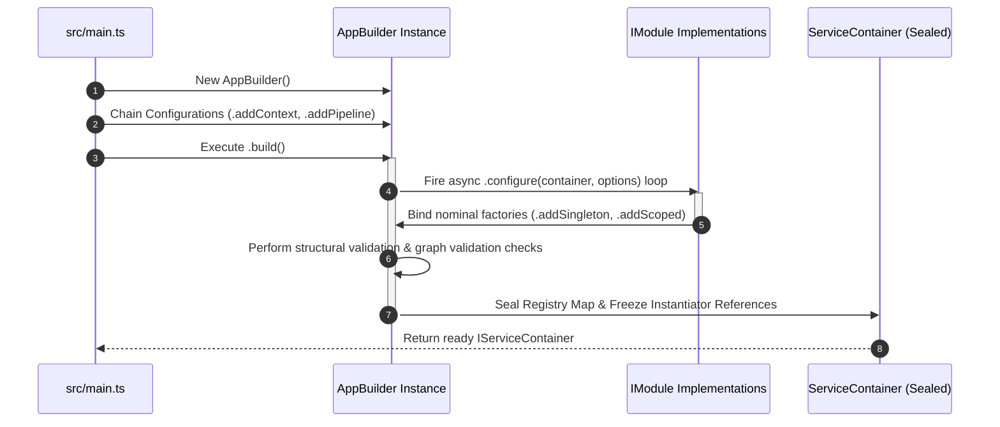

# Core Architecture & Lifecycle

The Core Architecture & Lifecycle chapter documents the foundational
programmatic primitives that govern the instantiation, compilation, tracking,
and teardown of an unhydrated framework environment.

---

## Direct Definition Block

Core Architecture & Lifecycle defines the initialization sequence and resource
management patterns that transform declarative service definitions into a
sealed, compiled dependency graph. By entirely omitting runtime decorator
metadata analysis and reflection scanning, the internal bootstrap engine
executes linearly to minimize startup computation overhead.

---

## Technical Architecture Breakdown

### 1. Host Layout and Programmatic Compilation

#### Definition

Host Layout and Programmatic Compilation represents the isolation layer
separating explicit boot scripts from the live runtime environments executing
the application process.

#### Behavior

The execution layout distributes system setup across two independent stages: the
configuration setup script (`src/bootstrap.ts`) manages the fluid orchestration
parameters, while the startup module (`src/main.ts`) calls the compilation graph
and hooks the resulting sealed container into transport listeners.

#### Effect

This separation prevents configuration leakage and enables the same application
layout to deploy interchangeably across long-running virtual machines,
serverless workers, or detached command-line tools without modifying the core
entry code.

### 2. Inversion-of-Control Graph Validation

#### Definition

Inversion-of-Control Graph Validation is a verification process that evaluates
service container descriptions during host initialization prior to operational
processing.

#### Behavior

The `AppBuilder` parsing engine evaluates the registered dependency graph
against nominal branding constraints. It traces factory functions, maps
lifecycle assignments, and seals the internal service registry dictionary.

#### Effect

This intercepts missing dependency faults, configuration errors, and type
mismatches during the build phase, completely preventing runtime service
resolution crashes.

### 3. Isolated Request Sandboxing

#### Definition

Isolated Request Sandboxing is a memory allocation strategy that encapsulates
request variables within strict, independent execution boundaries.

#### Behavior

The framework uses native Node.js `AsyncLocalStorage` cells to pass context
metadata, tenancy markers, and telemetry tokens down the execution track without
modifying component constructors. When a request ends, the container captures
the scope handler and executes an automated `.dispose()` sequence across all
internal objects implementing cleanup hooks.

#### Effect

This eliminates variable state pollution across concurrent operation tracks and
handles garbage collection deterministically, preventing memory reference leaks
in production runtimes.

---

## Container Compilation Lifecycle Trace

The sequence diagram below traces the sequential transition from an unhydrated
programmatic configuration state to a sealed, thread-safe service container
ready to process application operations:

Every step in this lifecycle runs sequentially. If the verification block
encounters a broken factory blueprint or an invalid token descriptor,
compilation aborts instantly and logs a structured startup error to the active
diagnostic client.

---

## Architectural Constraints & Trade-offs

- **Absence of Directory Crawling and Automated Bindings**: Since Xeno
  completely rejects automated file indexing and reflection meta-programming,
  every class component, command handler, and infrastructure service descriptor
  must be explicitly registered within the builder modules manually. This layout
  delivers absolute runtime clarity but requires detailed initialization files.
- **Rigid Monolithic Dependency Manifest Enforcements**: Activating specific
  built-in module presets within the programmatic configuration engine requires
  that the root manifest file explicitly provides the relevant peer dependency
  assets. Activating an integration without providing the underlying peer
  package results in an immediate boot compilation failure.

---

## Next Steps

To continue setting up and optimizing the application container layout, proceed
to the following architectural sections:

- **[Application Hosting & Fluent Bootstrap Engine](./application-hosting-bootstrap-engine)**:
  Explore the detailed mechanics of the fluid initialization builder.
- **[The IoC Container & Service Lifetimes](./ioc-container-service-lifetimes)**:
  Review allocation tracking across Singleton, Scoped, and Transient paths.
- **[Module Composition Pattern](./module-composition-pattern)**: Encapsulate
  features and application blocks using clean domain integration rules.
