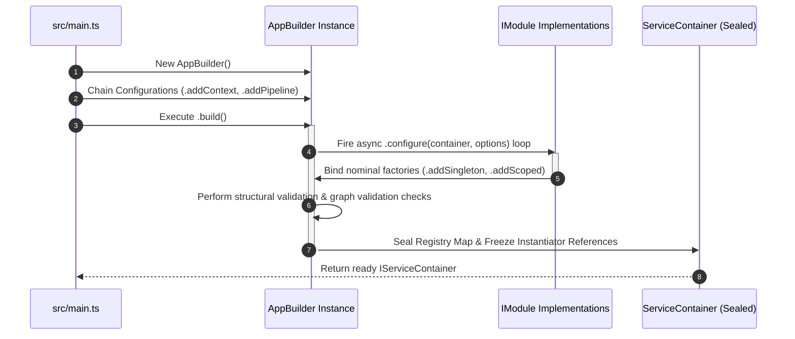

# Core Architecture & Lifecycle

This chapter encapsulates the deep programmatic primitives that govern the
instantiation, compilation, tracking, and teardown of a Gantry5 framework
environment.

By entirely eliminating reflection, runtime decorator overhead, and ambient
magic metadata parsing, the core engine achieves near-instantaneous startup
sequences, optimized specifically for high-efficiency distributed environments
and serverless runtimes.

---

## Chapter Summary

The _Core Architecture & Lifecycle_ layer acts as the foundational engine room
of Gantry5. It isolates how an unhydrated host translates declarative
configurations, manages graph dependency validation safely through nominal type
tokens, handles scoped memory isolation blocks, and exposes macro structural
plugins. Understanding these core components is essential before implementing
use cases or writing custom domain application handlers.

---

## Document Directory

Navigate through the foundational runtime structural paths sequentially:

### 1. [Application Hosting & Fluent Bootstrap Engine](./application-hosting-bootstrap-engine.md)

- **What it covers:** An anatomical deep dive into the fluent `AppBuilder`
  orchestrator model, the separate roles of the `bootstrap.ts` configuration
  script and `main.ts` process runtime, and the multi-step lazy-loading workflow
  executed during container compilation.
- **Target Audience:** Systems engineers designing multi-environment setups,
  orchestrating configuration overrides, or integrating custom cloud
  infrastructure wrappers.

### 2. [The IoC Container & Service Lifetimes](./ioc-container-service-lifetimes.md)

- **What it covers:** An explicit technical manual on how Gantry5 allocates
  instance tracking behaviors across its three native lifecycles: `Singleton`,
  `Scoped`, and `Transient`. It includes complete implementation analysis of
  `IServiceScopeFactory`, thread scope creation during active requests, and safe
  garbage collection mechanics via explicit resource cleanup lookups
  (`.dispose()`).
- **Target Audience:** Application architects managing thread-safe memory
  allocations, state persistence boundaries, or debugging active cross-cutting
  connection leaks.

### 3. [Module Composition Pattern](./module-composition-pattern.md)

- **What it covers:** Best-practice architectural blueprints for encapsulating
  features and domain blocks using the clean `IModule` implementation interface.
  This section reveals how core systems (such as `CqrsModule`, `DbModule`, and
  `HttpCoreModule`) use their `.configure()` loops to hook into the
  `IServiceContainer` safely without exposing private inner classes.
- **Target Audience:** Domain engineers needing to isolate corporate feature
  boundaries, scale large-scale workspaces into decoupled modules, or write
  pluggable architectural add-ons.

---

## The Container Compilation Lifecycle Trace

The following workflow charts the logical transformation from raw, unhydrated
builder options to a sealed, thread-safe, and production-ready service
container:

---

## Core Best Practices at a Glance

:::info Always structure large-scale micro-features into self-contained
`IModule` classes. Never allow distinct domain use cases to inject dependencies
globally outside of their designated module configuration block. :::

:::tip TIP: Lifetimes Matter

- Always map long-lived, stateless shared wrappers (like an HTTP engine client
  or database pool abstraction) as **Singletons**.

- Always keep web request parameters, user authentication claims, and tracking
  contexts strictly isolated within **Scoped** lifecycles. :::

---

## Next Step

Begin by reviewing the composition layout of the primary application bootstrap
orchestrator:

- 👉
  **[Proceed to Application Hosting & Fluent Bootstrap Engine](./application-hosting-bootstrap-engine.md)**
