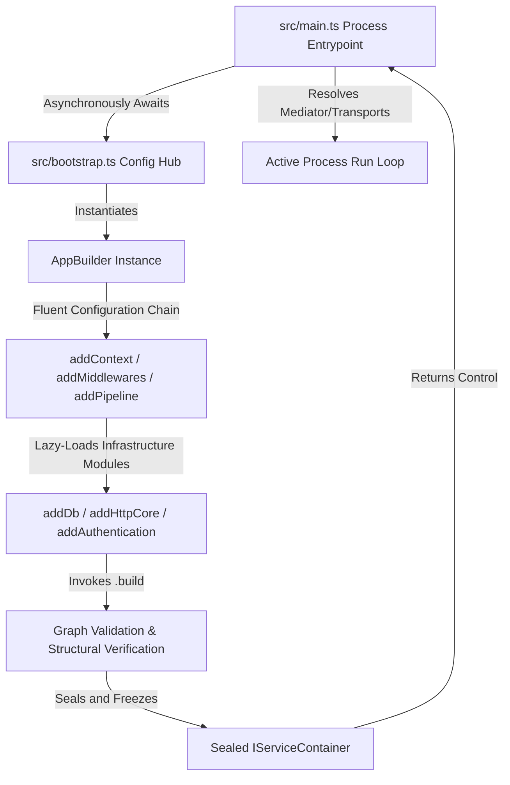

# Application Hosting & Bootstrap Engine

## What is it?

The **`AppBuilder`** engine is the central runtime host composition orchestrator
for Gantry5 applications. Inspired by streamlined modern software orchestration
models (such as the .NET `WebApplicationBuilder`), it exposes a type-safe,
fluent API to register infrastructure dependencies, encapsulate technology
modules, configure cross-cutting CQRS pipelines, and compile the root Inversion
of Control (IoC) dependency container.

## Why does it exist?

Traditional Node.js and TypeScript backend frameworks rely heavily on runtime
metadata reflection (via `reflect-metadata`) or implicit directory scanning to
discover, instantiate, and wire services. While this provides a highly automated
appearance, it compromises enterprise software on multiple fronts:

- **Cold-Start Performance Tax:** Reflection scans require scanning the entire
  dependency tree at boot time, causing substantial latency spikes that degrade
  efficiency in serverless or edge computing runtimes.

- **Opaque Debugging:** Reflection creates an invisible runtime initialization
  layer, making stack traces difficult to follow and making it harder to track
  down circular references or misconfigured bindings.

- **Implicit Framework Lock-In:** Core business code becomes deeply coupled to
  proprietary decorators, making it difficult to extract use cases into pure,
  agnostics units.

`AppBuilder` removes this hidden complexity. By utilizing an explicit,
code-first configuration approach, Gantry5 eliminates reflection overhead
entirely. This ensures that application startup is lightning fast, fully
traceable, and optimized for serverless architecture.

---

## Initialization Workflow Architecture

The initialization sequence separates configuration mechanics from active
process run loops, split cleanly across two main operational phases:



---

## Technical Assembly Blueprint

### 1. The Configuration Hub (`src/bootstrap.ts`)

The `bootstrap.ts` module acts as the isolated configuration assembly layer for
the application. Its exclusive architectural purpose is to instantiate
`AppBuilder`, coordinate options, map pipeline rules, and return a compiled
container instance.

> ### ⚠️ Operational Constraint
>
> This file must never run production business operations, query live databases,
> or bind network server transport listeners. Keep registration loops strictly
> separated from runtime side effects.

```typescript
import { AppBuilder, LOG_LEVEL } from '@gantry5/core'

/**
 * @description Coordinates infrastructure configurations and builds the
 * root Inversion of Control (IoC) service graph.
 * @returns {Promise<IServiceContainer>} A sealed, fully compiled container client.
 */
export async function bootstrap() {
  const builder = new AppBuilder()

  builder
    // 1. Register thread context boundary primitives
    .addContext()

    // 2. Wire core request metadata infrastructure middlewares
    .addMiddlewares()

    // 3. Configure global cross-cutting CQRS execution pipelines
    .addPipeline((config) => {
      config.performance.thresholdMs = 500 // Logs slow operations exceeding 500ms
      config.authorization.tenant = true // Enforces multi-tenant data boundaries
      config.commandBus.idempotency = { lockTtlSeconds: 60 }
      config.commandBus.concurrency = { maxRetries: 3 }
      config.queryBus.isEnabled = true
    })

    // 4. Mount the database engine wrapper (Drizzle ORM)
    .addDb((config) => {
      config.connectionString = process.env.DATABASE_URL!
      config.tables = {} // Populate with PgTable schema maps
    })

    // 5. Secure HTTP Client channels with integrated resilience policies
    .addHttpCore((config) => {
      config.http.client.baseURL = process.env.HTTP_BASE_URL!
      config.http.client.timeoutMs = 5000
      config.resilience.retry.attempts = 3
    })

  // Finalize graph compilation and seal the container
  return await builder.build()
}
```

### 2. The Runtime Entrypoint (`src/main.ts`)

The `main.ts` module represents the concrete physical execution entry point of
the Node.js process. It imports the asynchronous setup engine from
`bootstrap.ts`, triggers graph compilation, resolves necessary transport
abstractions, and opens the system run loop.

```typescript
import { bootstrap } from './bootstrap.js'
import { INJECTION_TOKENS } from '@gantry5/core'

/**
 * @description Orchestrates the runtime launch sequence of the system host.
 */
async function main() {
  try {
    console.info('⏳ Initializing Gantry5 application kernel...')

    // 1. Asynchronously compile the framework infrastructure and dependency graphs
    const container = await bootstrap()

    console.info('✅ Inversion of Control (IoC) container hydration complete!')

    // 2. Resolve the compiled Mediator to process CQRS requests
    const mediator = container.resolve(INJECTION_TOKENS.MEDIATOR)
    console.log('  CQRS Mediator bus sealed and online.')

    // 3. Bind transport engines (e.g., Express, Fastify, Hono, or event loops)
    // const server = container.resolve(CUSTOM_HTTP_SERVER_TOKEN);
    // await server.start();
  } catch (error) {
    console.error(
      '  Critical system fault captured during runtime startup:',
      error,
    )
    process.exit(1)
  }
}

main()
```

---

## Internal Runtime Mechanics

When `.build()` is executed on the `AppBuilder`, the framework performs a
deterministic compilation sequence:

1. **Dependency Resolution:** The builder locks down foundational modules first
   (`ContextModule`, `MiddlewareModule`), providing the backbone for execution
   context tracking.

2. **Pipeline Composition:** It evaluates your configuration options to assemble
   the command and query pipeline chains. If performance monitoring or
   validation is enabled, the matching behaviors (`PerformancePipeline`,
   `ValidationPipeline`) are dynamically woven into a unified
   `CompositePipeline`.

3. **Lazy-Loaded Module Mounting:** Gantry5 leverages an intelligent **Optional
   Peer Dependencies** architecture. If a plugin block (such as `.addDb()`) is
   omitted, its underlying third-party codebase (e.g., `drizzle-orm`) is
   completely skipped during import loading, keeping memory usage clean and
   minimal.

---

## Architectural Trade-offs & Common Mistakes

### ❌ Relying on Automatic File Discovery

Gantry5 values absolute transparency and explicit design choices. It completely
avoids sweeping file paths or automatically parsing directory maps. If you
create a new Command Handler, Query Handler, or infrastructure adapter service,
it will **never be resolved implicitly** by the framework. Every component must
be explicitly mapped to its nominal symbol token inside your bootstrap sequence.

### ❌ Misconfiguring Peer Dependencies

Because the framework relies on a modular peer-dependency model, registering a
plugin via `AppBuilder` (such as `.addLogger()` with Pino configuration) without
installing the required underlying package (`pino`) will cause a runtime
dependency exception during host initialization.

---

## Next Mechanics

With your application host setup constructed and verified, dive into the
underlying container mechanics:

- **[Type-Safe Dependency Injection](https://www.google.com/search?q=../core-runtime-mechanics/type-safe-dependency-injection.md)**:
  Understand nominal branding via `TokenHelper` and phantom type safety.

- **[Execution Context Lifecycle](https://www.google.com/search?q=..%2Fcore-runtime-mechanics%2Fexecution-context-lifecycle.md)**:
  Explore asynchronous execution thread tracking and multi-tenant key isolation.
