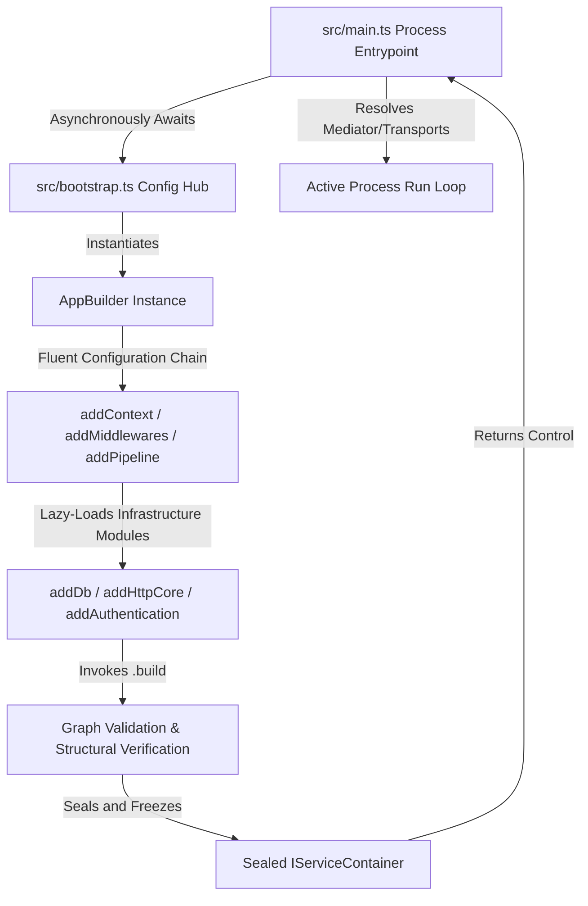

# Application Hosting & Bootstrap Engine

## What is it?

The **`AppBuilder`** engine is the central runtime host composition orchestrator
for XenoJS applications. Inspired by streamlined modern software orchestration
models (such as the .NET `WebApplicationBuilder`), it exposes a type-safe,
fluent API to register infrastructure dependencies, encapsulate technology
modules, configure cross-cutting CQRS pipelines, and compile the root Inversion
of Control (IoC) dependency container.

```typescript
import type { IModule, IServiceContainer } from '@/domain'
import type { InjectionToken, SetupAction } from '@/shared'
import { Guards, LOG_LEVEL } from '@/shared'

import { ServiceContainer } from '../container/service-container'
import type {
  AuthClientConfig,
  CacheConfig,
  DbConfig,
  HttpConfig,
  HttpCoreConfig,
  LoggerConfig,
  PipelineConfig,
  ResilienceConfig,
} from '../modules/config'

/**
 * @description The AppBuilder class provides a fluent, .NET-style API for configuring and bootstrapping the application. It orchestrates the registration of various modules (CQRS, HTTP, Database, Logging, Auth) into the ServiceContainer.

   * 
   * @author XenoJS
   * @version 1.0.0
   * @since 2025-09-30
   * @link https://github.com/Mattia-Carcione/XenoJS 
   */
interface QueuedModule {
  name: string
  action: () => Promise<void>
}

/**
 * @description The AppBuilder class provides a fluent, .NET-style API for configuring and bootstrapping the application.
 * It orchestrates the registration of various modules (CQRS, HTTP, Database, Logging, Auth) into the ServiceContainer.

   * 
   * @author XenoJS
   * @version 1.0.0
   * @since 2025-09-30
   * @link https://github.com/Mattia-Carcione/XenoJS 
   */
export class AppBuilder {
  private readonly _container: IServiceContainer = new ServiceContainer()

  // --- Module Configurations ---
  private readonly _modules: QueuedModule[] = []

  // --- Specific Configurations ---
  private _pipelineConfig: PipelineConfig = {
    performance: { thresholdMs: 500 },
    authorization: {
      tenant: false,
      policy: { role: false, permission: false, policyRegistry: undefined },
      customAuthorizationStrategy: undefined,
    },
    validation: {
      zod: undefined,
      customValidationStrategy: undefined,
    },
    commandBus: {
      idempotency: undefined,
      concurrency: undefined,
    },
    queryBus: { isEnabled: false },
  }

  // --- Module Queuing Flags ---
  private _isContextModuleQueued = false
  private _isMiddlewareModuleQueued = false
  private _isPipelineModuleQueued = false
  private _isLoggerModuleQueued = false
  private _isAuthModuleQueued = false
  private _isDbContextModuleQueued = false
  private _isConcurrencyServiceQueued = false
  private _isResilienceModuleQueued = false

  // ─────────────────────────────────────────────────────────────────────────────
  // Application Modules Configuration
  // ─────────────────────────────────────────────────────────────────────────────

  /**
   * @description Enables the use of middlewares in the application. Middlewares can be used for cross-cutting concerns such as logging, authentication, and request/response manipulation.
   * @returns The current instance of AppBuilder for method chaining.
  
   * 
   * @author XenoJS
   * @version 1.0.0
   * @since 2025-09-30
   * @link https://github.com/Mattia-Carcione/XenoJS 
   */
  public addMiddlewares(): this {
    this._queueMiddlewareModule()
    return this
  }

  /**
   * @description Enables the use of context in the application. Context can be used to store and manage request-specific data, such as user information, correlation IDs, and other metadata that needs to be accessible throughout the request lifecycle.
   * @returns The current instance of AppBuilder for method chaining.
  
   * 
   * @author XenoJS
   * @version 1.0.0
   * @since 2025-09-30
   * @link https://github.com/Mattia-Carcione/XenoJS 
   */
  public addContext(): this {
    this._queueContextModule()
    return this
  }

  /**
   * @description Configures the logger for the application. This method allows you to set up logging options such as log level, console logging, and integration with external logging services like Sentry or Pino.
   * @param setupAction A callback function that receives a LoggerConfig object to configure the logger settings.
   * @returns The current instance of AppBuilder for method chaining.
  
   * 
   * @author XenoJS
   * @version 1.0.0
   * @since 2025-09-30
   * @link https://github.com/Mattia-Carcione/XenoJS 
   */
  public addLogger(setupAction: SetupAction<LoggerConfig>): this {
    if (this._isLoggerModuleQueued) return this
    this._isLoggerModuleQueued = true
    const config = {
      level: LOG_LEVEL.DEBUG,
      console: true,
      sentry: { config: undefined },
      pino: { config: undefined },
      customLoggers: undefined,
    }
    setupAction(config)
    this._modules.push({
      name: 'LoggerModule',
      action: async () => {
        const { LoggerUtils } = await import('../modules/utils/logger.utils')
        await LoggerUtils.addLogger(this._container, config)
      },
    })
    return this
  }

  /**
   * @description Configures the caching settings for the application. This method allows you to set up caching options such as Redis configuration or in-memory caching.
   * @param setupAction A callback function that receives a CacheConfig object to configure the caching settings.
   * @returns The current instance of AppBuilder for method chaining.
  
   * 
   * @author XenoJS
   * @version 1.0.0
   * @since 2025-09-30
   * @link https://github.com/Mattia-Carcione/XenoJS 
   */
  public addCache(setupAction: SetupAction<CacheConfig>): this {
    const config = { inMemory: true, redis: undefined }
    setupAction(config)
    this._modules.push({
      name: 'CacheModule',
      action: async () => {
        const { CacheUtils } = await import('../modules/utils/cache.utils')
        await CacheUtils.addCache(this._container, config)
      },
    })
    return this
  }

  /**
   * @description Configures the authentication client for the application. This method allows you to set up authentication options such as the authentication server URL, API key, and additional options.
   * @param setupAction A callback function that receives an AuthClientConfig object to configure the authentication client settings.
   * @returns The current instance of AppBuilder for method chaining.
  
   * 
   * @author XenoJS
   * @version 1.0.0
   * @since 2025-09-30
   * @link https://github.com/Mattia-Carcione/XenoJS 
   */
  public addAuth(setupAction: SetupAction<AuthClientConfig>): this {
    if (this._isAuthModuleQueued) return this
    this._isAuthModuleQueued = true
    const config = { url: '', key: '', options: undefined }
    setupAction(config)
    this._modules.push({
      name: 'AuthModule',
      action: async () => {
        const { AuthUtils } = await import('../modules/utils/auth.utils')
        await AuthUtils.addAuthN(this._container, config)
      },
    })
    return this
  }

  /**
   * @description Configures the database settings for the application. This method allows you to set up database options such as enabling/disabling the database, connection string, and table definitions.
   * @param setupAction A callback function that receives a DbConfig object to configure the database settings.
   * @returns The current instance of AppBuilder for method chaining.
  
   * 
   * @author XenoJS
   * @version 1.0.0
   * @since 2025-09-30
   * @link https://github.com/Mattia-Carcione/XenoJS 
   */
  public addDb(setupAction: SetupAction<DbConfig>): this {
    if (this._isDbContextModuleQueued) return this
    this._isDbContextModuleQueued = true
    const config = { connectionString: '', tables: {} }
    setupAction(config)
    this._modules.push({
      name: 'DbModule',
      action: async () => {
        const { DbModule } = await import('../modules/db.module')
        const dbModule = new DbModule()
        await dbModule.configure(this._container, config)
      },
    })
    return this
  }

  /**
   * @description Enables the use of the service for concurrency control in the application. This method allows you to limit the number of concurrent asynchronous tasks being executed, which is useful for managing system resources and preventing event loop blocking during massive batch operations.
   * @returns The current instance of AppBuilder for method chaining.
  
   * 
   * @author XenoJS
   * @version 1.0.0
   * @since 2025-09-30
   * @link https://github.com/Mattia-Carcione/XenoJS 
   */
  public addConcurrencyService(): this {
    if (this._isConcurrencyServiceQueued) return this
    this._isConcurrencyServiceQueued = true
    this._modules.push({
      name: 'ConcurrencyServiceModule',
      action: async () => {
        const { PLimitConcurrencyService } =
          await import('../services/concurrency')
        const { INJECTION_TOKENS } =
          await import('../di/injection-tokens.constants')
        this._container.addSingleton(
          INJECTION_TOKENS.CONCURRENCY_SERVICE,
          PLimitConcurrencyService,
          [],
        )
      },
    })
    return this
  }

  // ─────────────────────────────────────────────────────────────────────────────
  // CQRS Pipeline Configuration
  // ─────────────────────────────────────────────────────────────────────────────

  /**
   * @description Configures the CQRS pipeline settings for the application. This method allows you to set up various aspects of the CQRS pipeline, including performance monitoring, authorization, validation, command bus settings, and query bus settings.
   * @param setupAction A callback function that receives a PipelineConfig object to configure the CQRS pipeline settings.
   * @returns The current instance of AppBuilder for method chaining.
  
   * 
   * @author XenoJS
   * @version 1.0.0
   * @since 2025-09-30
   * @link https://github.com/Mattia-Carcione/XenoJS 
   */
  public addPipeline(setupAction: SetupAction<PipelineConfig>): this {
    setupAction(this._pipelineConfig)
    this._queuePipelineModule()
    return this
  }

  // ─────────────────────────────────────────────────────────────────────────────
  // HTTP & Resilience Configuration
  // ─────────────────────────────────────────────────────────────────────────────

  /**
   * @description Configures the HTTP settings for the application. This method allows you to set up HTTP options such as authentication token, headers, and other HTTP client configurations.
   * @param setupAction A callback function that receives an HttpConfig object to configure the HTTP settings.
   * @returns The current instance of AppBuilder for method chaining.
  
   * 
   * @author XenoJS
   * @version 1.0.0
   * @since 2025-09-30
   * @link https://github.com/Mattia-Carcione/XenoJS 
   */
  public addHttp(setupAction: SetupAction<HttpConfig>): this {
    const config = { token: undefined, client: {} } as unknown as HttpConfig
    setupAction(config)
    this._modules.push({
      name: 'HttpModule',
      action: async () => {
        const { HttpUtils } = await import('../modules/utils/http.utils')
        await HttpUtils.addAxios(this._container, config)
      },
    })
    return this
  }

  /**
   * @description Configures the resilience settings for the application. This method allows you to set up resilience options such as retry policies, circuit breakers, and bulkhead isolation.
   * @param setupAction A callback function that receives a ResilienceConfig object to configure the resilience settings.
   * @returns The current instance of AppBuilder for method chaining.
  
   * 
   * @author XenoJS
   * @version 1.0.0
   * @since 2025-09-30
   * @link https://github.com/Mattia-Carcione/XenoJS 
   */
  public addResilience(setupAction: SetupAction<ResilienceConfig>): this {
    if (this._isResilienceModuleQueued) return this
    this._isResilienceModuleQueued = true
    const resilienceConfig = {
      retry: {
        attempts: undefined,
        baseDelayMs: undefined,
        maxDelayMs: undefined,
      },
      circuitBreaker: {
        consecutiveFailures: undefined,
        halfOpenTimeoutMs: undefined,
      },
      bulkhead: {
        maxConcurrent: undefined,
      },
    }
    setupAction(resilienceConfig)
    this._modules.push({
      name: 'ResilienceModule',
      action: async () => {
        const { HttpUtils } = await import('../modules/utils/http.utils')
        await HttpUtils.addResilience(this._container, resilienceConfig)
      },
    })
    return this
  }

  /**
   * @description Configures the HTTP core settings for the application. This method allows you to set up HTTP core options such as data source token, HTTP client configuration, and resilience settings.
   * @param setupAction A callback function that receives an HttpCoreConfig object to configure the HTTP core settings.
   * @returns The current instance of AppBuilder for method chaining.
  
   * 
   * @author XenoJS
   * @version 1.0.0
   * @since 2025-09-30
   * @link https://github.com/Mattia-Carcione/XenoJS 
   */
  public addHttpCore(setupAction: SetupAction<HttpCoreConfig>): this {
    const config = {
      dataSourceToken: undefined as unknown,
      http: { token: undefined as unknown, client: {} },
      resilience: { retry: {}, circuitBreaker: {}, bulkhead: {} },
    } as unknown as HttpCoreConfig
    setupAction(config)
    this._modules.push({
      name: 'HttpCoreModule',
      action: async () => {
        const { HttpCoreModule } = await import('../modules/http-core.module')
        const coreModule = new HttpCoreModule()
        await coreModule.configure(this._container, config)
      },
    })
    return this
  }

  // ─────────────────────────────────────────────────────────────────────────────
  // Dependency Injection Pass-through Methods
  // ─────────────────────────────────────────────────────────────────────────────
  // Dependency Injection Pass-through Methods
  // ─────────────────────────────────────────────────────────────────────────────

  /**
   * @description Registers services in the application. This method allows you to add custom services to the dependency injection container, enabling modular and organized configuration of services.
   * @param setupAction A callback function that receives the IServiceContainer to register services.
   * @returns The current instance of AppBuilder for method chaining.
   *
   * @author XenoJS
   * @version 1.0.0
   * @since 2025-09-30
   * @link https://github.com/Mattia-Carcione/XenoJS
   */
  public addServices(setupAction: SetupAction<IServiceContainer>): this {
    setupAction(this._container)
    return this
  }

  /**
   * @description Registers a module in the application. A module is a self-contained unit of functionality that can configure services and dependencies in the service container. This method allows you to add custom modules to the application, enabling modular and organized configuration of services.
   * @param factory A factory function that creates the module instance.
   * @param opts Optional configuration options for the module.
   * @returns The current instance of AppBuilder for method chaining.
  
   * 
   * @author XenoJS
   * @version 1.0.0
   * @since 2025-09-30
   * @link https://github.com/Mattia-Carcione/XenoJS 
   */
  public addModule<T>(
    name: string,
    factory: () => Promise<IModule<T>>,
    opts?: T,
  ): this {
    this._modules.push({
      name,
      action: async () => {
        const module = await factory()
        await module.configure(this._container, opts)
      },
    })
    return this
  }

  /**
   * @description Resolves a service from the dependency injection container.
   * @param token The injection token used to identify the service.
   * @returns The resolved service instance.
  
   * 
   * @author XenoJS
   * @version 1.0.0
   * @since 2025-09-30
   * @link https://github.com/Mattia-Carcione/XenoJS 
   */
  public resolve<T>(token: InjectionToken<T>): T {
    return this._container.resolve(token)
  }

  // ─────────────────────────────────────────────────────────────────────────────
  // Build
  // ─────────────────────────────────────────────────────────────────────────────

  /**
   * @description Finalizes the configuration and initializes all registered modules in the container.
   * @returns The fully configured ServiceContainer.
  
   * 
   * @author XenoJS
   * @version 1.0.0
   * @since 2025-09-30
   * @link https://github.com/Mattia-Carcione/XenoJS 
   */
  public async build(): Promise<IServiceContainer> {
    for (const queued of this._modules) {
      try {
        // If in the future you want to add a debug log for each module:
        // console.log(`[AppBuilder] Initializing module: ${queued.name}...`);
        await queued.action()
      } catch (error) {
        // 1. Extract the error message safely
        const errorMessage =
          error instanceof Error ? error.message : String(error)

        // 2. Direct output for the developer in the terminal
        console.error(`\n❌ [AppBuilder Fatal Error]`)
        console.error(`An error occurred while initializing the module:`)
        console.error(`👉 Module: **${queued.name}**`)
        console.error(`📝 Reason: ${errorMessage}\n`)

        // If the error has a useful stack trace, print it for debugging
        if (error instanceof Error && Guards.isDefined(error.stack)) {
          console.error(error.stack)
        }

        // 3. Throw a descriptive exception to halt execution (Graceful Shutdown pre-start)
        throw new Error(
          `Bootstrap failed at [${queued.name}]: ${errorMessage}`,
          { cause: error },
        )
      }
    }

    return this._container
  }

  // ─────────────────────────────────────────────────────────────────────────────
  // Private Helper Methods
  // ─────────────────────────────────────────────────────────────────────────────

  /**
   * @description Queues the configuration of the CQRS pipeline module if it has not already been queued. This method ensures that the pipeline module is only added once, even if multiple pipeline-related configurations are made.
  
   * 
   * @author XenoJS
   * @version 1.0.0
   * @since 2025-09-30
   * @link https://github.com/Mattia-Carcione/XenoJS 
   */
  private _queuePipelineModule(): void {
    if (this._isPipelineModuleQueued) return
    this._isPipelineModuleQueued = true

    this._queueMiddlewareModule()

    this._modules.push({
      name: 'CqrsModule',
      action: async () => {
        const { CqrsModule } = await import('../modules/cqrs.module')
        const pipelineModule = new CqrsModule()
        await pipelineModule.configure(this._container, this._pipelineConfig)
      },
    })
  }

  /**
   * @description Queues the configuration of the middleware module if it has not already been queued. This method ensures that the middleware module is only added once, even if multiple middleware-related configurations are made.
  
   * 
   * @author XenoJS
   * @version 1.0.0
   * @since 2025-09-30
   * @link https://github.com/Mattia-Carcione/XenoJS 
   */
  private _queueMiddlewareModule(): void {
    if (this._isMiddlewareModuleQueued) return
    this._isMiddlewareModuleQueued = true

    this._queueContextModule()

    this._modules.push({
      name: 'MiddlewareModule',
      action: async () => {
        const { MiddlewareModule } =
          await import('../modules/middleware.module')
        const middlewareModule = new MiddlewareModule()
        await middlewareModule.configure(this._container)
      },
    })
  }

  /**
   * @description Queues the configuration of the context module if it has not already been queued. This method ensures that the context module is only added once, even if multiple context-related configurations are made.
  
   * 
   * @author XenoJS
   * @version 1.0.0
   * @since 2025-09-30
   * @link https://github.com/Mattia-Carcione/XenoJS 
   */
  private _queueContextModule(): void {
    if (this._isContextModuleQueued) return
    this._isContextModuleQueued = true

    this._modules.push({
      name: 'ContextModule',
      action: async () => {
        const { ContextModule } = await import('../modules/context.module')
        const contextModule = new ContextModule()
        await contextModule.configure(this._container)
      },
    })
  }
}
```

## Why does it exist?

Traditional Node.js and TypeScript backend frameworks rely heavily on runtime
metadata reflection (via `reflect-metadata`) or implicit directory scanning to
discover, instantiate, and wire services. While this provides a highly automated
appearance, it compromises enterprise software on multiple fronts:

- **Cold-Start Performance Tax:** Reflection scans require scanning the entire
  dependency tree at boot time, causing substantial latency spikes that degrade
  efficiency in serverless or edge computing runtimes.

- **Opaque Debugging:** Reflection creates an invisible runtime initialization
  layer, making stack traces difficult to follow and making it harder to track
  down circular references or misconfigured bindings.

- **Implicit Framework Lock-In:** Core business code becomes deeply coupled to
  proprietary decorators, making it difficult to extract use cases into pure,
  agnostics units.

`AppBuilder` removes this hidden complexity. By utilizing an explicit,
code-first configuration approach, XenoJS eliminates reflection overhead
entirely. This ensures that application startup is lightning fast, fully
traceable, and optimized for serverless architecture.

---

## Initialization Workflow Architecture

The initialization sequence separates configuration mechanics from active
process run loops, split cleanly across two main operational phases:



---

## Technical Assembly Blueprint

### 1. The Configuration Hub (`src/bootstrap.ts`)

The `bootstrap.ts` module acts as the isolated configuration assembly layer for
the application. Its exclusive architectural purpose is to instantiate
`AppBuilder`, coordinate options, map pipeline rules, and return a compiled
container instance.

> ### ⚠️ Operational Constraint
>
> This file must never run production business operations, query live databases,
> or bind network server transport listeners. Keep registration loops strictly
> separated from runtime side effects.

```typescript
import { AppBuilder, LOG_LEVEL } from '@xeno/core'

/**
 * @description Coordinates infrastructure configurations and builds the
 * root Inversion of Control (IoC) service graph.
 * @returns {Promise<IServiceContainer>} A sealed, fully compiled container client.
 */
export async function bootstrap() {
  const builder = new AppBuilder()

  builder
    // 1. Register thread context boundary primitives
    .addContext()

    // 2. Wire core request metadata infrastructure middlewares
    .addMiddlewares()

    // 3. Configure global cross-cutting CQRS execution pipelines
    .addPipeline((config) => {
      config.performance.thresholdMs = 500 // Logs slow operations exceeding 500ms
      config.authorization.tenant = true // Enforces multi-tenant data boundaries
      config.commandBus.idempotency = { lockTtlSeconds: 60 }
      config.commandBus.concurrency = { maxRetries: 3 }
      config.queryBus.isEnabled = true
    })

    // 4. Mount the database engine wrapper (Drizzle ORM)
    .addDb((config) => {
      config.connectionString = process.env.DATABASE_URL!
      config.tables = {} // Populate with PgTable schema maps
    })

    // 5. Secure HTTP Client channels with integrated resilience policies
    .addHttpCore((config) => {
      config.http.client.baseURL = process.env.HTTP_BASE_URL!
      config.http.client.timeoutMs = 5000
      config.resilience.retry.attempts = 3
    })

  // Finalize graph compilation and seal the container
  return await builder.build()
}
```

### 2. The Runtime Entrypoint (`src/main.ts`)

The `main.ts` module represents the concrete physical execution entry point of
the Node.js process. It imports the asynchronous setup engine from
`bootstrap.ts`, triggers graph compilation, resolves necessary transport
abstractions, and opens the system run loop.

```typescript
import { bootstrap } from './bootstrap.js'
import { INJECTION_TOKENS } from '@xeno/core'

/**
 * @description Orchestrates the runtime launch sequence of the system host.
 */
async function main() {
  try {
    console.info('⏳ Initializing XenoJS application kernel...')

    // 1. Asynchronously compile the framework infrastructure and dependency graphs
    const container = await bootstrap()

    console.info('✅ Inversion of Control (IoC) container hydration complete!')

    // 2. Resolve the compiled Mediator to process CQRS requests
    const mediator = container.resolve(INJECTION_TOKENS.MEDIATOR)
    console.log('  CQRS Mediator bus sealed and online.')

    // 3. Bind transport engines (e.g., Express, Fastify, Hono, or event loops)
    // const server = container.resolve(CUSTOM_HTTP_SERVER_TOKEN);
    // await server.start();
  } catch (error) {
    console.error(
      '  Critical system fault captured during runtime startup:',
      error,
    )
    process.exit(1)
  }
}

main()
```

---

## Internal Runtime Mechanics

When `.build()` is executed on the `AppBuilder`, the framework performs a
deterministic compilation sequence:

1. **Dependency Resolution:** The builder locks down foundational modules first
   (`ContextModule`, `MiddlewareModule`), providing the backbone for execution
   context tracking.

2. **Pipeline Composition:** It evaluates your configuration options to assemble
   the command and query pipeline chains. If performance monitoring or
   validation is enabled, the matching behaviors (`PerformancePipeline`,
   `ValidationPipeline`) are dynamically woven into a unified
   `CompositePipeline`.

3. **Lazy-Loaded Module Mounting:** XenoJS leverages an intelligent **Optional
   Peer Dependencies** architecture. If a plugin block (such as `.addDb()`) is
   omitted, its underlying third-party codebase (e.g., `drizzle-orm`) is
   completely skipped during import loading, keeping memory usage clean and
   minimal.

---

## Architectural Trade-offs & Common Mistakes

### ❌ Relying on Automatic File Discovery

XenoJS values absolute transparency and explicit design choices. It completely
avoids sweeping file paths or automatically parsing directory maps. If you
create a new Command Handler, Query Handler, or infrastructure adapter service,
it will **never be resolved implicitly** by the framework. Every component must
be explicitly mapped to its nominal symbol token inside your bootstrap sequence.

### ❌ Misconfiguring Peer Dependencies

Because the framework relies on a modular peer-dependency model, registering a
plugin via `AppBuilder` (such as `.addLogger()` with Pino configuration) without
installing the required underlying package (`pino`) will cause a runtime
dependency exception during host initialization.

---

## Next Mechanics

With your application host setup constructed and verified, dive into the
underlying container mechanics:

- **[Type-Safe Dependency Injection](https://www.google.com/search?q=../core-runtime-mechanics/type-safe-dependency-injection.md)**:
  Understand nominal branding via `TokenHelper` and phantom type safety.

- **[Execution Context Lifecycle](https://www.google.com/search?q=..%2Fcore-runtime-mechanics%2Fexecution-context-lifecycle.md)**:
  Explore asynchronous execution thread tracking and multi-tenant key isolation.
