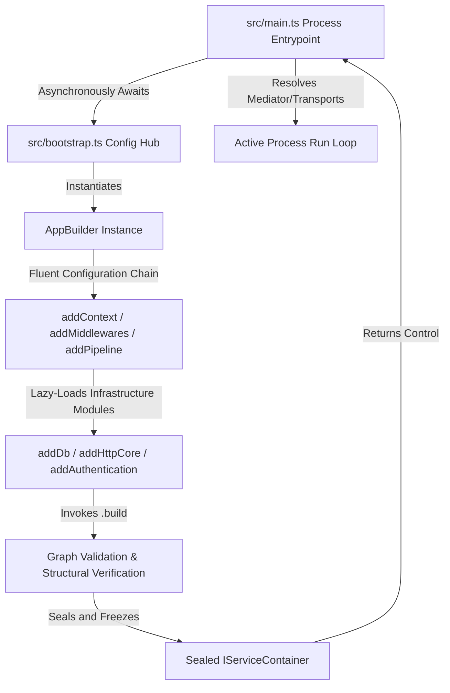

# Application Hosting & Bootstrap Engine

The Application Hosting & Bootstrap Engine page provides a technical
specification of the configuration mechanics, initialization loops, and internal
orchestration steps managed by the programmatic `AppBuilder` engine.

---

## Direct Definition Block

The `AppBuilder` engine is the central runtime host composition orchestrator for
Xeno applications. It provides a type-safe, fluent API to register
infrastructure dependencies, encapsulate technology modules, configure
cross-cutting CQRS pipelines, and compile the root Inversion of Control (IoC)
dependency container explicitly without runtime metadata reflection or
annotation-driven scanning.

---

## The Initialization Paradigm

### What it is

The initialization paradigm of Xeno is a programmatic, code-first configuration
layout that completely replaces runtime metadata reflection (via
`reflect-metadata`) or implicit folder crawling with explicit service
descriptions.

### How it works

The host sets up its initialization sequence across two independent source
modules inside the codebase: `src/bootstrap.ts` and `src/main.ts`. The
`AppBuilder` initializes linearly, compiling dependency graphs and sealing
container registries during the boot phase through explicit factory
declarations.

### Why it exists

Traditional reflection-driven frameworks scan entire directory trees and
evaluate decorator metadata at boot time. This introduces severe cold-start
latency spikes that degrade performance in serverless or edge environments,
while creating an invisible initialization layer that complicates tracing and
debugging. Moving to an explicit composition model eliminates reflection
overhead entirely, delivering sub-millisecond graph compilation and predictable
stack traces.

---

## Initialization Workflow Architecture

The lifecycle of an application transitioning from an unhydrated configuration
state to an active process runtime loop is mapped out below:



Every stage runs sequentially. If the configuration sequence fails during graph
validation, compilation aborts instantly and routes a structured error to the
system telemetry channels prior to activating the network listener layer.

---

## Technical Assembly Blueprint

### 1. The Configuration Hub (`src/bootstrap.ts`)

#### Definition

The Configuration Hub is an isolated configuration assembly layer tasked
exclusively with instantiating `AppBuilder`, coordinating options, and exporting
the compiled dependency container.

#### Behavior

This script maps out cross-cutting pipeline behaviors and infrastructure
adapters using a programmatic fluid layout, remaining entirely decoupled from
network server instances or live process side effects.

```typescript
import { AppBuilder, LOG_LEVEL } from '@xeno/core'

/**
 * @description Coordinates infrastructure configurations and builds the
 * root Inversion of Control (IoC) service graph.
 * @returns {Promise<IServiceContainer>} A sealed, fully compiled container client.
 */
export async function bootstrap() {
  const builder = new AppBuilder()

  builder
    // 1. Register thread context boundary primitives
    .addContext()

    // 2. Wire core request metadata infrastructure middlewares
    .addMiddlewares()

    // 3. Configure global cross-cutting CQRS execution pipelines
    .addPipeline((config) => {
      config.performance.thresholdMs = 500 // Logs slow operations exceeding 500ms
      config.authorization.isEnabled = true // Enforces authorization
      config.authorization.tenant = true // Enforces multi-tenant data boundaries
      config.commandBus.idempotency = { lockTtlSeconds: 60 }
      config.commandBus.concurrency = { maxRetries: 3 }
      config.queryBus.isEnabled = true
    })

    // 4. Mount the database engine wrapper (Drizzle ORM)
    .addDb((config) => {
      config.connectionString = process.env.DATABASE_URL!
      config.tables = {} // Populate with PgTable schema maps
    })

    // 5. Secure HTTP Client channels with integrated resilience policies
    .addHttpCore((config) => {
      config.http.client.baseURL = process.env.HTTP_BASE_URL!
      config.http.client.timeoutMs = 5000
      config.resilience.retry.attempts = 3
    })

  // Finalize graph compilation and seal the container
  return await builder.build()
}
```

#### Effect

This isolates configuration metadata from the active application process
runtime, ensuring that container setups can be executed and verified in
isolation within automation testing tracks.

:::warning The `bootstrap.ts` file must never run production business
operations, invoke live database queries, or bind network server listeners. Keep
registration loops strictly separated from active process lifecycles. :::

### 2. The Runtime Entrypoint (`src/main.ts`)

#### Definition

The Runtime Entrypoint module governs the physical execution launch of the
Node.js process, handling process errors and mapping the agnostic kernel to
concrete transport delivery adapters.

#### Behavior

This module imports the asynchronous builder execution graph from
`bootstrap.ts`, maps core components like the Mediator using nominal tokens, and
links the application container to the preferred network wrapper.

```typescript
import { bootstrap } from './bootstrap.js'
import { INJECTION_TOKENS } from '@xeno/core'

/**
 * @description Orchestrates the runtime launch sequence of the system host.
 */
async function main() {
  try {
    console.info('⏳ Initializing Xeno application kernel...')

    // 1. Asynchronously compile the framework infrastructure and dependency graphs
    const container = await bootstrap()

    console.info('✅ Inversion of Control (IoC) container hydration complete!')

    // 2. Resolve the compiled Mediator to process CQRS requests
    const mediator = container.resolve(INJECTION_TOKENS.MEDIATOR)
    console.log('  CQRS Mediator bus sealed and online.')

    // 3. Bind transport engines (e.g., Express, Fastify, Hono, or event loops)
    // const server = container.resolve(CUSTOM_HTTP_SERVER_TOKEN);
    // await server.start();
  } catch (error) {
    console.error(
      '  Critical system fault captured during runtime startup:',
      error,
    )
    process.exit(1)
  }
}

main()
```

#### Effect

This decouples the underlying service graph from the active transport medium,
allowing identical container logic to deploy interchangeably across HTTP
daemons, message queue workers, or serverless functions.

---

## Internal Runtime Mechanics

When `.build()` is executed on the `AppBuilder`, the framework performs a
deterministic compilation sequence:

1. **Dependency Resolution**: The builder initializes and locks baseline modules
   first (`ContextModule`, `MiddlewareModule`), providing the underlying
   mechanisms needed for execution context tracking.
2. **Pipeline Composition**: The engine evaluates the provided configuration
   structures to assemble the command and query pipeline chains. If functions
   like schema validation or performance tracing are enabled, their matching
   pipeline classes (`ValidationPipeline`, `PerformancePipeline`) are
   dynamically woven into a unified `CompositePipeline`.
3. **Lazy-Loaded Module Mounting**: Xeno leverages an intentional **Optional
   Peer Dependencies** architecture. If a plugin block (such as `.addDb()`) is
   omitted from the configuration script, its corresponding third-party package
   assets (e.g., `drizzle-orm`) are skipped during compilation, keeping runtime
   memory footprints minimal.

:::danger Strict Inversion of Control (IoC) Graph Validation During the final
invocation of the `.build()` method, the framework engine executes a
deterministic validation loop across the entire service container before handing
control over to the application transport adapters. If any of the following
conditions are met, the bootstrap sequence aborts instantly, throwing a fatal
exception that halts the Node.js process initialization:

- **Arity Mismatch (`IoC Arity Mismatch Error`)**: The number of dependencies
  declared within the bootstrap registration array does not exactly match the
  number of parameters expected by the target class constructor signature.
- **Missing Dependency (`IoC Missing Dependency Error`)**: One of the nominal
  branded tokens declared as a constructor dependency has not been registered
  anywhere within the active modules or the IoC container registry.

This structural validation tier completely eliminates runtime instantiation
anomalies, execution failures, or hidden side-effects caused by unresolved
dependencies or passing `undefined` arguments into class components. :::

---

## Architectural Constraints & Trade-offs

- **Complete Avoidance of Automatic Handler Discovery**: Because Xeno completely
  rejects file path sweeping and dynamic directory indexing, new use-case
  handlers or infrastructural services are never discovered implicitly. Every
  component must be explicitly mapped to its designated nominal token within the
  container registration routines, or the Mediator will reject operation
  queries.
- **Rigid Monolithic Manifest Enforcement Rules**: Utilizing a configuration
  block that encapsulates an integration preset requires that the root workspace
  manifest explicitly holds the corresponding peer package assets. Activating an
  integration without providing the underlying peer package results in an
  immediate boot initialization failure.

---

## Next Steps

To verify how the application container allocates instances resolved from the
`AppBuilder` layer, navigate to the following resources:

- **[Architecture Layers](../getting-started/architectural-layers-boundaries)**:
  Review code isolation constraints and compilation policies enforced across
  domain boundaries.
- **[CQRS System](../cqrs-pipeline-architecture/README)**: Construct decoupled
  Command and Query pipelines using the explicit Mediator abstraction layer.
