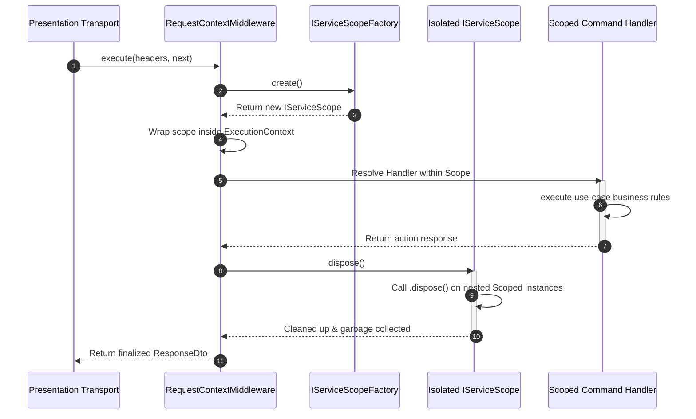

# The IoC Container & Service Lifetimes

## What is it?

The **Inversion of Control (IoC) Container** is the architectural engine that
controls object instantiation, dependency resolution, and memory lifecycles
throughout the XenoJS framework execution lifecycle. By organizing component
dependencies explicitly into three native service lifetimes—**Singleton**,
**Scoped**, and **Transient**—the container manages memory boundaries cleanly,
maintaining thread safety and preventing execution memory leaks.

## Why does it exist?

In a highly concurrent or multi-tenant system, different services have
fundamentally different lifecycle and data isolation requirements. For instance:

- A database pool connection client or external HTTP router should exist
  globally to prevent resource exhaustion.

- User authentication claims, tracing identifiers, and transactional units of
  work must remain strictly locked within a single isolated execution thread
  context.

The IoC container explicitly segregates these boundaries. It replaces manual
object orchestration and prevents severe performance traps, such as accidentally
sharing request-specific state across separate incoming connection threads.

---

## Service Lifetime Classifications

XenoJS supports three deterministic instance tracking lifecycles:

| Lifetime        | Cardinality & Resolution Boundary                                                        | Architectural Target Use Case                                                            |
| --------------- | ---------------------------------------------------------------------------------------- | ---------------------------------------------------------------------------------------- |
| **`Singleton`** | One single instance created once and shared globally across the entire process lifetime. | State-free infrastructure clients, database connection managers, and configurations.     |
| **`Scoped`**    | One distinct instance created per execution storage context boundary branch.             | Request metadata, current user context, transaction states, and single-request handlers. |
| **`Transient`** | A brand new, unique instance instantiated on every individual resolution call site.      | Stateless calculation algorithms, validation parsing templates, and map operators.       |

---

## Service Registration API

Dependencies are configured and bound within the initialization loop of a module
(`IModule`) using the unsealed container instance. The container exposes precise
methods for both direct constructor dependency wiring and functional
factory-driven hydration.

### 1. Standard Class Registration

When registering a raw class, you pass the nominal type-safe injection token,
the concrete class constructor, and an array of dependency tokens matching the
constructor parameters in exact linear order.

- **Singleton Registration:** Maps a globally shared instance across the entire
  application thread.

```typescript
container.addServices((services) => {
  services.addSingleton(token, Class, dependenciesArray)
})
```

- **Scoped Registration:** Maps an isolated instance unique to each incoming
  request execution context branch.

```typescript
container.addServices((services) => {
  services.addScoped(token, Class, dependenciesArray)
})
```

- **Transient Registration:** Generates a completely new instance on every
  resolution call site.

```typescript
container.addServices((services) => {
  services.addTransient(token, Class, dependenciesArray)
})
```

#### Implementation Example:

```typescript
// Concrete example from infrastructure/modules/middleware.module.ts
container.addServices((services) => {
  services.addSingleton<IMiddleware<HttpHeaders>>(
    INJECTION_TOKENS.MIDDLEWARE,
    RequestContextMiddleware,
    [
      INJECTION_TOKENS.REQUEST_CONTEXT,
      INJECTION_TOKENS.SERVICE_EXTRACTOR,
      INJECTION_TOKENS.GATE_KEEPER,
      INJECTION_TOKENS.SERVICE_SCOPE_FACTORY,
    ],
  )
})
```

### 2. Factory-Driven Registration

Factories allow for complex instantiation logic, custom configurations
injection, or manual conditioning before object return. The factory callback
function passes a context-aware injection tracker (`resolver`) to allow lazy
dependency lookups during resolution.

- **Singleton Factory:** Instantiates the factory closure only once, caching the
  result globally.

```typescript
container.addServices((services) => {
  services.addSingletonFactory(token, (resolver) => new CustomClass())
})
```

- **Scoped Factory:** Invokes the factory once per request context branch,
  caching the result inside the active scope array.

```typescript
container.addServices((services) => {
  services.addScopedFactory(token, (resolver) => new CustomClass())
})
```

- **Transient Factory:** Re-executes the factory lambda function continuously on
  every resolution site request.

```typescript
container.addServices((services) => {
  services.addTransientFactory(token, (resolver) => new CustomClass())
})
```

#### Implementation Example:

```typescript
// Concrete example from infrastructure/modules/cqrs.module.ts
container.addServices((services) => {
  services.addSingletonFactory(
    INJECTION_TOKENS.MY_PERFORMANCE_PIPELINE,
    (resolver) => {
      const logger = resolver.resolve(INJECTION_TOKENS.LOGGER)
      const thresholdMs = 100
      return new MyPerformancePipeline(logger, thresholdMs)
    },
  )
})
```

## Scoped Isolation & Request Lifecycle Mechanics

The framework guarantees multi-tenant and cross-request state isolation by
binding the **Scoped** lifetime to an independent runtime execution wrapper.
When a transport layer triggers an action, the system provisions an isolated
boundary.

### Lifecycle Flow of a Scoped Request

1. **Request Interception:** The `RequestContextMiddleware` intercepts an
   incoming transport request array.

2. **Scope Factory Invocation:** The middleware calls
   `IServiceScopeFactory.create()` to instantiate a dedicated `IServiceScope`
   instance.

3. **Context Binding:** A unique `ExecutionContext` is created, binding the new
   `scope` along with isolated network and tracing details.

4. **Execution Sandbox:** The request enters an asynchronous storage wrapper
   (`_requestContext.runAsync()`), routing operations within an isolated context
   path.

5. **Deterministic Teardown:** When the operation finishes (successfully or via
   an unhandled exception), the `finally` block activates `.dispose()` on the
   scope, cleaning up resources.



---

## Technical Implementations Exploration

### 1. Request Scope Creation

The `RequestContextMiddleware` relies on the injected `IServiceScopeFactory` to
coordinate request sandbox boundaries:

```typescript
// Excerpt from presentation/middlewares/request.middleware.ts
export class RequestContextMiddleware implements IMiddleware<HttpHeaders> {
  constructor(
    private readonly _requestContext: IRequestContext<ExecutionContext>,
    private readonly _extractor: IServiceExtractor<HttpHeaders, Metadata>,
    private readonly _gateKeeper: IGateKeeper,
    private readonly _factoryScope: IFactory<void, IServiceScope>, // ServiceScopeFactory
  ) {}

  public async execute<T>(
    headers: HttpHeaders,
    next: () => Promise<ResponseDto<T>>,
  ): Promise<ResponseDto<T>> {
    let correlationId = GuidHelper.generate()
    let requestId = GuidHelper.generate()
    let scope: Optional<IServiceScope> = undefined

    try {
      const meta = this._extractor.extract(headers)
      correlationId = meta.correlationId ?? correlationId
      requestId = meta.requestId ?? requestId

      // ... Identity Authentication Logic ...

      // 1. Provision an isolated scope instance for this specific thread loop
      scope = this._factoryScope.create()

      const executionContext: ExecutionContext = {
        context: { identity: identity!, network, tracing },
        scope, // Binds the scope directly to the execution sequence
      }

      return this._requestContext.runAsync(executionContext, async () => {
        return next()
      })
    } catch (error) {
      // System Exception Handling...
    } finally {
      // 2. Critical: Ensure the container releases and disposes of scoped resources
      if (Guards.isDefined(scope)) {
        scope.dispose()
      }
    }
  }
}
```

### 2. Eager Resource Disposal Pattern

To prevent persistent connection leaks, stateful services instantiated inside a
Scoped lifetime can implement an explicit disposal sequence. When
`scope.dispose()` is executed, the container looks for explicit teardown hooks,
ensuring reliable resource release.

---

## Architectural Guardrails & Common Mistakes

### ❌ Captive Dependencies (The Singleton Trap)

A **Captive Dependency** occurs when a longer-lived service references a
shorter-lived service. For example, injecting a **Scoped** service directly into
a **Singleton** constructor freezes the scoped instance inside the singleton
context forever. This breaks request isolation and leaks multitenant or
request-specific data across the entire global process.

```typescript
// ─── CRITICAL ARCHITECTURAL ANTI-PATTERN ───
export class FaultyGlobalService {
  // Bounded as Singleton inside the AppBuilder graph
  constructor(
    // DANGER: Injecting a Scoped dependency directly locks this instance into global memory!
    private readonly _userContext: IScopedUserContext,
  ) {}
}
```

### Proper Pattern for Singleton Contexts ✅

If a global Singleton component needs to query data belonging to a Scoped
service, it must retrieve it lazily at runtime through the active thread
executor or an injected context abstraction.

```typescript
// ─── ACCURATE DECOUPLED PATTERN ───
export class SafeGlobalService {
  constructor(
    // Inject the thread manager wrapper, not the raw scoped state instance
    private readonly _contextAccessor: IRequestContext<ExecutionContext>,
  ) {}

  public executeAction() {
    // Dynamically retrieve the current context boundary of the executing task safely
    const currentThreadContext = this._requestContext.getContext()
    const currentTenantId = currentThreadContext?.context.identity.tenantId
    // ...
  }
}
```

---

## Next Steps

Now that the core lifetime and scope tracking boundaries are fully defined,
explore the macro structural grouping layer:

- **[Module Composition Pattern](./module-composition-pattern.md):** Master how
  to bundle separate multi-lifetime services into maintainable architectural
  blocks using `IModule` classes.
