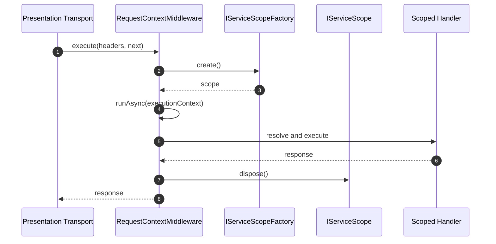

# The IoC Container & Service Lifetimes

The IoC Container in Xeno resolves dependencies and controls instance lifetime
across application execution. It provides three lifetimes, Singleton, Scoped,
and Transient, to isolate state and define disposal boundaries.

## What it is

The IoC Container is the dependency resolution runtime used by modules to bind
tokens to implementations. It tracks object creation rules and lifetime scope.

Behavior:

- Registers services by token using class constructors or factory functions.
- Resolves dependencies recursively based on registration metadata.
- Stores instances according to lifetime policy.

Effect:

- Reduces manual wiring between Domain, Application, Infrastructure, and
  Presentation components.
- Isolates request-level state from process-level state.
- Enables deterministic cleanup of scoped resources.

## Why it exists

Concurrent systems require different lifetimes for different responsibilities.
Long-lived infrastructure clients and short-lived request context should not
share the same lifecycle.

Behavior:

- Global services are cached once and reused.
- Request services are created within a scope and disposed at the end.
- Per-use services are instantiated on every resolve.

Effect:

- Prevents accidental cross-request state sharing.
- Reduces resource leaks by explicit scope disposal.
- Keeps lifecycle intent visible in module registration.

## Service lifetimes

| Lifetime  | Definition                                               | Typical usage                                              |
| --------- | -------------------------------------------------------- | ---------------------------------------------------------- |
| Singleton | One instance for the process lifetime.                   | Configuration readers, shared adapters, telemetry clients. |
| Scoped    | One instance per scope created for an execution context. | Request metadata, unit of work, context-aware handlers.    |
| Transient | New instance on every resolution.                        | Stateless calculators, mappers, validation helpers.        |

## How it works

### Class registration

Use class registration when constructor dependencies are known as tokens.

```typescript
container.addServices((services) => {
  services.addSingleton(token, ServiceClass, [depA, depB])
  services.addScoped(token2, ScopedClass, [depC])
  services.addTransient(token3, TransientClass)
})
```

### Factory registration

Use factory registration when initialization needs runtime logic.

```typescript
container.addServices((services) => {
  services.addSingletonFactory(TOKENS.PIPELINE, (resolver) => {
    const logger = resolver.resolve(TOKENS.LOGGER)
    return new PerformancePipeline(logger, 100)
  })
  services.addSTransientFactory(TOKENS.TRANSIENT_CLASS, (resolver) => {
    const deps = resolver.resolve(TOKENS.DEPS)
    return new TransientClass(deps)
  })
  services.addScopedFactory(TOKENS.PIPELINE, () => {
    return new ScopedClass()
  })
})
```

### Request scope flow

Scoped services are bound to an execution scope that is created and disposed per
request.



## Internal behavior flow

1. Presentation middleware extracts metadata and starts request processing.
2. A new IServiceScope is created through IServiceScopeFactory.
3. ExecutionContext is populated with identity, network, tracing, and scope.
4. Command or Query handlers resolve dependencies inside the active scope.
5. The scope is disposed in a finally block, including nested scoped resources.

## Example

```typescript
// Excerpt from presentation/middlewares/request.middleware.ts
export class RequestContextMiddleware implements IMiddleware<HttpHeaders> {
  constructor(
    private readonly _requestContext: IRequestContext<ExecutionContext>,
    private readonly _extractor: IServiceExtractor<HttpHeaders, Metadata>,
    private readonly _gateKeeper: IGateKeeper,
    private readonly _factoryScope: IFactory<void, IServiceScope>, // ServiceScopeFactory
  ) {}

  public async execute<T>(
    headers: HttpHeaders,
    next: () => Promise<ResponseDto<T>>,
  ): Promise<ResponseDto<T>> {
    let correlationId = GuidHelper.generate()
    let requestId = GuidHelper.generate()
    let scope: Optional<IServiceScope> = undefined

    try {
      const meta = this._extractor.extract(headers)
      correlationId = meta.correlationId ?? correlationId
      requestId = meta.requestId ?? requestId

      // ... Identity Authentication Logic ...

      // 1. Provision an isolated scope instance for this specific thread loop
      scope = this._factoryScope.create()

      const executionContext: ExecutionContext = {
        context: { identity: identity!, network, tracing },
        scope, // Binds the scope directly to the execution sequence
      }

      return this._requestContext.runAsync(executionContext, async () => {
        return next()
      })
    } catch (error) {
      // System Exception Handling...
    } finally {
      // 2. Critical: Ensure the container releases and disposes of scoped resources
      if (Guards.isDefined(scope)) {
        scope.dispose()
      }
    }
  }
}
```

## Constraints and limitations

- Captive dependency risk: injecting a Scoped dependency into a Singleton can
  retain request state beyond its boundary.
- Scope disposal is required for deterministic cleanup. Missing disposal can
  delay resource release.
- Lifetime choice does not replace thread-safety requirements inside shared
  Singleton implementations.
- The current implementation depends on explicit module registration order and
  token correctness.

## Common mistake and safe pattern

Anti-pattern:

```typescript
export class FaultyGlobalService {
  constructor(private readonly _userContext: IScopedUserContext) {}
}
```

Safe pattern:

```typescript
export class SafeGlobalService {
  constructor(
    private readonly _contextAccessor: IRequestContext<ExecutionContext>,
  ) {}

  public executeAction() {
    const ctx = this._contextAccessor.getContext()
    const tenantId = ctx?.context.identity?.tenantId
    return tenantId
  }
}
```

## Next step

- Continue with [Module Composition Pattern](./module-composition-pattern) to
  define module boundaries and registration composition.
