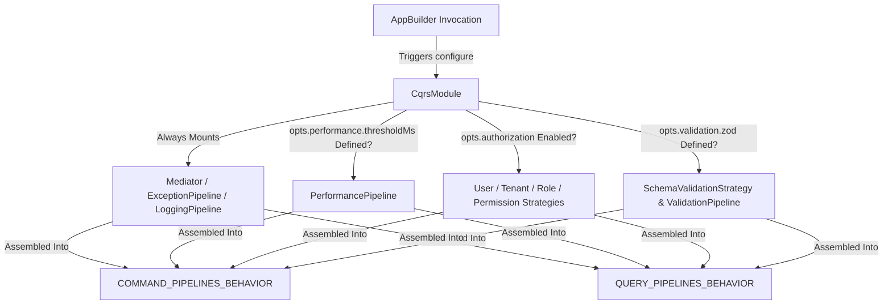

# Module Composition Pattern

## What is it?

The **Module Composition Pattern** is the primary encapsulation mechanism used
by XenoJS to organize, decouple, and scale large codebase frameworks.
Implemented via the **`IModule<TOptions>`** structural contract, a module acts
as a self-contained registry block that packages related services, commands,
queries, and infrastructure adapters together, exposing only what is necessary
to the parent Inversion of Control (IoC) container.

## Why does it exist?

As enterprise applications expand, assembling every single controller, service
handler, and database adapter inside a monolithic `bootstrap.ts` file introduces
critical development liabilities:

- **Codebase Bloat:** The bootstrap file becomes a massive, fragile script that
  is difficult to maintain and prone to merge conflicts.
- **Leaked Architectural Boundaries:** Internal technological components bleed
  into upper layers, violating the encapsulation rules of Clean Architecture.

- **High Memory Footprint:** Services are required and evaluated globally at
  startup, preventing the framework from utilizing lazy-loading or optional peer
  dependency optimizations.

The `IModule` pattern resolves these issues. By grouping registrations into
cohesive technical boundaries, features can be safely turned on or off via the
`AppBuilder` configuration engine without impacting adjacent sub-systems.

---

## Technical Specifications: The `IModule` Contract

Every structural capsule inside XenoJS implements the clean, asynchronous
initialization contract of `IModule`:

```typescript
import type { IServiceContainer } from '@/domain'

export interface IModule<TOptions = void> {
  /**
   * @description Asynchronously registers services and wires configurations
   * into the target dependency container.
   * @param {IServiceContainer} container - The unsealed service container reference.
   * @param {TOptions} opts - Customizable options mapped during host assembly.
   */
  configure(container: IServiceContainer, opts: TOptions): Promise<void>
}
```

---

## Structural Breakdown of Framework Modules

XenoJS builds its entire core capability map—from database persistence to
telemetry tracking—by executing dedicated internal implementations of the
`IModule` contract.

### 1. The Persistence Module (`DbModule`)

Responsible for reading database options, initializing heavy pooling adapters,
and mounting the core relational client token.

```typescript
// Architectural structure of infrastructure/modules/db.module.ts
import type { IModule, IServiceContainer } from '@/domain'
import type { DbConfig } from './config/db.config'

export class DbModule implements IModule<DbConfig> {
  public async configure(
    container: IServiceContainer,
    opts: DbConfig,
  ): Promise<void> {
    const { INJECTION_TOKENS } =
      await import('../di/injection-tokens.constants')
    const { DbClientFactory } = await import('../factories/db-client.factory')

    // Explicitly seals the initialization of the Drizzle Client database pool
    container.addSingletonFactory(INJECTION_TOKENS.DB_CLIENT, () => {
      return new DbClientFactory().create(opts)
    })
  }
}
```

### 2. The Complex Cross-Cutting Behavior Module (`CqrsModule`)

Demonstrates how an advanced module can dynamically adjust container hydration
using conditional options. The `CqrsModule` registers basic processing
capabilities (`Mediator`, `ExceptionPipeline`, `LoggingPipeline`) and then hooks
up specialized behaviors like performance tracing, Zod validation pipelines, and
multitenancy guards based on incoming configuration properties.



---

## Guide: Creating and Registering a Custom Feature Module

To encapsulate a newly developed corporate domain boundary (e.g., an Identity
Management Sub-system), follow the standard XenoJS encapsulation blueprint:

### 1. Define the Feature Module Structure

```typescript
// src/infrastructure/modules/identity-management.module.ts
import type { IModule, IServiceContainer } from '@xeno/core'
import { TokenHelper } from '@xeno/core'

export interface IdentityModuleConfig {
  enableAuditTrails: boolean
  maxSessionDurationSeconds: number
}

// Generate nominal type tokens securely
export const IDENTITY_SERVICE_TOKEN =
  TokenHelper.createToken<any>('IDENTITY_SERVICE')

export class IdentityManagementModule implements IModule<IdentityModuleConfig> {
  public async configure(
    container: IServiceContainer,
    opts: IdentityModuleConfig,
  ): Promise<void> {
    // Lazy-load internal layer requirements to minimize cold start memory usage
    const { ConcreteIdentityService } =
      await import('../services/identity.service.js')

    // Register dependencies with the target lifetime rules
    container.addSingleton(IDENTITY_SERVICE_TOKEN, ConcreteIdentityService, [])

    if (opts.enableAuditTrails) {
      const { AuditTrailBehavior } =
        await import('../services/audit-trail.behavior.js')
      container.addScoped(
        TokenHelper.createToken('AUDIT_BEHAVIOR'),
        AuditTrailBehavior,
        [],
      )
    }
  }
}
```

### 2. Register the Custom Module inside the Host Bootstrap

Integrate your module directly into the application initialization sequence
within `src/bootstrap.ts`:

```typescript
// src/bootstrap.ts
import { AppBuilder } from '@xeno/core'
import { IdentityManagementModule } from './infrastructure/modules/identity-management.module.js'

export async function bootstrap() {
  const builder = new AppBuilder()

  builder
    .addContext()
    .addMiddlewares()
    // Mount custom module capabilities explicitly using the container instantiation instance
    .addModule(new IdentityManagementModule(), {
      enableAuditTrails: true,
      maxSessionDurationSeconds: 3600,
    })

  return await builder.build()
}
```

---

## Architectural Guardrails & Common Mistakes

### ❌ Direct Cross-Module Domain Leakage

Never allow a module to resolve or reference private implementations belonging
to an adjacent module. Communication between distinct modules must occur
exclusively through abstract tokens or by dispatching decoupled events/commands
via the central pipeline `Mediator` bus.

### ❌ Hardcoding Environmental Variables Inside Modules

Modules must always remain stateless, generic, and testable. Never access global
configuration parameters like `process.env` directly inside the `.configure()`
loop. Instead, extract environmental variables within your main bootstrap script
and inject them cleanly via the strongly-typed `opts` parameter.

---

## Next Architecture Layer

Now that the application hosting, lifetime containers, and modularization
patterns are fully defined, progress to the data structures that govern business
logic domains:

- **[Entities & Unique Identifiers](https://www.google.com/search?q=../domain-driven-design-core-building-blocks/entities-unique-identifiers.md):**
  Master how XenoJS identifies aggregate roots and tracks domain changes
  securely.

- **[Functional Monads & Core Errors](https://www.google.com/search?q=..%2Fdomain-driven-design-core-building-blocks%2Ffunctional-monads-core-errors.md):**
  Explore type-safe execution modeling via the native `Result` monad.
