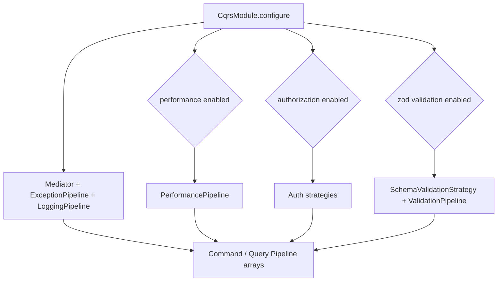

# Module Composition Pattern

The Module Composition Pattern defines how Xeno groups related registrations
into independent units using IModule. A module configures services and
cross-cutting behaviors behind a clear boundary.

## What it is

An IModule is an asynchronous configuration unit that receives a service
container and typed options.

Behavior:

- Registers services, handlers, and adapters for a feature boundary.
- Applies options-driven configuration during startup.
- Exposes capabilities through tokens, not private concrete types.

Effect:

- Keeps bootstrap composition explicit.
- Reduces coupling between Domain, Application, Infrastructure, and Presentation
  boundaries.
- Enables selective feature activation.

## Why it exists

Large bootstrap files centralize unrelated registrations and make feature
boundaries implicit.

Behavior:

- Each module owns its registration logic.
- AppBuilder composes modules in sequence.
- Feature options are provided from host configuration.

Effect:

- Improves maintainability and testability.
- Reduces merge conflicts in startup code.
- Isolates infrastructure details from application composition.

## IModule contract

```typescript
import type { IServiceContainer } from '@/domain'

export interface IModule<TOptions = void> {
  configure(container: IServiceContainer, opts: TOptions): Promise<void>
}
```

## How it works

### Module composition flow

```mermaid
graph TD
    A[AppBuilder] --> B[addModule(module, options)]
    B --> C[module.configure(container, options)]
    C --> D[Register tokens and lifetimes]
    D --> E[Container available to handlers and pipelines]
```

### Example: infrastructure module

```typescript
import type { IModule, IServiceContainer } from '@/domain'
import type { DbConfig } from './config/db.config'

export class DbModule implements IModule<DbConfig> {
  public async configure(
    container: IServiceContainer,
    opts: DbConfig,
  ): Promise<void> {
    const { INJECTION_TOKENS } =
      await import('../di/injection-tokens.constants')
    const { DbClientFactory } = await import('../factories/db-client.factory')

    container.addSingletonFactory(INJECTION_TOKENS.DB_CLIENT, () => {
      return new DbClientFactory().create(opts)
    })
  }
}
```

### Example: options-driven behavior in CQRS



## Internal behavior flow

1. Host creates AppBuilder and base context.
2. Host calls addModule with an IModule instance and typed options.
3. Module loads required internal dependencies.
4. Module registers tokens with explicit lifetime policies.
5. Runtime resolves handlers and pipelines through the composed container.

## Creating a custom feature module

```typescript
import type { IModule, IServiceContainer } from '@xeno/core'
import { TokenHelper } from '@xeno/core'

export interface IdentityModuleConfig {
  enableAuditTrails: boolean
  maxSessionDurationSeconds: number
}

export const IDENTITY_SERVICE_TOKEN =
  TokenHelper.createToken<any>('IDENTITY_SERVICE')

export class IdentityManagementModule implements IModule<IdentityModuleConfig> {
  public async configure(
    container: IServiceContainer,
    opts: IdentityModuleConfig,
  ): Promise<void> {
    const { ConcreteIdentityService } =
      await import('../services/identity.service.js')

    container.addSingleton(IDENTITY_SERVICE_TOKEN, ConcreteIdentityService)

    if (opts.enableAuditTrails) {
      const { AuditTrailBehavior } =
        await import('../services/audit-trail.behavior.js')

      container.addScoped(
        TokenHelper.createToken('AUDIT_BEHAVIOR'),
        AuditTrailBehavior,
        [],
      )
    }
  }
}
```

```typescript
import { AppBuilder } from '@xeno/core'
import { IdentityManagementModule } from './infrastructure/modules/identity-management.module.js'

export async function bootstrap() {
  const builder = new AppBuilder()

  builder.addModule(new IdentityManagementModule(), {
    enableAuditTrails: true,
    maxSessionDurationSeconds: 3600,
  })

  return await builder.build()
}
```

## Constraints and limitations

- Modules should not expose private concrete implementations outside their
  boundary.
- Cross-module integration should occur through tokens, Command/Query dispatch,
  or explicit shared contracts.
- Reading process.env directly inside configure reduces testability and
  portability.
- The current implementation relies on correct module ordering when multiple
  modules register related tokens.

## Common mistakes

- Registering all feature logic in a single bootstrap file.
- Coupling modules through direct imports of internal classes.
- Mixing environment parsing with registration logic in configure.

## Next step

- Continue with [DDD Core](../domain-driven-design/README) to define domain
  model boundaries and business invariants.
