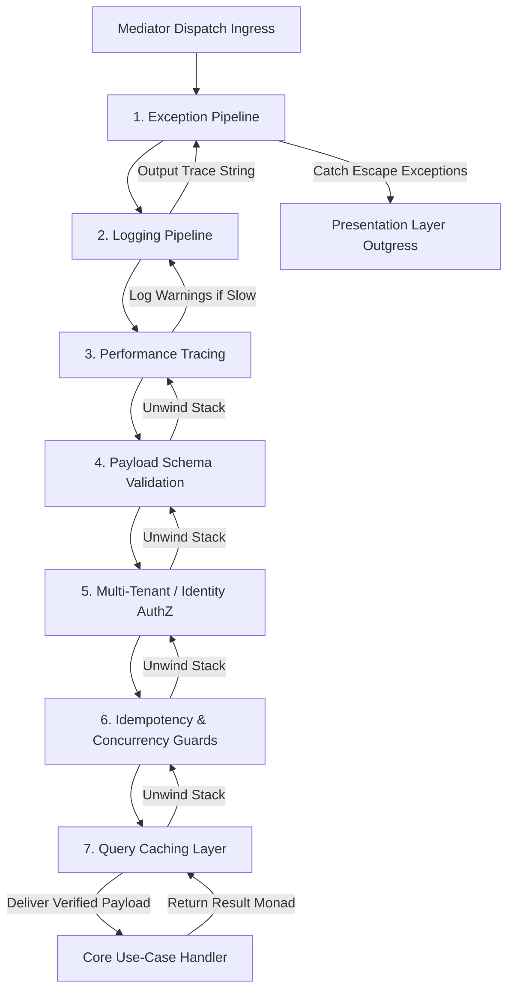

# CQRS Pipeline Architecture

The CQRS Pipeline Architecture documentation defines the core structural layout,
execution topologies, and behavioral processing rings governing message dispatch
inside the Xeno framework.

---

## Direct Definition Block

The CQRS Pipeline Architecture is the central message-routing and
transaction-interception engine of Xeno. It segregates application intents into
state modifications (Commands) and state reads (Queries), channeling operations
agnostically through a sequential stack of cross-cutting interceptor rings
called Pipeline Behaviors prior to use-case handler evaluation.

---

## The Processing Paradigm

### What it is

The CQRS processing paradigm is a message-dispatch infrastructure driven by a
non-reflective, centralized mediator bus (`IMediator`) that isolates application
handlers from transport delivery endpoints.

### How it works

Rather than allowing presentation network layers to instantiate use cases or
interact with services directly, actions are mapped into serializable command or
query request wrappers. The presentation layer dispatches these envelopes to the
`IMediator` bus, which intercepts the operations through a series of automated
middleware layers before delivering the sanitized payload to its dedicated
handler.

### Why it exists

Traditional backend systems frequently mix business rules with infrastructure
tasks like database transaction mapping, user validation checks, performance
timing scripts, and telemetry logging inside handlers or controllers. This
pattern yields tight coupling, generates duplicate boilerplate arrays, and
introduces security exposure if an engineer forgets to emplace a validation
check inside a newly written execution path.

---

## Pipeline Execution Order Topology

### What it is

The Pipeline Execution Order Topology is the deterministic, two-way nesting
sequence (onion routing architecture) that request payloads navigate during
dispatch.

### How it works

When a message passes through the mediator, it traverses the processing blocks
sequentially from the outer exception layer down to the core aggregate. Upon
handler completion, the call stack unwinds in reverse order, allowing each
pipeline interceptor to evaluate results, cache data packets, or update metrics.



### Why it exists

Structuring the request lifecycle into sequential, nested rings ensures that
cross-cutting prerequisites are satisfied before business logic executes. If an
operation fails an early guard checkpoint (e.g., Payload Schema Validation),
execution terminates instantly and routes a structured failure to the client,
preventing unnecessary execution overhead in deeper modules.

---

## Document Directory

Navigate through the CQRS and execution pipeline components sequentially to
master their usage:

### 1. [The Mediator Dispatcher Engine](./mediator-dispatcher-engine.md)

- **Framework Concept:** Learn how the `IMediator` dispatcher bus coordinates
  message routing, evaluates incoming intent definitions, and isolates execution
  pipelines agnostically from HTTP layers.
- **Framework Usage:** How to invoke the mediator dispatcher within custom
  transport interfaces, map DTO envelopes, and safely handle returned monad
  outcomes.

### 2. [Cross-Cutting Pipeline Implementations](../cqrs-pipeline-architecture/README.md)

- **Framework Concept:** Deep dive into the native behavioral guardrails bundled
  out-of-the-box with Xeno.
- **Framework Usage:** Detailed operational manuals for configuring individual
  pipeline behaviors via the fluent `AppBuilder` configurations API:
- **Exception Behavior:** Transforming unhandled crashes cleanly into
  standardized `AppError` payloads.
- **Logging Behavior:** Automatically recording execution milestones and tracing
  vectors.
- **Performance Behavior:** Auditing request execution delays against
  operational warning thresholds.
- **Validation Behavior:** Enforcing automatic schema validation using injected
  strategies.
- **Idempotency Behavior:** Isolating duplicate command executions using
  distinct tenant-prefixed caching states.
- **Concurrency & Retry Behavior:** Managing race conditions and transient
  failures with exponential fallback algorithms.
- **Query Caching Behavior:** Boosting data processing performance by matching
  read queries to temporary caches.

---

## Core Usage Pattern at a Glance

The following block outlines how a presentation layer controller prepares an
operational command envelope and routes it through the central mediator
pipeline:

```typescript
import { BaseController, STATUS_CODES } from '@xeno/core'
import { PingCommand } from './ping.command'

export class PingController extends BaseController<
  { message: string },
  { echoed: string }
> {
  public async handle(request: {
    message: string
  }): Promise<ResponseDto<{ echoed: string }>> {
    const command: ICommand<{ echoed: string }> = new PingCommand(
      request.message,
    )
    const result = await this._send(command)

    if (!result.isOk()) {
      return this.fail(result.getErrorOrThrow(), 'Failed to process ping')
    }

    return this.ok(result.getValueOrThrow()!, STATUS_CODES.CREATED) // 201 Created
  }
}
```

---

## Architectural Constraints & Trade-offs

- **Compulsory Strict Segregation Disciplines**: The mediator will reject
  requests that do not follow the explicit `ICommand` or `IQuery` type
  blueprints. Developers cannot build multi-purpose hybrid endpoints that
  combine structural reads and writes within a single pipeline operation.
- **Absence of Dynamic Runtime Interceptor Manipulation**: To maintain
  deterministic stack execution and eliminate performance allocation loops, the
  sequential order of the pipeline stack is frozen at application startup.
  Interceptors cannot be appended, removed, or reordered dynamically during a
  request lifecycle.

---

## Next Steps

Begin by mastering the structural design of the central application messaging
engine:

- **[Proceed to The Mediator Dispatcher Engine](./mediator-dispatcher-engine.md)**
