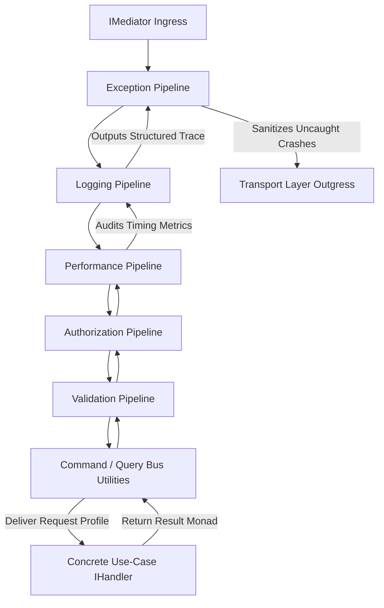

# Pipeline Behaviors Core Fundamentals

The Pipeline Behaviors Core Fundamentals page documents the structural
interception topology, programmatic configuration models, and composition
mechanics managed by the cross-cutting middleware engine inside the framework
core.

---

## Direct Definition Block

Pipeline Behaviors represent the foundational middleware interception
infrastructure for CQRS messages (Commands and Queries) within Xeno. Based on
the core `IPipelineBehavior<TInput, TResult>` contract, they enable the
framework to inject non-functional capabilities around application use cases by
intercepting every request payload both before it reaches its designated handler
and as the execution stack unwinds back to the transport layer.

---

## The Cross-Cutting Interception Paradigm

### What it is

The cross-cutting interception paradigm is an automated execution wrapper system
that decouples non-functional requirements from application use cases.

### How it works

Rather than forcing individual handlers to manage infrastructure tasks, requests
pass through a sequential chain of specialized pipeline modules. The system
captures the message envelope at the framework boundary, applies validation and
security policies, records telemetry data, and intercepts execution outcomes
prior to routing responses back to the presentation layer.

### Why it exists

In typical enterprise software architectures, operations such as telemetry
logging, payload structural parsing, permission auditing, exception scrubbing,
and atomic idempotency locking frequently leak directly into the business logic.
This contamination litters use cases with infrastructure boilerplate,
complicates unit testing orchestration, and creates security enforcement
inconsistencies across separate feature sets.

---

## The Core Composition Engine: `CompositePipeline`

### What it is

The `CompositePipeline` is an architectural coordination module that organizes
enabled framework behaviors into a nested, immutable execution chain at
application startup.

### How it works

During the initialization phase, the `CqrsModule` inspects the active
configurations and compiles the injection tokens of all activated behaviors into
distinct sequential arrays for the command and query buses. The
`CompositePipeline` instantiates these components from the outermost link
inward, nesting each phase within an execution closure delegate wrapper.



### Why it exists

Enforcing a frozen, nested composition layout guarantees that cross-cutting
preconditions are fully evaluated before any business logic executes. If an
early interceptor ring detects a contract violation (such as an invalid
authorization token), processing halts instantly, preventing unnecessary
database or memory allocation overhead in deeper application rings.

---

## Native Framework Pipelines Reference

Every native behavior performs an explicit, dedicated role within the request
lifecycle:

### 1. [Exception Pipeline (`ExceptionPipeline`)](./exception-pipeline-behavior)

- **Definition**: The absolute outermost safety layer tasked with intercepting
  uncaught runtime crashes.
- **Behavior**: It encapsulates the entire execution path within a global
  try-catch block, trapping raw infrastructure errors or unhandled database
  exceptions and mapping them into standardized, sanitized `AppError` payloads.
- **Effect**: Prevents raw stack traces from leaking to presentation clients,
  ensuring a uniform failure protocol across all delivery nodes.

### 2. [Logging Pipeline (`LoggingPipeline`)](./logging-pipeline-behavior)

- **Definition**: A telemetry monitoring ring positioned directly inside the
  exception boundary.
- **Behavior**: It automatically records execution milestones, tracing tracking
  vectors, and command ingress/egress payload states using the configured system
  logger.
- **Effect**: Supplies structured, traceable execution timelines across
  distributed application environments.

### 3. [Performance Pipeline (`PerformancePipeline`)](./logging-pipeline-behavior)

- **Definition**: A latency monitoring and profiling interceptor ring.
- **Behavior**: It measures use-case execution durations. If the processing
  duration exceeds the configured threshold, it logs diagnostic warning markers
  into the telemetry streams.
- **Effect**: Identifies slow execution tracks and performance anomalies in
  heavy production environments.

### 4. [Authorization Pipeline (`AuthorizationPipeline`)](./authorization-pipeline-behavior)

- **Definition**: A zero-trust security gate that evaluates request parameters
  prior to handler execution.
- **Behavior**: It processes sequential security strategy checks (Tenant, User,
  Role, and Permission matrices) to verify the identity context bound to the
  active thread.
- **Effect**: Enforces multi-tenant data boundaries and permissions constraints
  uniformly across all entry endpoints.

### 5. [Validation Pipeline (`ValidationPipeline`)](./validation-pipeline-behaviors)

- **Definition**: An input-sanitization safety barrier.
- **Behavior**: It maps incoming request payloads against structural compilation
  rules (such as Zod schemas) before the parameters interact with internal
  domain models.
- **Effect**: Blocks malformed data objects from entering use cases, eliminating
  manual type-checking code inside handlers.

### 6. [Command Bus Utilities](./concurrency-retry-pipeline-behavior)

- **Definition**: A specialized safety ring applied exclusively to
  state-mutating (`ICommand`) operations.
- **Behavior**: It manages distributed idempotency key locking via cache lookups
  and handles transient race conditions using mathematical retry algorithms.
- **Effect**: Guarantees exactly-once execution semantics for critical
  transactional workflows.

### 7. [Query Bus Utilities](./query-caching-pipeline-behavior)

- **Definition**: A read-optimization ring applied exclusively to data retrieval
  (`IQuery`) operations.
- **Behavior**: It intercepts queries and evaluates incoming criteria against
  assigned cache databases.
- **Effect**: Bypasses relational index lookups for repetitive operations,
  boosting query response performance.

---

## Configuring Pipelines via `AppBuilder`

### 1. Default Baseline Stack Activation

Invoking `.addPipeline()` without parameter configurations implicitly enables
the framework's core protection layer, including global exception handling,
logging diagnostics, and the default 500ms performance alerting threshold.

```typescript
// src/bootstrap.ts
import { AppBuilder } from '@xeno/core'
import type { IServiceContainer } from '@xeno/core'

export async function bootstrap(): Promise<IServiceContainer> {
  const builder = new AppBuilder()

  builder
    // Activates Exception, Logging, and Performance pipelines automatically
    .addPipeline()

  return await builder.build()
}
```

:::tip Calling `.addPipeline()` implicitly initializes the foundational context
and middleware infrastructures; explicit calls to `.addContext()` and
`.addMiddlewares()` can be omitted when using the default baseline configuration
layout. :::

### 2. Customizing Advanced Interceptor Rings

Advanced validation rules, safety guards, and custom performance thresholds are
declared explicitly by passing a programmatic configuration callback to the
pipeline option blocks:

```typescript
// src/bootstrap.ts
import { AppBuilder } from '@xeno/core'
import type { IServiceContainer } from '@xeno/core'
import { z } from 'zod'

const CreateUserSchema = z.object({
  username: z.string().min(3).max(20),
  email: z.string().email(),
  age: z.number().int().positive().optional(),
})

const GetProductQuerySchema = z.object({
  productId: z.string().uuid(),
})

export const appZodConfig = {
  schemas: {
    'user.create': CreateUserSchema,
    'product.getById': GetProductQuerySchema,
  },
}

export async function bootstrap(): Promise<IServiceContainer> {
  const builder = new AppBuilder()

  builder.addPipeline((opts) => {
    // 1. Tune execution profiling warning limits
    opts.performance.thresholdMs = 250 // Warning issued if handler takes > 250ms

    // 2. Activate authorization filters
    opts.authorization.tenant = true // Enforce strict multi-tenant boundary checks

    // 3. Inject validation engine requirements
    opts.validation.zod = appZodConfig // Automatically evaluates Zod schemas matching commands

    // 4. Mount write-side transactional safety configurations
    opts.commandBus.idempotency = {
      lockTtlSeconds: 60,
      processedTtlSeconds: 300,
    }
    opts.commandBus.concurrency = {
      maxRetries: 3,
      delayConfig: { baseDelayMs: 100, maxJitterMs: 50 },
    }

    // 5. Hydrate read-side query acceleration interceptors
    opts.queryBus.isEnabled = true
  })

  return await builder.build()
}
```

---

## Architectural Constraints & Trade-offs

- **Manual Reordering of the Behavior Chain Prohibited**: To ensure structural
  safety and prevent systemic data exposure vulnerabilities, the execution order
  of the pipeline behaviors is unalterable and strictly locked by the core
  engine. Input validation always precedes concurrency retries, and
  authorization evaluations execute safely inside the exception handling
  envelope.
- **Compulsory Registration Prerequisite Rules**: The `AppBuilder` wires the
  messaging core conditionally based on clear builder parameters. Omitting the
  `.addPipeline()` statement inside the initialization scripts prevents the
  system from loading the `CqrsModule`. This leaves the `IMediator` token
  unhydrated, causing a container resolution error at application launch.

---

## Next Steps

Explore how individual built-in pipelines process requests and manage your use
cases:

- **[Exception Pipeline](../cross-cutting-pipeline-behaviors/README):**
  Understand unhandled exception mapping and error scrubbing.
