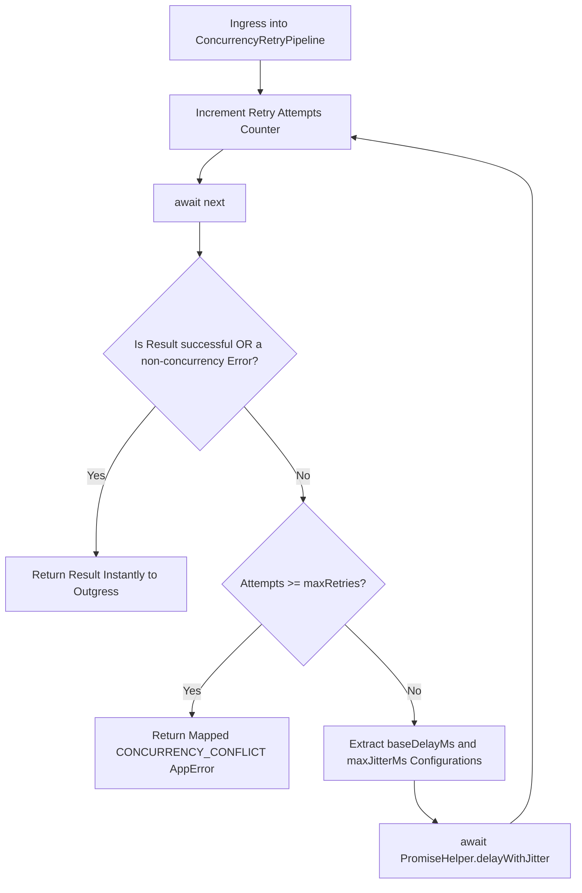

# Concurrency & Retry Pipeline Behavior

The Concurrency & Retry Pipeline Behavior documentation defines the
transactional retry control loops, backoff configurations, and runtime race
condition management patterns implemented inside the command bus execution path.

---

## Direct Definition Block

The `ConcurrencyRetryPipeline` is a native middleware behavior in Xeno designed
to handle concurrency conflicts and operational race conditions during command
execution. When an underlying persistence module or business aggregate fails by
returning a concurrency collision error, this pipeline intercepts the failure
and automatically retries the use-case execution track up to a pre-configured
maximum threshold, utilizing an exponential backoff strategy with randomized
jitter.

---

## The Conflict Resolution Paradigm

### What it is

The conflict resolution paradigm is an automated application-layer loop that
intercepts optimistic or pessimistic persistence collision errors and retries
the command processing sequence.

### How it works

Rather than failing the operation immediately, the pipeline intercepts
transaction attempts through a deterministic loop wrapper. If a database
collision or version-mismatch exception occurs, the behavior pauses the thread
execution for a stochastically staggered duration before reinstantiating the
use-case call path, shielding upper layers from state synchronization anomalies.

### Why it exists

In high-concurrency enterprise environments, parallel operation threads
frequently attempt to alter identical database records or business aggregate
states at the same instance. When using Optimistic Concurrency Control (OCC),
data layers trigger a conflict error to maintain system state integrity.
Rejecting the operation instantly forces front-end components to implement
duplicate retry mechanisms, leading to increased technical debt and exposing
database pools to a "thundering herd" resource depletion if multiple clients
retry simultaneously.

---

## Runtime Mechanics & Execution Flow

### What it is

The runtime mechanics represent the sequential loop conditions and backoff
calculations performed by the pipeline wrapper to smooth out database
contention.

### How it works

The `ConcurrencyRetryPipeline` class
(`src/application/cqrs/pipelines/concurrency-retry.pipeline.ts`) wraps
transaction propagation inside a dedicated execution tracking matrix:

1. **Attempt Increment**: Logs the initialization step and monitors the
   operation loop counter.
2. **Outcome Evaluation**: Evaluates the returned `Result` monad from the
   `next()` delegate link via the private `isConcurrencyError()` helper. The
   loop breaks if execution succeeds or encounters a non-concurrency fault.
3. **Threshold Check**: Breaks execution and returns a definitive
   `CONCURRENCY_CONFLICT` `AppError` to the transport node if the internal
   attempts counter matches or exceeds the `maxRetries` setting.
4. **Jitter Backoff Staggering**: Extracts `baseDelayMs` and `maxJitterMs`
   parameters and calls the `PromiseHelper.delayWithJitter()` primitive to
   stagger the execution thread before recycling the loop.



### Why it exists

Combining exponential delays with a random variance window distributes
processing execution pressure evenly across the event loop, maximizing
transaction success probability under heavy data contention without leaking
database details to the presentation layer.

---

## Activation & Configuration via `AppBuilder`

Because Xeno completely avoids automatic handler discovery, pipeline
configurations must be explicitly mapped inside the `AppBuilder` fluid
configuration scripts:

```typescript
// src/bootstrap.ts
import { AppBuilder } from '@xeno/core'
import type { IServiceContainer } from '@xeno/core'

export async function bootstrap(): Promise<IServiceContainer> {
  const builder = new AppBuilder()

  builder.addPipeline((opts) => {
    // Configure command-side concurrency retry behavior constraints
    opts.commandBus.concurrency = {
      maxRetries: 5, // Maximum retry threshold before returning failure
      delayConfig: {
        baseDelayMs: 150, // Baseline exponential delay unit in milliseconds
        maxJitterMs: 75, // Maximum random variance window size in milliseconds
      },
    }
  })

  return await builder.build()
}
```

---

## Architectural Constraints & Trade-offs

- **Strict Non-Zero Positive Int Option Restrictions**: The constructor uses
  strict type assertions via `Guards.throwIfNegative()` to evaluate
  initialization parameters. Registering a zero or negative integer value inside
  the `maxRetries` option maps causes an immediate initialization failure,
  crashing the application process during startup.
- **Isolation from External Client Integration Latency**: This pipeline is
  optimized exclusively to detect the `CONCURRENCY_CONFLICT` code string and
  matching HTTP status markers. It cannot be used to manage downstream
  microservice network timeouts or circuit breaker loops. External client
  connection failures must be wrapped inside the framework's dedicated
  resilience layer architecture (`IResilienceService`).

---

## Next Steps

Now that write-side command safety and retry behaviors are fully established,
explore how to optimize and accelerate read operations on the query bus:

- **[Query Caching Pipeline Behavior](./query-caching-pipeline-behavior.md)**
