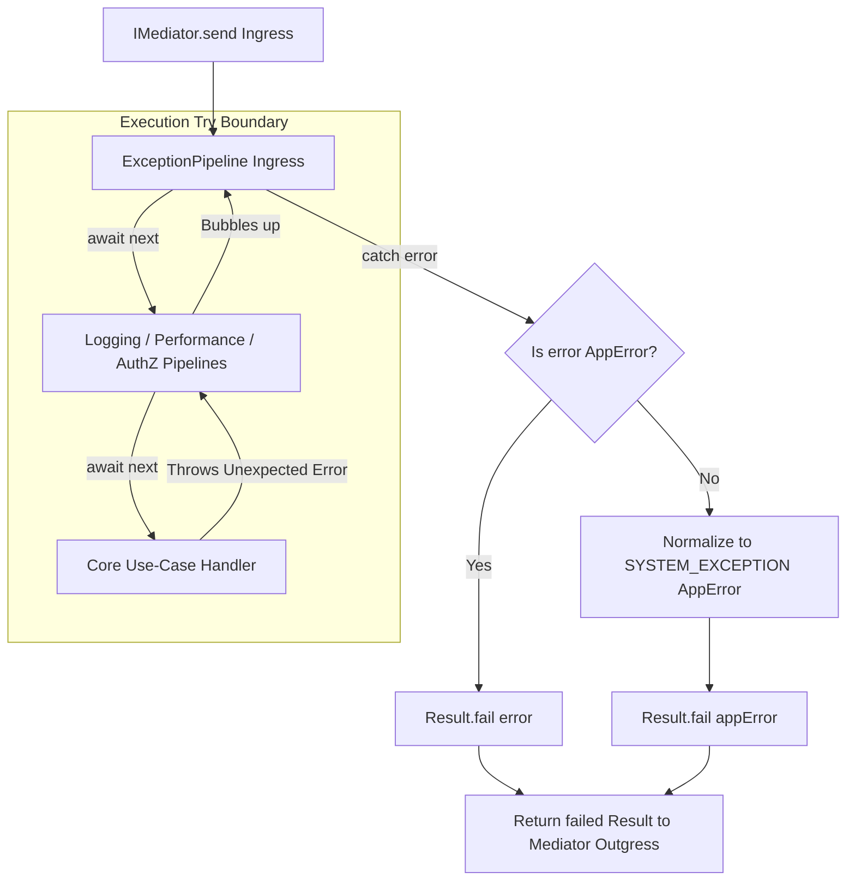

# Exception Pipeline Behavior

The Exception Pipeline Behavior documentation defines the outer transactional
safety boundaries, unhandled runtime error capture loops, and payload scrubbing
mechanisms implemented inside the mediator execution ring.

---

## Direct Definition Block

The `ExceptionPipeline` is the absolute outermost defensive shield of the Xeno
CQRS messaging engine. Operating as a pre-built middleware behavior at the base
of the mediator stack, it intercepts unexpected runtime exceptions or
catastrophic infrastructure failures thrown during command or query processing,
normalizing them into a failed `Result` monad containing a uniform, type-safe
`AppError` structure.

---

## The Error Isolation Paradigm

### What it is

The error isolation paradigm is an automated execution containment barrier that
programmatically intercepts uncaught asynchronous rejections and synchronous
exceptions before they exit the CQRS layer.

### How it works

Rather than allowing raw database faults, file system rejections, or type
mutations to escape into the runtime environment, the pipeline wraps the
downstream processing execution track. Unhandled exceptions are caught at the
boundary tier, evaluated against framework types, and stripped of sensitive
internal context signatures before reaching the transport interface.

### Why it exists

When a downstream use-case handler, aggregate invariant validator, or
infrastructural database adapter triggers an unhandled crash, a raw JavaScript
exception bubbles up through the active V8 execution loop. If left unmanaged,
this pattern causes server process instability or unexpected termination,
exposes sensitive platform internals (such as relational table schemas, network
connection ports, or internal module layouts) to external API clients, and
forces developers to write duplicate, brittle `try/catch` boilerplate blocks
within presentation layer controllers.

---

## Subsystem Processing Flow

### What it is

The subsystem processing flow represents the runtime evaluation checkpoints and
mapping rules executed by the pipeline when an operation triggers a code-level
failure.

### How it works

The `ExceptionPipeline` class
(`src/application/cqrs/pipelines/exception.pipeline.ts`) runs a sequential
multi-stage verification track:

1. **Downstream Invocation**: Invokes the `next()` delegate pointer to propagate
   execution to intermediate behavioral rings or target use-case handlers.
2. **Short-Circuit Bypass**: Captures the failure payload. If the caught object
   satisfies the framework structural criteria for an intentional `AppError`
   monad, it skips the normalization factory entirely and transfers the error
   directly via a `Result.fail(error)` envelope.
3. **Agnostic Error Normalization**: If the exception is a raw, un-opinionated
   code-level failure (such as a database `QueryError` or a native JavaScript
   `TypeError`), the engine structures an implicit `AppError` payload
   containing:
   - **`code`**: Set strictly to the `PIPELINE_ERROR_CODES.SYSTEM_EXCEPTION`
     tracking key to mask platform implementation specifications.
   - **`message`**: Resolved dynamically from the pre-bundled framework error
     dictionary mapping layers (`PIPELINE_ERROR_CODES_KEYS`).
   - **`status`**: Set to `STATUS_CODES.INTERNAL_SERVER_ERROR` (HTTP 500) to
     ensure uniform routing across network delivery layers.
   - **`name`**: Bounded directly to the `request.intent` string property to
     provide immediate debugging traces during telemetry auditing lookups.
   - **`cause`**: Preserves the original raw error reference to enable
     underlying loggers and telemetry tracing modules to extract deep debugging
     stack dumps.

---

## Architectural Lifecycle Placement

Because the `ExceptionPipeline` is hardcoded as the absolute outermost boundary
link during `CqrsModule` container compilation, it wraps all inner middleware
blocks. This structural positioning ensures it traps failures occurring within
adjacent interceptor layers—such as telemetry logging drops, validation
mismatches, or multi-tenant authorization breaches—before they escape the
application boundary layer.



---

## Activation and Configuration

The `ExceptionPipeline` initializes as a structural invariant of the application
bootstrap engine. It cannot be disabled, omitted, or reordered. Triggering the
core pipeline setup sequence inside `src/bootstrap.ts` hydrates its factories
inside the service container automatically:

```typescript
// src/bootstrap.ts
import { AppBuilder } from '@xeno/core'

export async function bootstrap() {
  const builder = new AppBuilder()

  builder
    .addContext()
    .addMiddlewares()
    // Registers ExceptionPipeline globally inside the underlying IoC graph
    .addPipeline()

  return await builder.build()
}
```

---

## Architectural Guardrails for Developers

- **Repetitive Try/Catch Boilerplate inside Handlers Prohibited**: Use-case
  handlers must not be wrapped inside manual, repetitive `try/catch` blocks
  simply to return a failure status or log a failure trace. Handlers must let
  infrastructure adapter rejections bubble up naturally. The `ExceptionPipeline`
  captures these errors at the boundary, correlates them with the active
  `intent` string, and packages them inside a standardized functional envelope.
- **Hiding Business Validations behind Raw Throws Prohibited**: For predictable
  domain rule violations or expected business policy constraints (such as an
  expired tenant contract or suspended client account), developers cannot throw
  raw `new Error()` statements. Expected business failures must return an
  explicit `Result.fail(AppError.validation(...))` monad directly from the
  domain or use-case layers, reserving raw code throws exclusively for
  unrecoverable infrastructure faults or unexpected system exceptions.

---

## Next Steps

Now that the outer exception management layout is defined, explore how requests
are audited and timed:

- **[Proceed to Logging & Performance Pipelines](./logging-pipeline-behavior)**
