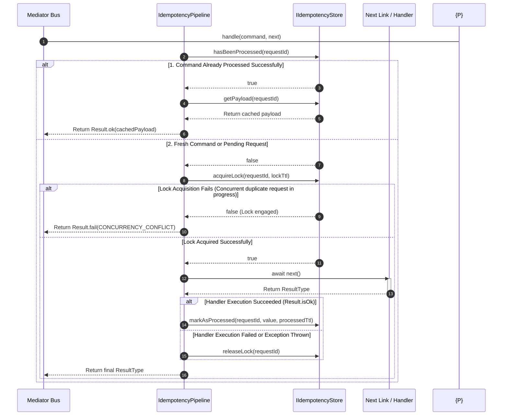

# Idempotency Pipeline Behavior

The Idempotency Pipeline Behavior documentation defines the atomic locking
states, key-space tracking sequences, and cached result hydration mechanisms
implemented inside the command bus processing loop.

---

## Direct Definition Block

The `IdempotencyPipeline` is a pre-built CQRS pipeline behavior in Xeno designed
to guarantee exactly-once execution semantics for state-mutating operations. It
exclusively intercepts the execution flow of Commands (`ICommand`), evaluating
unique request fingerprints to short-circuit duplicate transactions and serve
cached response monads without re-triggering business domain logic or database
persistence adapters.

---

## The Request Protection Paradigm

### What it is

The request protection paradigm is an automated infrastructure-level boundary
that intercepts client-side command retransmissions based on immutable request
identifiers.

### How it works

The pipeline filters transactions by inspecting the `requestId` property
contained within the thread-local execution context. It evaluates this key
against an infrastructure-backed persistence contract (`IIdempotencyStore`),
blocking parallel or duplicated execution streams before they can access
use-case or domain logic rings.

### Why it exists

In distributed cloud topologies and web environments, API clients frequently
transmit identical network packets multiple times due to unexpected packet
dropouts, reverse-proxy network retry behaviors, or duplicate user submissions.
If a state-mutating operation (such as debiting account balances, allocating
ledger vouchers, or firing concrete domain event triggers) lacks infrastructure
protection, multi-execution cascades lead to severe data corruption, duplicate
database records, and invalid accounting states.

---

## Technical Architecture & Execution Flow

### What it is

The technical architecture represents the sequential, deterministic runtime
checkpoints—divided into State Verification, Lock Acquisition, and Atomic Result
Caching—navigated by a command payload.

### How it works

The execution sequence maps requests according to three distinct system
outcomes:

1. **Command Already Processed**: Queries the cache backend. If
   `hasBeenProcessed` returns true, it extracts the stored value via
   `getPayload` and immediately terminates the pipeline, returning the original
   successful payload up the call stack.
2. **Concurrent Duplicate Request in Progress**: If the transaction is active
   but not completed, a second incoming thread fails the `acquireLock` atomic
   check. Propagation terminates instantly, returning a `CONCURRENCY_CONFLICT`
   `AppError`.
3. **Fresh Execution and Hydration**: If the request token is completely new,
   the pipeline engages an exclusive lock using the configured `lockTtlSeconds`
   timer and delegates execution to `await next()`. Upon success, the result is
   written to the store via `markAsProcessed`; upon failure or exception,
   `releaseLock` is called immediately.



---

## Technical Source Code Evaluation

The underlying `IdempotencyPipeline` class implements the strict
`IPipelineBehavior` interface, executing the verification loop within its
programmatic `.handle()` method:

1. **Context Boundary Verification**: Extracts the `requestId` property from the
   active `ExecutionContext` via the injected `IRequestContext` client. If the
   tracking context or request token is missing, execution short-circuits
   instantly with a `CONCURRENCY_CONFLICT` error payload
   (`STATUS_CODES.CONFLICT`).
2. **Atomic Cache Probing**: Evaluates request signatures against the database.
   If a match exists, it calls `getPayload` and copies the immutable output back
   to the transport node.
3. **Exclusive Distributed Locking**: Invokes an atomic cache setter
   (`acquireLock`) to register a short-lived concurrency lock. If a collision
   occurs because an identical ID is actively executing on an adjacent
   event-loop thread pool node, the routine returns `false`, blocking
   multi-execution.
4. **Outcome Preservation and Rollbacks**: Tracks the downstream handler. If the
   return state is successful, it maps the outcome to the cache via
   `markAsProcessed`. If a business error or unhandled database exception
   emerges, it triggers `releaseLock` to permit subsequent network recovery
   transmissions to re-attempt the transaction.

---

## Activation and Configuration via `AppBuilder`

Because Xeno completely avoids automatic directory indexing, pipeline timing
parameters and caching boundaries must be mapped explicitly inside the
`AppBuilder` fluid configuration scripts:

```typescript
// src/bootstrap.ts
import { AppBuilder } from '@xeno/core'
import type { IServiceContainer } from '@xeno/core'

export async function bootstrap(): Promise<IServiceContainer> {
  const builder = new AppBuilder()

  builder
    .addContext()
    .addMiddlewares()
    .addPipeline((opts) => {
      // Configure write-side command idempotency constraints
      opts.commandBus.idempotency = {
        lockTtlSeconds: 60, // Maximum duration a processing lock is held (e.g., 60 seconds)
        processedTtlSeconds: 86400, // Duration the successful cached result persists (e.g., 24 hours)
      }
    })

  return await builder.build()
}
```

---

## Architectural Constraints & Trade-offs

- **Strict Non-Zero Positive Integer Options Restrictions**: The pipeline
  utilizes explicit validation routines (`Guards.throwIfNotInteger()`,
  `Guards.throwIfNegative()`) during initialization. Registering a zero,
  negative, or fractional value inside either the `lockTtlSeconds` or
  `processedTtlSeconds` configuration maps throws an instant crash during host
  bootstrapping, blocking application process startup.
- **Compulsory ID Retention Requirements Across Client Invariants**: The locking
  logic maps request uniqueness entirely based on the incoming string token
  values extracted from the network headers. If the front-end interface
  application or external message broker regenerates a fresh unique identifier
  key for each retry transmission of an identical payload, the kernel processes
  it as an independent transaction intent, bypassing the `IdempotencyStore`
  entirely.

---

## Next Steps

With your write-side operations secured by idempotency constraints, explore how
the framework manages transient failures and race conditions:

- **[Concurrency & Retry Pipeline Behavior](./concurrency-retry-pipeline-behavior)**

```

```
