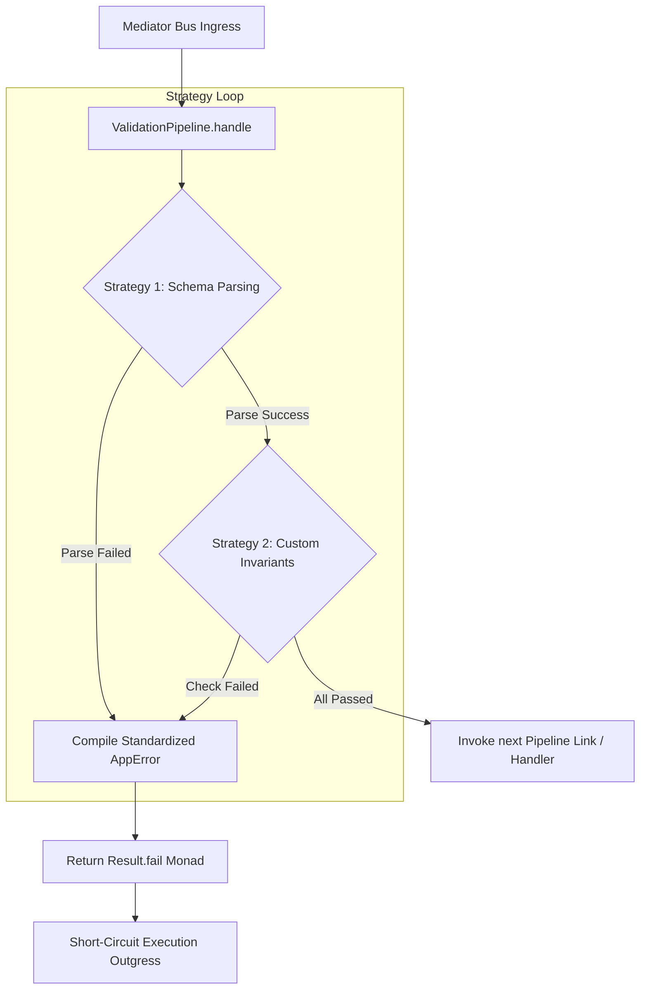

# Validation Pipeline Behavior

## What is it?

The **`ValidationPipeline`** is the data protection checkpoint within the
**Xeno** messaging engine. It intercepts incoming commands and queries, running
them through a sequence of validation rules before allowing them to reach their
concrete application use-case handlers. If any validation check flags an error,
the pipeline safely blocks execution, prevents data corruption, and returns a
standardized HTTP 400 Bad Request error payload.

## Why does it exist?

Accepting unverified or structurally malformed data objects into your domain
layer leads to application instability, unhandled exceptions, or invalid data
states. Writing manual validation syntax inside every transport controller or
use-case handler creates repetitive boilerplate code and increases the risk of
missed security blocks.

Xeno centralizes data safety by decoupling schema parsing from business logic.
By providing a flexible, multi-strategy validation chain, the framework allows
you to easily combine global automated schema rules with specialized, custom
business-rule strategies.

---

## Technical Validation Workflow

The validation pipeline executes an sequential strategy execution loop. Each
request moves through the active verification filters before control is handed
over to the subsequent link or handler:



---

## Configuring the Native Validation Pipeline (Zod)

Xeno provides native support for automated schema parsing using the Zod engine.
When activated, the framework maps your schemas to incoming requests based on
the request's nominal `intent` description string.

To activate native schema validation, supply your global Zod instance
configuration handle to the `.addPipeline()` configuration block inside
`src/bootstrap.ts`:

```typescript
// src/bootstrap.ts
import { AppBuilder } from '@xeno/core'
import type { IServiceContainer } from '@xeno/core'
import { z } from 'zod'

// 1. Defines schema zod for command or query
const CreateUserSchema = z.object({
  username: z.string().min(3).max(20),
  email: z.string().email(),
  age: z.number().int().positive().optional(),
})

const GetProductQuerySchema = z.object({
  productId: z.string().uuid(),
})

// 2. Defines the zod schema config
export const appZodConfig = {
  schemas: {
    // The key is the name of the command/query, the value is the zod schema
    'user.create': CreateUserSchema,
    'product.getById': GetProductQuerySchema,
  },
}

export async function bootstrap(): Promise<IServiceContainer> {
  const builder = new AppBuilder()

  builder
    .addContext()
    .addMiddlewares()
    .addPipeline((opts) => {
      // Pass the appZodConfig
      opts.validation.zod = appZodConfig
    })

  return await builder.build()
}
```

---

## Leveraging `BaseValidationStrategy` for Custom Strategies

While automated schema checking validates basic data types, certain complex
scenarios require business invariant validation (e.g., verifying that a
promotional discount code is valid for the selected item type).

To write custom validation rules, create a class that extends the framework's
**`BaseValidationStrategy`**. This base abstract utility exposes a built-in
`createValidationError()` helper to help you compile consistent HTTP 400 Bad
Request error payloads seamlessly.

```typescript
// src/infrastructure/validation/order-business-rules.strategy.ts
import { BaseValidationStrategy, Result } from '@xeno/core'
import type { IRequest, ResultType } from '@xeno/core'

export class OrderBusinessRulesStrategy extends BaseValidationStrategy {
  constructor() {
    super()
  }

  /**
   * @description Executes custom validation logic against the incoming request payload.
   */
  public async execute(request: IRequest): Promise<ResultType<boolean>> {
    // Cast request safely to access its payload characteristics
    const command = request as any

    if (command.intent === 'PlaceOrderCommand') {
      const { items, promoCode } = command.payload

      // Perform a custom business invariant calculation
      if (promoCode === 'SUPER_DISCOUNT' && items.length < 3) {
        // Automatically structures a standardized HTTP 400 ValidationError payload
        return this.createValidationError(
          request,
          `Validation failed: Promo code 'SUPER_DISCOUNT' requires a minimum purchase of 3 items.`,
        )
      }
    }

    // Return Result.ok(true) to instruct the pipeline to move to the next check
    return Result.ok(true)
  }
}
```

---

## Integrating `IValidatorService` inside Custom Strategies

If your custom strategy utilizes an abstract external parsing engine or a custom
validation package (other than Zod), you can inject Xeno's core
**`IValidatorService`** engine. This approach mirrors the framework's native
`SchemaValidationStrategy` structure, letting you route data payloads
dynamically through a secondary validation registry.

```typescript
// src/infrastructure/validation/custom-engine-schema.strategy.ts
import { BaseValidationStrategy, Result } from '@xeno/core'
import type { IRequest, IValidatorService, ResultType } from '@xeno/core'

export class CustomEngineSchemaStrategy extends BaseValidationStrategy {
  // Inject the framework's validator service provider
  constructor(private readonly _customValidatorService: IValidatorService) {
    super()
  }

  public async execute(request: IRequest): Promise<ResultType<boolean>> {
    const routingKey = request.intent

    // Execute data extraction and parsing against a custom validation schema engine
    const parseResult = await this._customValidatorService.validate(
      routingKey,
      request,
    )

    if (!parseResult.isOk()) {
      return this.createValidationError(
        request,
        `Custom schema parse failure: ${parseResult.getErrorOrThrow().message}`,
      )
    }

    return Result.ok(true)
  }
}
```

---

## Registering Custom Strategies in `AppBuilder`

To include your custom validation strategies within the active
`ValidationPipeline` execution loop, register your component into the dependency
container and map its Injection Token to the `customValidationStrategy`
configuration array:

```typescript
// src/bootstrap.ts
import { AppBuilder, TokenHelper } from '@xeno/core'
import type { IServiceContainer } from '@xeno/core'
import { appZodConfig } from './infrastructure/schemas/zod-schemas'
import { OrderBusinessRulesStrategy } from './infrastructure/validation/order-business-rules.strategy.js'

// Define a distinct container token pointer key for your validation rule component
const ORDER_BUSINESS_RULES_TOKEN = TokenHelper.createToken(
  'OrderBusinessRulesStrategy',
)

export async function bootstrap(): Promise<IServiceContainer> {
  const builder = new AppBuilder()

  // 1. Register your custom validation class into the DI graph
  builder.addServices((services) => {
    services.addSingleton(
      ORDER_BUSINESS_RULES_TOKEN,
      OrderBusinessRulesStrategy,
      [],
    )
  })

  builder.addPipeline((opts) => {
    // 2. Mix native Zod automated lookups with your targeted custom strategies
    opts.validation.zod = appZodConfig

    // 3. Append your tokens to execute sequentially inside the validation loop
    opts.validation.customValidationStrategy = [ORDER_BUSINESS_RULES_TOKEN]
  })

  return await builder.build()
}
```

---

## Technical Pitfalls to Avoid

- ❌ **Swallowing Exceptions and Returning `Result.ok(false)`:** Custom
  strategies must return an explicit error monad using
  `this.createValidationError()` when validation checks fail. Returning
  `Result.ok(false)` evaluates as a successful execution step within the
  pipeline loop, bypassing the validation guard and mistakenly allowing invalid
  payloads to reach your use-case handlers.
- ❌ **Forgetting to Provide a Registration Signature:** If you call
  `.addPipeline()` but leave the `opts.validation` settings entirely empty, Xeno
  optimizes resource allocation by excluding the `ValidationPipeline` from the
  compiled middleware stack. Always make sure either `opts.validation.zod` or
  your custom strategy array tokens are explicitly declared when request
  protection is required.

---

## Next Steps

Now that data inputs are fully verified and guarded against structural
corruption, explore how the write-side command bus optimizes state changes and
prevents race conditions:

- **[Command Bus Utilities: Idempotency & Concurrency Behaviors](./idempotency-pipeline-behavior.md)**
