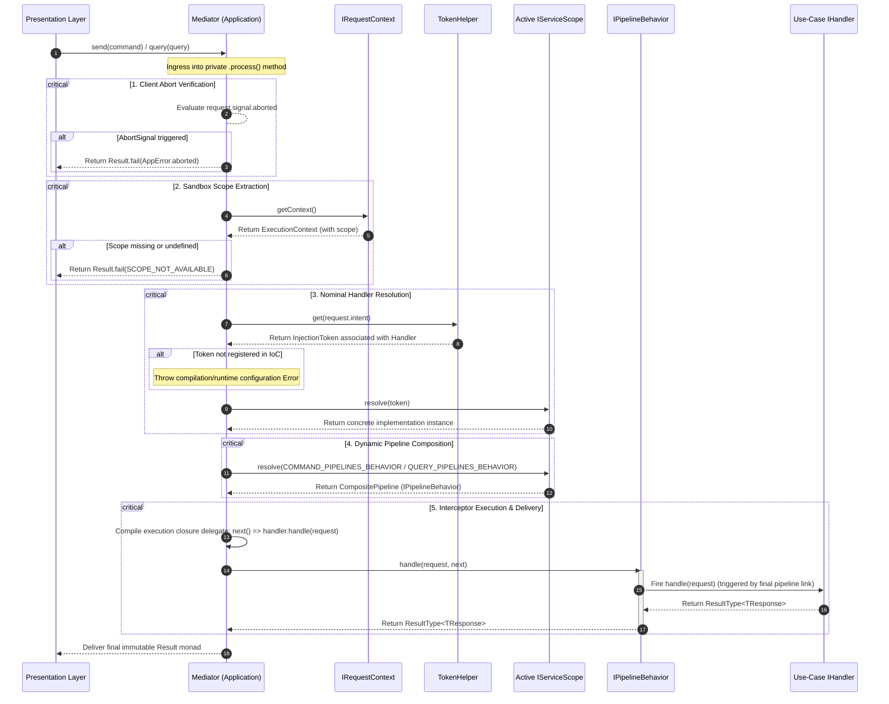

# The Mediator Dispatcher Engine

The Mediator Dispatcher Engine page documents the structural layout, in-memory
routing matrices, and execution lifecycles managed by the centralized messaging
bus inside the framework core.

---

## Direct Definition Block

The Mediator is the central in-memory message routing engine for Xeno's CQRS
(Command Query Responsibility Segregation) pattern. Implemented via the core
`IMediator` contract, it provides an agnostic, strongly-typed dispatcher that
maps incoming intent envelopes (`ICommand` or `IQuery`) onto their designated
application handlers (`IHandler`) through a sequential chain of cross-cutting
interceptor pipelines.

---

## The Decoupling Paradigm

### What it is

The decoupling paradigm of the Mediator is an architectural boundary that
separates use-case intent declarations from concrete execution blocks.

### How it works

Presentation layer elements—including HTTP route parameters, command-line
daemons, or remote event brokers—interface exclusively with the `IMediator`
abstraction. Communication is triggered by dispatching serializable request
envelopes containing explicit parameters and textual intent properties, leaving
presentation classes oblivious to handler locations or service graphs.

### Why it exists

Traditional backend routers frequently inject use-case handlers or
infrastructure adapters directly into controller constructors. This practice
creates bloated initialization blocks, replicates cross-cutting logic across
endpoints, and binds business orchestration rules directly to volatile network
transport layers.

---

## Internal Runtime Mechanics & Workflow

### What it is

The internal runtime mechanics represent the validation, sandbox scope lookup,
and composition routine executed by the private `.process()` engine block during
message dispatch.

### How it works

The `Mediator` class (`src/application/cqrs/mediator.ts`) processes incoming
transactions using a five-stage verification and resolution lifecycle:

1. **Client Abort Verification**: Evaluates the `AbortSignal` state. If the
   client has terminated the connection, propagation halts and returns an
   explicit failure monad.
2. **Sandbox Scope Extraction**: Queries the `IRequestContext` to extract the
   `ExecutionContext` bound to the active thread via Node.js
   `AsyncLocalStorage`.
3. **Nominal Handler Resolution**: Passes the `request.intent` string to the
   `TokenHelper` to map the target branded token, resolving the matching
   instance from the active `IServiceScope`.
4. **Dynamic Pipeline Composition**: Resolves the compiled behavior array
   matching the operational path (`COMMAND_PIPELINES_BEHAVIOR` or
   `QUERY_PIPELINES_BEHAVIOR`).
5. **Interceptor Execution & Delivery**: Packs handler execution inside a nested
   closure wrapper and passes it to the `CompositePipeline` for sequential
   execution.



### Why it exists

Enforcing a uniform resolution routine ensures that every transaction is
isolated within an independent sub-container sandbox. This isolates request
scopes across parallel threads and forces operations through the configuration
guardrails before triggering changes to the domain state.

---

## Practical Implementation Guide

### 1. Defining Intent Contracts (Command / Query)

Every use-case transaction must explicitly declare its target success structure
(`TResponse`), an explicit request type parameter, and a distinct intent key
string mapping to its matching handler registration token:

```typescript
// src/application/use-cases/register-user/register-user.command.ts
import type { ICommand } from '@xeno/core'
import { REQUEST_TYPE } from '@xeno/core'

export interface RegisterUserResponse {
  userId: string
  createdAt: Date
}

export class RegisterUserCommand implements ICommand<RegisterUserResponse> {
  public readonly type = REQUEST_TYPE.COMMAND
  public readonly intent = 'RegisterUserCommand'

  constructor(
    public readonly payload: {
      email: string
      fullName: string
    },
  ) {}
}
```

### 2. Implementing the Use-Case Handler

Handlers manage application logic workflows, wrapping outcomes inside uniform
functional result objects:

```typescript
// src/application/use-cases/register-user/register-user.handler.ts
import type { IHandler, ResultType } from '@xeno/core'
import { Result } from '@xeno/core'
import type {
  RegisterUserCommand,
  RegisterUserResponse,
} from './register-user.command'

export class RegisterUserHandler implements IHandler<
  RegisterUserCommand,
  RegisterUserResponse
> {
  public async handle(
    request: RegisterUserCommand,
  ): Promise<ResultType<RegisterUserResponse>> {
    const data: RegisterUserResponse = {
      userId: 'USR-98765',
      createdAt: new Date(),
    }

    return Result.ok(data)
  }
}
```

### 3. Dispatching from the Presentation Layer

Presentation controllers capture transport events, instantiate the use-case
intent parameters, and pass the envelope agnostically to the mediator:

```typescript
// src/presentation/controllers/user.controller.ts
import {
  BaseController,
  INJECTION_TOKENS,
  HttpHelper,
  STATUS_CODES,
} from '@xeno/core'
import { RegisterUserCommand } from '../../application/use-cases/register-user/register-user.command'

export class UserController extends BaseController<any, any> {
  public async handle(webContext: any): Promise<ResponseDto<any>> {
    const command = new RegisterUserCommand({
      email: webContext.req.body.email,
      fullName: webContext.req.body.fullName,
    })

    const result = await this._send(command)

    if (!result.isOk()) {
      return this.fail(result.getErrorOrThrow(), 'Failed to process ping')
    }

    return this.ok(result.getValueOrThrow()!, STATUS_CODES.CREATED)
  }
}
```

---

## Architectural Constraints & Trade-offs

- **Mandatory Pipeline Registration Prerequisites**: The `AppBuilder`
  instantiates the messaging system lazily based on explicit parameters.
  Omitting `.addPipeline()` inside the configuration bootstrap scripts prevents
  the framework from loading the underlying `CqrsModule`. This leaves the
  `IMediator` token unhydrated, causing a container resolution error at
  application launch.
- **Token Identifier Configuration Mismatch**: The message routing logic
  executes a strict nominal token lookup by matching the text value of
  `request.intent` directly with container registry records. If the symbolic
  token description used to register the handler class inside the `AppBuilder`
  block deviates from the command's `intent` string property, the lookup returns
  `undefined`, triggering a fatal registration exception.

```typescript
// src/bootstrap.ts configuration wiring constraint layout
// The handler token string must mirror RegisterUserCommand.intent exactly ('RegisterUserCommand')
const REGISTER_USER_HANDLER_TOKEN = TokenHelper.createToken<
  IHandler<RegisterUserCommand, RegisterUserResponse>
>('RegisterUserCommand')

export async function bootstrap(): Promise<IServiceContainer> {
  const builder = new AppBuilder()

  builder.addPipeline((config) => {
    config.commandBus.idempotency = {
      lockTtlSeconds: 60,
      processedTtlSeconds: 300,
    }
    config.queryBus.isEnabled = true
  })

  builder.addServices((services) => {
    services.addTransient(REGISTER_USER_HANDLER_TOKEN, RegisterUserHandler)
  })

  return builder.build()
}
```

---

## Next Steps

Now that you have mastered how the Mediator handles intent messages and maps
handlers, discover how to intercept and wrap this flow using cross-cutting
pipeline behaviors:

- **[Proceed to Pipeline Behaviors Core Fundamentals](./cross-cutting-pipeline-behaviors/README)**
