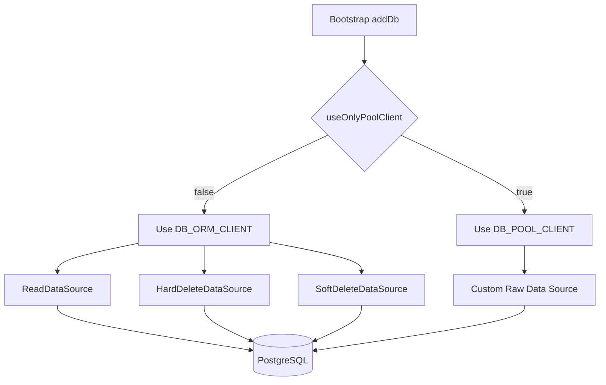

# Data Sources & Execution Topology

## Definition

This page documents how XenoJS data sources execute reads and writes, and how to
wire them with DB_ORM_CLIENT or DB_POOL_CLIENT.

## What It Is

Definition: The data source layer is the infrastructure boundary that translates
generic criteria into concrete database operations.

Behavior:

- ReadDataSource implements IReadDataSource`<TDto>`
- HardDeleteDataSource and SoftDeleteDataSource extend AbstractWriteDataSource
- All local data sources depend on IDbClient and IFilterBuilder
- Selection of DB_POOL_CLIENT vs DB_ORM_CLIENT depends on bootstrapping mode

Effect: Application and repository code can use stable contracts while
persistence details stay isolated in infrastructure.

## How It Works

Definition: Current implementations split read and write responsibilities into
separate classes.

Behavior:

- ReadDataSource:
  - find(criteria, signal) builds query criteria and projections
  - findById(id, criteria, signal) builds query criteria by id and projections
- HardDeleteDataSource:
  - inherits find/findById/insert/update/delete from AbstractWriteDataSource
  - delete performs physical delete through IDbClient.delete
- SoftDeleteDataSource:
  - inherits the same write interface
  - delete performs update through IDbClient.update using delete criteria
  - payload comes from dto passed to delete

Effect: The same write contract supports different retention strategies without
changing repository call sites.

## Why It Exists

Definition: The layer is designed to keep query-building and SQL orchestration
out of handlers.

Behavior: IFilterBuilder converts agnostic criteria into provider-specific
conditions and projections; IDbClient executes the resulting operations.

Effect: Persistence flows are reusable, testable, and less coupled to transport
and domain behavior.

## Topology

The diagram below summarizes strategy selection:



## Native Data Sources

Definition: XenoJS provides local data source classes you can register in DI.

Behavior:

- ReadDataSource for read-only flows
- HardDeleteDataSource for physical delete
- SoftDeleteDataSource for update-based delete semantics

Effect: You can choose deletion strategy per aggregate while reusing the same
base write API.

## Registration Example

Definition: This bootstrap wires read and soft-delete data sources in ORM mode.

Behavior:

- Registers filter builder
- Resolves DB_ORM_CLIENT
- Creates ReadDataSource and SoftDeleteDataSource with table name

Effect: Repositories can consume ready-to-use data source tokens.

```typescript
import {
  AppBuilder,
  INJECTION_TOKENS,
  ReadDataSource,
  SoftDeleteDataSource,
  TokenHelper,
} from '@xeno/core'
import type { IServiceContainer } from '@xeno/core'
import type { SQL } from 'drizzle-orm'
import type { SelectedFields } from 'drizzle-orm/pg-core'
import { UserFilterBuilder } from './filter-builder'
import type { UserDto } from './schema'
import { usersTable } from './schema'

const FILTER_BUILDER_TOKEN = TokenHelper.createToken<UserFilterBuilder>(
  'FILTER_BUILDER_TOKEN',
)
const USERS_READ_SOURCE =
  TokenHelper.createToken<
    ReadDataSource<UserDto, SQL | undefined, SelectedFields | undefined>
  >('USERS_READ_SOURCE')
const USERS_WRITE_SOURCE =
  TokenHelper.createToken<SoftDeleteDataSource<UserDto, SQL | undefined>>(
    'USERS_WRITE_SOURCE',
  )

export async function bootstrap(): Promise<IServiceContainer> {
  const builder = new AppBuilder()

  builder.addDb((opts) => {
    opts.connectionString = process.env.DATABASE_URL ?? ''
    opts.useOnlyPoolClient = false
    opts.tables = {
      users: usersTable,
    }
  })

  builder.addServices((services) => {
    services.addSingleton(FILTER_BUILDER_TOKEN, UserFilterBuilder)

    services.addSingletonFactory(USERS_READ_SOURCE, (container) => {
      const dbClient = container.resolve(INJECTION_TOKENS.DB_ORM_CLIENT)
      const filterBuilder = container.resolve(FILTER_BUILDER_TOKEN)
      return new ReadDataSource<
        UserDto,
        SQL | undefined,
        SelectedFields | undefined
      >(dbClient, filterBuilder, 'users')
    })

    services.addSingletonFactory(USERS_WRITE_SOURCE, (container) => {
      const dbClient = container.resolve(INJECTION_TOKENS.DB_ORM_CLIENT)
      const filterBuilder = container.resolve(FILTER_BUILDER_TOKEN)
      return new SoftDeleteDataSource<UserDto, SQL | undefined>(
        dbClient,
        'users',
        filterBuilder,
      )
    })
  })

  return await builder.build()
}
```

## Consumption Example

Definition: Repository code uses datasource contracts without embedding SQL.

Behavior:

- find uses read criteria and optional projections
- delete delegates to selected write strategy

Effect: Read/write orchestration remains explicit and consistent.

```typescript
import type { ReadDataSource, SoftDeleteDataSource } from '@xeno/core'
import type { UserDto } from './schema'

export class UserRepository {
  constructor(
    private readonly readSource: ReadDataSource<UserDto>,
    private readonly writeSource: SoftDeleteDataSource<UserDto>,
  ) {}

  public async getActiveUsers(signal?: AbortSignal): Promise<UserDto[]> {
    return await this.readSource.find(
      {
        filter: { isDeleted: false },
        cols: ['id', 'email'],
      },
      signal,
    )
  }

  public async deleteUser(dto: UserDto, signal?: AbortSignal): Promise<void> {
    await this.writeSource.delete(
      {
        ...dto,
        isDeleted: true,
      },
      signal,
    )
  }
}
```

## Custom Data Source

Definition: Custom data sources can use DB_POOL_CLIENT, DB_ORM_CLIENT, or both.

Behavior:

- DB_POOL_CLIENT gives direct access to the pg pool through $client
- DB_ORM_CLIENT gives IDbClient abstraction for select/insert/update/delete

Effect: Advanced scenarios can optimize per operation while keeping DI
integration.

```typescript
import { INJECTION_TOKENS, TokenHelper, type IDbClient } from '@xeno/core'
import type { NodePgDatabase } from 'drizzle-orm/node-postgres'
import type { Pool } from 'pg'

export class CustomAnalyticsDataSource {
  constructor(
    private readonly rawPool: NodePgDatabase<Record<string, never>> & {
      $client: Pool
    },
    private readonly ormClient: IDbClient,
  ) {}

  public async calculateSystemMetrics(): Promise<number> {
    const result = await this.rawPool.$client.query(
      'SELECT COUNT(*)::int AS total FROM system_logs',
    )
    return Number(result.rows[0]?.total ?? 0)
  }

  public async findLatestEvents(signal?: AbortSignal): Promise<unknown[]> {
    return await this.ormClient.select<unknown>(
      'system_logs',
      undefined,
      undefined,
      signal,
    )
  }
}

const CUSTOM_ANALYTICS_SOURCE =
  TokenHelper.createToken<CustomAnalyticsDataSource>('CUSTOM_ANALYTICS_SOURCE')

builder.addServices((services) => {
  services.addSingletonFactory(CUSTOM_ANALYTICS_SOURCE, (container) => {
    return new CustomAnalyticsDataSource(
      container.resolve(INJECTION_TOKENS.DB_POOL_CLIENT),
      container.resolve(INJECTION_TOKENS.DB_ORM_CLIENT),
    )
  })
})
```

## Constraints / Limitations

Definition: Datasource execution has explicit behavioral constraints.

Behavior:

- ReadDataSource does not expose write operations
- SoftDeleteDataSource does not auto-inject deletion flags; dto payload defines
  updated values
- DB_ORM_CLIENT is unavailable when useOnlyPoolClient is true
- Correct criteria behavior depends on IFilterBuilder implementation

Effect: Retention semantics and query correctness should be validated in
datasource and filter-builder tests.

## Next Step

Continue with [The Filter Query Builder](./fluent-query-filter-compiler-grid).
