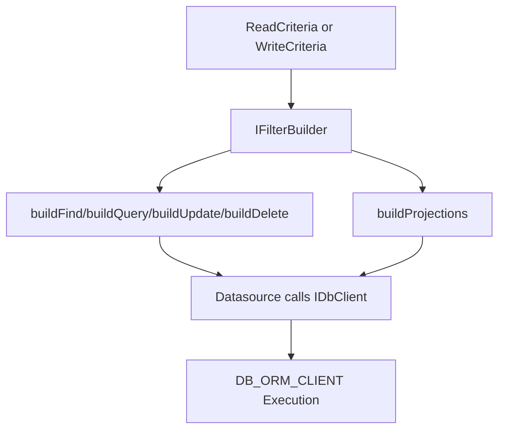

# Fluent Query & Filter Compiler Grid

## Definition

The Fluent Query and Filter Compiler Grid is the criteria translation layer that
implements IFilterBuilder`<TQueryConditions, TQueryProjections>`.

## What It Is

Definition: IFilterBuilder converts framework-level criteria into
datasource-ready conditions and projections.

Behavior:

- buildFindCriteria(filter)
- buildQueryCriteria(filter, params?)
- buildUpdateCriteria(filter)
- buildDeleteCriteria(filter)
- buildProjections(cols)

Effect: ReadDataSource and write datasources can stay generic while query logic
remains centralized.

## How It Works

Definition: The same filter builder supports both read and write execution
paths.

Behavior:

- ReadDataSource:
  - find calls buildFindCriteria + buildProjections
  - findById calls buildQueryCriteria(criteria, `{ id }`) + buildProjections
- AbstractWriteDataSource:
  - find calls buildFindCriteria
  - findById calls buildQueryCriteria(`{ id }`)
  - delete calls buildDeleteCriteria(dto)
  - update calls buildUpdateCriteria(criteria)

Effect: All datasource methods delegate condition compilation to one component,
which improves consistency and testability.

## Criteria Model

Definition: The framework exposes ReadCriteria and WriteCriteria in shared query
types.

Behavior:

- ReadCriteria includes:
  - where: array of conditions
  - limit and offset
  - orderBy
  - cols
- WriteCriteria includes:
  - where: array of conditions
  - relationsToLoad (optional)

Effect: Query and command operations can use dedicated criteria shapes while
sharing a single filter contract.

```typescript
import type { Maybe, Optional } from '@xeno/core'

type FilterOperator = 'eq' | 'neq' | 'gt' | 'lt' | 'in'

interface WhereCondition {
  field: string
  operator: FilterOperator
  value: unknown
}

export interface ReadCriteria {
  where: Maybe<WhereCondition>[]
  limit?: Maybe<number>
  offset?: Maybe<number>
  orderBy?: Maybe<{ field: string; direction: 'asc' | 'desc' }>
  cols?: Optional<string[]>
}

export interface WriteCriteria {
  where: WhereCondition[]
  relationsToLoad?: Maybe<string[]>
}
```

## Implementation Example

Definition: The example below shows an IFilterBuilder implementation for Drizzle
SQL conditions.

Behavior:

- compiles where conditions into SQL
- supports id enrichment through params in buildQueryCriteria
- enforces explicit constraints for update/delete
- maps cols to projection names

Effect: Datasources can execute typed Drizzle filters without embedding
condition logic in repositories.

```typescript
import type {
  Dictionary,
  IFilterBuilder,
  Optional,
  ReadCriteria,
  WriteCriteria,
} from '@xeno/core'
import { Guards } from '@xeno/core'
import { and, eq, gt, inArray, lt, ne, sql, type SQL } from 'drizzle-orm'

import { usersTable } from '../schema'

type Condition = ReadCriteria['where'][number]

export class UserFilterBuilder implements IFilterBuilder<
  SQL | undefined,
  string[] | undefined
> {
  public buildFindCriteria(filter: unknown): SQL | undefined {
    const criteria = filter as ReadCriteria | WriteCriteria
    const where = Array.isArray(criteria?.where) ? criteria.where : []
    const compiled = this.compileConditions(where)
    return compiled.length > 0 ? and(...compiled) : undefined
  }

  public buildQueryCriteria(
    filter: unknown,
    params?: Dictionary<unknown>,
  ): SQL | undefined {
    const base = this.buildFindCriteria(filter)

    if (Guards.isDefined(params?.id)) {
      const byId = eq(usersTable.id, Number(params.id))
      return Guards.isDefined(base) ? and(base, byId) : byId
    }

    return base
  }

  public buildUpdateCriteria(filter: unknown): SQL | undefined {
    const criteria = filter as WriteCriteria
    if (!Array.isArray(criteria?.where) || criteria.where.length === 0) {
      throw new Error('Update operations require explicit where constraints.')
    }
    return this.buildFindCriteria(criteria)
  }

  public buildDeleteCriteria(filter: unknown): SQL | undefined {
    // In write datasources, delete receives dto payload, not WriteCriteria.
    const dto = filter as { id?: number; email?: string }

    if (Guards.isDefined(dto?.id)) {
      return eq(usersTable.id, dto.id)
    }

    if (Guards.isDefined(dto?.email)) {
      return eq(usersTable.email, dto.email)
    }

    throw new Error('Delete operations require identifiable dto fields.')
  }

  public buildProjections(cols: Optional<string[]>): string[] | undefined {
    if (!Array.isArray(cols) || cols.length === 0) {
      return undefined
    }

    const allowed = new Set(['id', 'name', 'email', 'createdAt'])
    return cols.filter((c) => allowed.has(c))
  }

  private compileConditions(where: Array<Condition>): SQL[] {
    const conditions: SQL[] = []

    for (const condition of where) {
      if (!Guards.isDefined(condition)) continue

      const column = this.resolveColumn(condition.field)
      if (!column) continue

      switch (condition.operator) {
        case 'eq':
          conditions.push(eq(column, condition.value as never))
          break
        case 'neq':
          conditions.push(ne(column, condition.value as never))
          break
        case 'gt':
          conditions.push(gt(column, condition.value as never))
          break
        case 'lt':
          conditions.push(lt(column, condition.value as never))
          break
        case 'in': {
          const values = Array.isArray(condition.value)
            ? condition.value
            : [condition.value]
          if (values.length > 0)
            conditions.push(inArray(column, values as never[]))
          break
        }
      }
    }

    return conditions
  }

  private resolveColumn(field: string) {
    switch (field) {
      case 'id':
        return usersTable.id
      case 'name':
        return usersTable.name
      case 'email':
        return usersTable.email
      case 'createdAt':
        return usersTable.createdAt
      default:
        return undefined
    }
  }
}
```

## Registration

Definition: Register the filter builder in DI and inject it into datasource
factories.

Behavior:

- create token with TokenHelper
- add builder as singleton
- resolve DB_ORM_CLIENT + filter builder in datasource factories

Effect: All datasource instances use the same compilation logic.

```typescript
import {
  AppBuilder,
  HardDeleteDataSource,
  INJECTION_TOKENS,
  TokenHelper,
} from '@xeno/core'
import type { IServiceContainer } from '@xeno/core'
import type { SQL } from 'drizzle-orm'

import { UserFilterBuilder } from './filter-builder'
import { usersTable, type UserDto } from './schema'

const FILTER_BUILDER_TOKEN = TokenHelper.createToken<UserFilterBuilder>(
  'FILTER_BUILDER_TOKEN',
)
const USER_DS_TOKEN =
  TokenHelper.createToken<HardDeleteDataSource<UserDto, SQL | undefined>>(
    'USER_DS_TOKEN',
  )

export async function bootstrap(): Promise<IServiceContainer> {
  const builder = new AppBuilder()

  builder.addDb((opts) => {
    opts.connectionString = process.env.DATABASE_URL ?? ''
    opts.useOnlyPoolClient = false
    opts.tables = { users: usersTable }
  })

  builder.addServices((services) => {
    services.addSingleton(FILTER_BUILDER_TOKEN, UserFilterBuilder)
    services.addTransientFactory(USER_DS_TOKEN, (container) => {
      return new HardDeleteDataSource<UserDto, SQL | undefined>(
        container.resolve(INJECTION_TOKENS.DB_ORM_CLIENT),
        'users',
        container.resolve(FILTER_BUILDER_TOKEN),
      )
    })
  })

  return await builder.build()
}
```

## Workflow



## Constraints / Limitations

Definition: Filter compilation has explicit implementation constraints.

Behavior:

- buildDeleteCriteria receives dto payload from write datasource delete
- Returning undefined from buildProjections can result in broader selects
- Field/operator mapping must be explicitly maintained
- Query safety for update/delete depends on builder validation rules

Effect: Strong tests on filter builders are essential to prevent accidental
broad write operations and projection regressions.

## Next Step

Continue with
[The Generic Repository Pattern](./repositories-daos-design-patterns.md).
