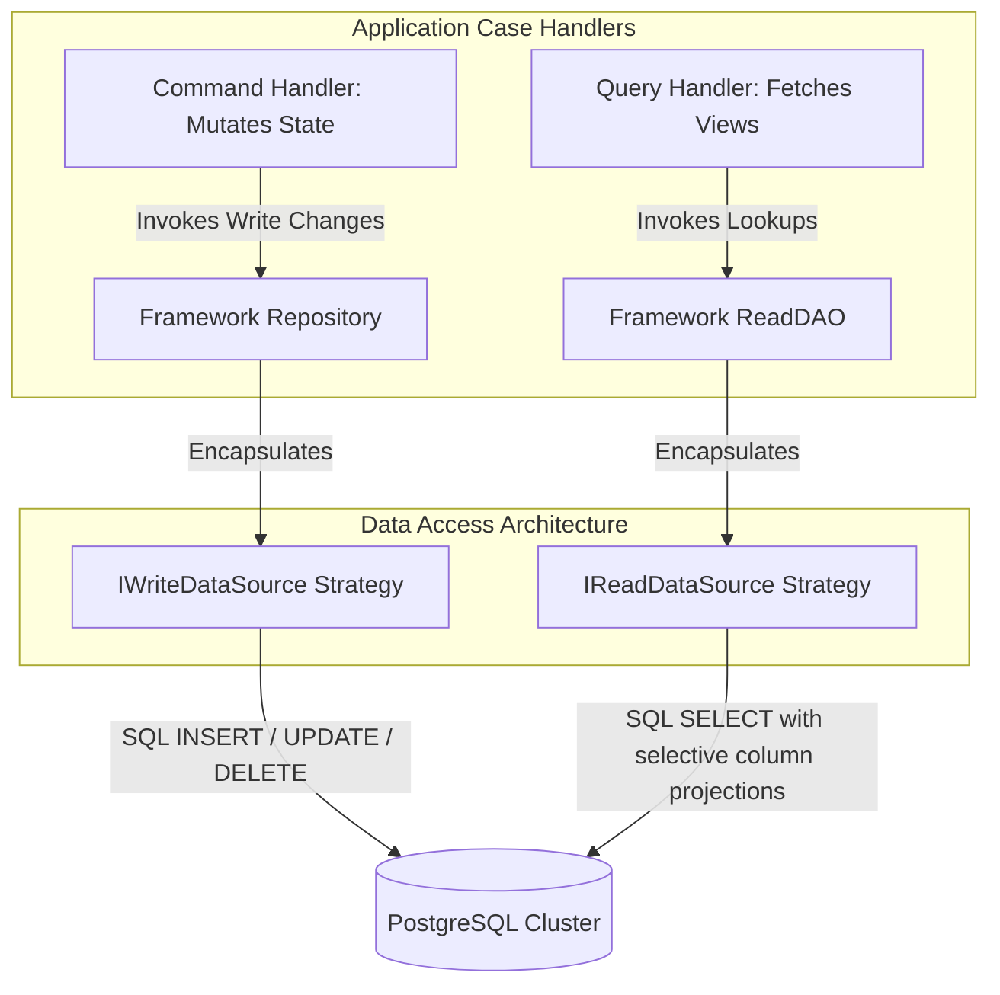

# Repositories & DAOs Design Patterns

The Repositories & DAOs Design Patterns page provides a technical specification
of the data access abstraction layer, data-transfer mapping behaviors, and
structural segregation between read and write operations inside the framework
core.

---

## Direct Definition Block

The Data Access Layer Abstraction Tier manages state persistence while
maintaining strict compile-time decoupling between core enterprise domains and
physical database drivers. It enforces CQRS data separation by dividing
persistence access loops into two dedicated architectural components:
`Repository` implementations for write-side mutations and `ReadDao`
implementations for read-only fetch workflows.

---

## The Persistence Paradigm

### What it is

The persistence paradigm of Xeno is a structural layout that divides data
operations into completely isolated write-mutation tracks and read-projection
tracks.

### How it works

The persistence engine rejects the practice of utilizing unified monolithic data
layers. Instead, write-side modifications route through concrete `Repository`
targets that manipulate domain aggregates, whereas read-side queries route
through optimized `ReadDao` classes that fetch raw database data transfer
objects (DTOs) directly.

### Why it exists

Traditional unified database layers blend validation rules, transactional state
modifications, and complex analytical reporting logic into single shared
tracking classes. This coupling leads to leaked infrastructure details,
introduces unnecessary mapping overhead for read operations, and tightly couples
the use-case layer to specific database engines or ORM schemas.

---

## Understanding `T` vs `TDto` (The Drizzle ORM Mapping)

### What it is

The data mapping pattern is a generic contract convention that separates the
business model structure (**`T`**) from the physical database table storage
layout (**`TDto`**).

### How it works

The implementation segregates data access responsibilities using two highly
specific generic data parameters:

- **`T` (The Domain Entity)**: An isolated business aggregate containing
  enterprise invariants, rules, and domain state-events. It is completely clean
  of persistence annotations or database keys.
- **`TDto` (The Persistence Model DTO)**: A structure that represents the exact
  table layout of the physical storage engine.

When utilizing the default Drizzle ORM integration, `TDto` configurations map
directly to the auto-inferred row model schema blueprints:

```typescript
import { pgTable, uuid, varchar, timestamp } from 'drizzle-orm/pg-core'

// 1. Physical Database Table Configuration
export const usersTable = pgTable('users', {
  id: uuid('id').primaryKey().defaultRandom(),
  email: varchar('email', { length: 255 }).notNull(),
  updatedAt: timestamp('updated_at').defaultNow().notNull(),
})

// 2. Automated TDto Layout Inference
export type UserDto = typeof usersTable.$inferSelect
```

An independent mapping component conforming to the `IMapper<T, TDto>` contract
handles programmatic conversions between these two models at the layer boundary.

### Why it exists

Allowing physical database columns or table changes to alter entity behaviors
violates Clean Architecture rules and breaks core business logic. Emplacing an
explicit `IMapper` step protects the enterprise domain from changes to tables or
schemas, allowing data layouts to be altered without impacting use cases.

---

## Architectural Segregation: Repository vs ReadDAO



### 1. The Write Repository (`Repository<T, TDto>`)

#### Definition

The Write Repository is a command-side persistence component tasked exclusively
with maintaining transactional consistency across domain entities.

#### Behavior

It accepts an active domain entity `T`, maps it into its relational `TDto`
representation via an injected `IMapper`, and invokes the assigned
`IWriteDataSource` code strategies (`SoftDeleteDataSource`,
`HardDeleteDataSource`).

#### Effect

This limits the scope of write paths to entity safety and transactional
validation, protecting data consistency across repository domains.

### 2. The Read DAO (`ReadDao<TDto>`)

#### Definition

The Read DAO is a query-side lookup component optimized exclusively for
high-performance read-only data mapping and retrieval.

#### Behavior

It completely bypasses domain entity validation, identity mapping registries,
and unit tracking lifecycles, using an `IReadDataSource` to select specific
columns and return raw `TDto` arrays directly to presentation components.

#### Effect

This optimizes database query read execution times by stripping away mapping
blocks and aggregate lifecycle overhead from read-heavy reporting tracks.

---

## Registering and Using Framework Patterns

### 1. Bootstrap Container Registration

Because Xeno completely avoids automatic file indexing, repositories and
ReadDAOs must be declared programmatically inside the `AppBuilder` configuration
sequence via clear transient factories:

```typescript
// src/bootstrap.ts
import { AppBuilder, TokenHelper, INJECTION_TOKENS } from '@xeno/core'
import type { IServiceContainer } from '@xeno/core'
import { Repository, ReadDao } from '@xeno/core'

import { TOKEN } from './tokens'

export const PRODUCT_REPOSITORY_TOKEN =
  TokenHelper.createToken<Repository<User, UserDto>>('ProductRepository')
export const PRODUCT_READ_DAO_TOKEN =
  TokenHelper.createToken<ReadDao<User, UserDto>>('ProductReadDao')

export async function bootstrap(): Promise<IServiceContainer> {
  const builder = new AppBuilder()

  builder.addDb((opts) => {
    opts.connectionString = process.env.DATABASE_URL!
    opts.useOnlyPoolClient = false
    opts.tables = {
      /* Drizzle schema dictionary mapping */
    }
  })

  builder.addServices((services) => {
    // A. Register the Framework's Native Write Repository
    services.addTransientFactory(PRODUCT_REPOSITORY_TOKEN, (container) => {
      const writeDataSource = container.resolve(TOKEN.MyProductWriteDataSource)
      const productMapper = container.resolve(TOKEN.MyProductMapper)

      return new Repository(writeDataSource, productMapper)
    })

    // B. Register the Framework's Native Read-Only DAO
    services.addTransientFactory(PRODUCT_READ_DAO_TOKEN, (container) => {
      const readDataSource = container.resolve(TOKEN.MyProductReadDataSource)
      const productMapper = container.resolve(TOKEN.MyProductMapper)

      return new ReadDao(readDataSource, productMapper)
    })
  })

  return await builder.build()
}
```

### 2. Consuming Data Access Components inside Handlers

#### Write-Side Command Processing Example:

```typescript
// src/application/commands/create-product.handler.ts
import { ICommand, IHandler, Repository, ResultType } from '@xeno/core'

export class CreateProductHandler implements IHandler<ICommand<any>, void> {
  constructor(private readonly _productRepository: Repository<User, UserDto>) {}

  public async handle(command: ICommand<any>): Promise<ResultType<void>> {
    // 1. Instantiate the pure business domain aggregate
    const productAggregate = Product.createNew({
      sku: command.payload.sku,
      price: command.payload.price,
    })

    // 2. Persist state changes via the repository wrapper
    const result = await this._productRepository.save(
      productAggregate,
      command.signal,
    )

    if (!result.isOk()) {
      return result.fail(result.getErrorOrThrow())
    }

    return result
  }
}
```

#### Read-Side Query Processing Example:

```typescript
// src/application/queries/get-active-products.handler.ts
import { IQuery, IHandler, ReadCriteria, ReadDao, ResultType } from '@xeno/core'

export class GetActiveProductsHandler implements IHandler<IQuery<any>, any[]> {
  constructor(private readonly _productReadDao: ReadDao<User, UserDto>) {}

  public async handle(query: IQuery<any>): Promise<ResultType<any[]>> {
    const searchCriteria = {
      where: { isAvailable: true },
      cols: ['id', 'sku', 'price'], // Extract selectively only required columns
    }

    // Fetch raw database records directly bypassing aggregate logic
    const result = await this._productReadDao.find(searchCriteria, query.signal)

    if (!result.isOk()) {
      return result.fail(result.getErrorOrThrow())
    }

    return result
  }
}
```

---

## Architectural Constraints & Trade-offs

- **Leaked `TDto` Configurations inside Use Cases Prohibited**: Use-case
  handlers are structurally blocked from processing physical database rows or
  Drizzle table configurations. Allowing data-tier layouts to leak outside
  mapping components breaks Clean Architecture constraints, spreading
  infrastructure dependencies throughout the codebase.
- **Overhead of Dual-Class Architecture for Trivial Domains**: Enforcing
  distinct repositories and DAOs for simplistic use cases with basic CRUD needs
  adds setup boilerplate and file-count weight. In scenarios with basic data
  lookups, this separation must still be maintained to uphold the structural
  boundary invariants enforced by the compilation linters.

---

## Next Steps

Now that your repositories, ReadDAOs, and data source strategies are configured,
learn how to manage HTTP request:

- **[HTTP Request](../http-requests-resilience/README.md)**
