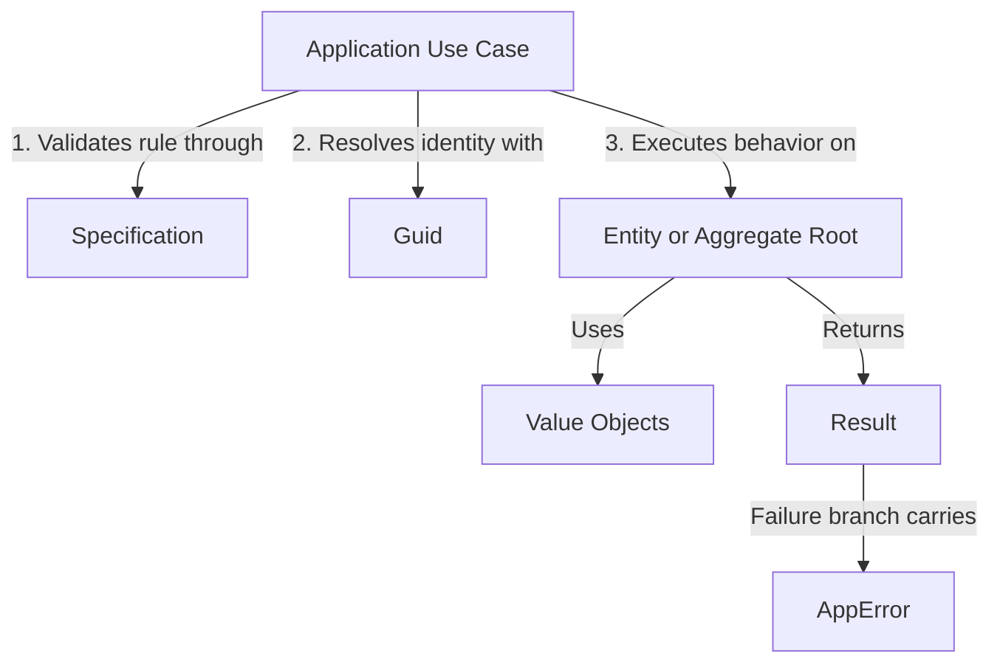

# Domain-Driven Design (DDD) Core Building Blocks

## Definition

The Domain Layer contains the core business model of a Xeno application. It is
implemented as pure TypeScript code and is isolated from transport, persistence,
and framework-specific concerns.

## What It Is

This chapter is the technical index for the Domain Layer located in
`src/domain/`.

The layer defines:

- Entities and identity boundaries
- Value Objects and invariant protection
- Functional outcomes and business error contracts
- Rule evaluation through Specifications

The current implementation is framework-agnostic and does not depend on HTTP,
ORM, logging, or message broker libraries.

## How It Works

Domain components collaborate through explicit types and deterministic behavior:

1. Application code invokes Domain logic for business decisions.
2. Specifications evaluate rule compliance.
3. Entities encapsulate mutable business state.
4. Value Objects encapsulate validated immutable attributes.
5. Methods return `Result` values that carry success or `AppError` failure
   states.

This model keeps policy decisions inside the Domain Layer and keeps
Infrastructure-specific behavior outside of it.

## Why It Exists

Separating Domain logic from Infrastructure reduces coupling and protects
business rules from technology churn. The effect is a codebase that is easier to
test, safer to refactor, and more predictable across delivery channels.

---

## Document Directory

Navigate through the domain structural building blocks sequentially:

### 1. [Entities & Unique Identifiers](./entities-unique-identifiers)

- **What it covers:** Entities as identity-based objects, aggregate state
  boundaries, and type-safe identity mapping with `Guid` and `GuidHelper`.

### 2. [Value Objects & Defensive Immutability](./value-objects-defensive-immutability)

- **What it covers:** Immutable domain attributes, validation-first
  construction, and defensive patterns used to preserve invariants.

### 3. [Functional Monads & Core Errors](./functional-monads-core-errors)

- **What it covers:** Explicit success/failure modeling through `Result`,
  standardized error contracts with `AppError`, and rule composition through
  `Specification`.

---

## Example: Domain Primitive Collaboration Trace

The diagram below shows the observable collaboration path between Application
logic and Domain primitives.

---

## Constraints / Limitations

:::info Isolation mandate

The Domain Layer must remain pure. Do not import Infrastructure libraries (for
example ORM clients, HTTP clients, or logging adapters) into Domain modules.
When external capabilities are required, define abstract contracts in Domain and
provide implementations in Infrastructure. :::

:::tip Exception policy

Do not use `throw new Error()` for predictable business rule violations. Return
a failed `Result` with a well-defined `AppError` instead. Reserve exceptions for
unrecoverable Infrastructure faults. :::

---

## Next Steps

Continue with the identity and entity model details:

- **[Proceed to Entities & Unique Identifiers](./entities-unique-identifiers)**
