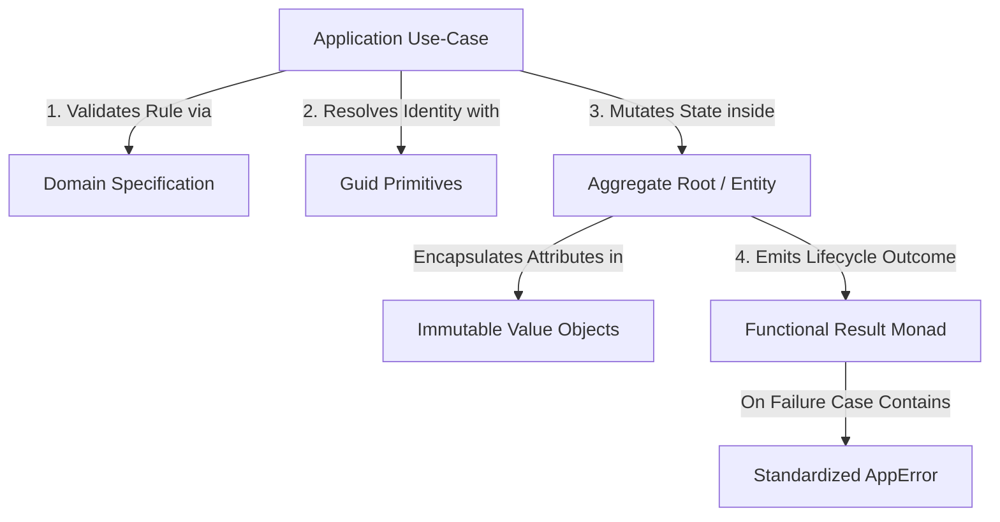

# Domain-Driven Design (DDD) Core Building Blocks

This chapter documents the primitive structures and structural rules that govern
the innermost layer of a Graviton5 application: the **Domain Layer**
(`src/domain/`).

In strict alignment with Clean Architecture, this layer is designed to be
entirely pure, framework-agnostic, and insulated from volatile external I/O
choices, third-party libraries, and database engines.

---

## Chapter Summary

The domain layer serves as the absolute blueprint of corporate business rules.
By encapsulating complex invariant logic directly inside deterministic
components, Graviton5 ensures that business rules remain highly testable,
self-documenting, and entirely decoupled from infrastructure drivers. This
chapter breaks down how to model real-world business domains using the
framework's native primitives without introducing runtime reflection or magic
decorations.

---

## Document Directory

Navigate through the domain structural building blocks sequentially:

### 1. [Entities & Unique Identifiers](./entities-unique-identifiers.md)

- **What it covers:** An analysis of entities and mutable domain objects defined
  by their programmatic identities rather than their structural attributes. This
  manual covers secure tracking mechanics and type-safe identity mapping
  utilizing the native framework `Guid` primitives and `GuidHelper` factory.

### 2. [Value Objects & Defensive Immutability](./value-objects-defensive-immutability.md)

- **What it covers:** Architectural guidelines for capturing descriptive,
  stateless, and immutable attributes of the business domain. This section
  outlines how to apply defensive programming techniques, leverage explicit
  runtime structural deep freezing, and execute validation checks to lock down
  invariants.

### 3. [Functional Monads & Core Errors](./functional-monads-core-errors.md)

- **What it covers:** An in-depth manual on modeling operational outcomes and
  handling edge cases without throwing traditional runtime JavaScript
  exceptions. It covers the structure of the native framework functional
  `Result` monad, the unified `AppError` record, and the integration of
  conditional business rules via the abstract `Specification` pattern.

---

## Domain Primitive Collaboration Trace

The following diagram illustrates how the individual DDD building blocks
collaborate natively within the application layer boundaries to process business
rules safely:

---

## DDD Best Practices at a Glance

:::info Isolation Mandate The domain layer must remain entirely pure. Never
import libraries like Drizzle ORM, Axios, or Pino into a domain module file. If
the domain requires external infrastructure capabilities, it must define them as
abstract contracts (interfaces) inside the domain layer, leaving implementations
to the infrastructure layer. :::

:::tip TIP: Avoid Exception Sprawl Do not use `throw new Error()` for
predictable business logic violations (e.g., "Insufficient funds" or "User
already exists"). Reserve exceptions strictly for unrecoverable infrastructure
faults. For all business policy validations, return a failed `Result` containing
a well-defined `AppError` code instead. :::

---

## Next Step

Begin by exploring how Graviton5 handles aggregate state tracking and identity
boundaries:

- 👉
  **[Proceed to Entities & Unique Identifiers](./entities-unique-identifiers.md)**
