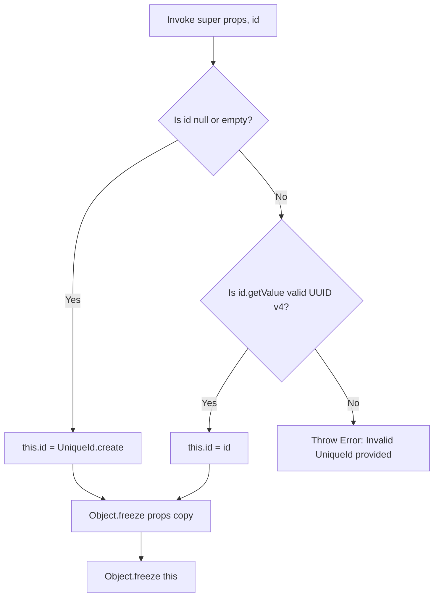

# Entities & Unique Identifiers

In Domain-Driven Design (DDD), a **Domain Entity** is an object characterized by
its structural identity thread rather than its temporary attributes. While the
properties of an entity can change during its lifecycle, its unique identity
remains completely immutable.

Graviton5 enforces this pattern at the architectural level through the abstract
**`Entity<T>`** base class, combining client-side unique identification via the
**`UniqueId`** value type with strict immutability guarantees.

---

## Technical Specifications: The `Entity<T>` Base Class

The `Entity<T>` abstract class acts as the baseline primitive for all entities
and aggregate roots within your domain layer. It encapsulates state, manages
structural encapsulation, and shields the model from direct external
manipulation.

```typescript
import type { Optional } from '@/shared'
import { Guards, GuidHelper } from '@/shared'

import { UniqueId } from '../unique_id/unique-id'
import type { IEntity } from './ientity.contracts'
/**
 * A base class representing a generic entity in the domain. An entity is an object that has a unique identity and is defined by its properties.
 *
 * @template T - The type of the properties of the entity.

   * 
   * @author XenoJS
   * @version 1.0.0
   * @since 2025-09-30
   * @link https://github.com/Mattia-Carcione/XenoJS 
   */
export abstract class Entity<T> implements IEntity<T> {
  public readonly id: UniqueId

  /**
   * The properties of the entity. This is a private property that holds the state of the entity. It should be accessed and modified through methods defined in the concrete entity classes to ensure encapsulation and maintain invariants.
  
   * 
   * @author XenoJS
   * @version 1.0.0
   * @since 2025-09-30
   * @link https://github.com/Mattia-Carcione/XenoJS 
   */
  private readonly props: T

  /**
   * Protected constructor to prevent direct instantiation. Concrete entity classes should extend this base class and call this constructor with the appropriate properties and an optional unique identifier.
   *
   * @param props - The properties of the entity.
   * @param id - An optional unique identifier for the entity. If not provided, a new UniqueId will be generated.
  
   * 
   * @author XenoJS
   * @version 1.0.0
   * @since 2025-09-30
   * @link https://github.com/Mattia-Carcione/XenoJS 
   */
  protected constructor(props: T, id: Optional<UniqueId> = undefined) {
    if (Guards.isNullOrEmpty(id)) {
      this.id = UniqueId.create()
    } else if (GuidHelper.isValid(id.getValue())) {
      this.id = id
    } else {
      throw new Error('Invalid UniqueId provided.')
    }
    this.props = Object.freeze({ ...props })
    Object.freeze(this)
  }

  public getProps(): T {
    return structuredClone(this.props)
  }

  public getId(): UniqueId {
    return this.id
  }
}
```

### Core Architectural Features

- nominal Identity Protection: The entity identity is wrapped inside a dedicated
  `UniqueId` type wrapper, shielding the model from raw string vulnerabilities.
- **Double-Layer Defensive Freezing:** During instantiation, the constructor
  applies `Object.freeze` to a shallow copy of the incoming properties (`props`)
  and then permanently freezes the entire entity instance execution surface via
  `Object.freeze(this)`. This blocks accidental direct assignment hacks outside
  the defined domain boundaries.
- **State Isolation via Cloning:** The `getProps()` method executes a deep copy
  using `structuredClone()` on the underlying state. This guarantees that
  consumers reading entity properties cannot mutate the internal state by
  modifying reference objects.

---

## How to Use It: Practical Implementation Guide

To implement a domain entity, you must define a dedicated state shape interface
(`Props`) and extend the base `Entity<T>` class.

### 1. Modeling an Entity with Immutability

Because the base constructor seals the instance completely, state transitions
must be modeled explicitly. Since the internal properties are frozen, updates
are typically applied by generating a modified copy or by managing specific
lifecycles within your use-case orchestration handlers.

Here is the recommended implementation pattern for a `Product` entity:

```typescript
import { Entity, Optional, UniqueId } from '@graviton5/core'

// 1. Define the isolated, strongly-typed property blueprint
export interface ProductProps {
  name: string
  sku: string
  priceInCents: number
  isAvailable: boolean
}

export class ProductEntity extends Entity<ProductProps> {
  // 2. Pass dependencies to the protected base constructor
  private constructor(props: ProductProps, id?: Optional<UniqueId>) {
    super(props, id)
  }

  /**
   * @description Factory method to instantiate a brand new Product with a generated ID.
   */
  public static create(
    name: string,
    sku: string,
    priceInCents: number,
  ): ProductEntity {
    return new ProductEntity({
      name,
      sku,
      priceInCents,
      isAvailable: true,
    })
  }

  /**
   * @description Factory method to reconstitute an existing Product from database persistence.
   */
  public static reconstitute(id: UniqueId, props: ProductProps): ProductEntity {
    return new ProductEntity(props, id)
  }

  // 3. Expose specific business accessors
  public get name(): string {
    return this.getProps().name
  }

  public get sku(): string {
    return this.getProps().sku
  }

  public get priceInCents(): number {
    return this.getProps().priceInCents
  }

  /**
   * @description Domain operation handling state evolution.
   * Because the instance is frozen, updates must return a newly compiled Entity copy.
   */
  public updatePrice(newPriceInCents: number): ProductEntity {
    if (newPriceInCents < 0) {
      throw new Error('[Domain Violation] Product price cannot be negative.')
    }

    return new ProductEntity(
      {
        ...this.getProps(),
        priceInCents: newPriceInCents,
      },
      this.getId(),
    )
  }
}
```

### 2. Consuming Identity Mechanics in Use Cases

When dispatching use cases or storing entities within repositories, developers
should interact directly with the explicit getters provided by the base class
contract:

```typescript
import { UniqueId } from '@graviton5/core'
import { ProductEntity } from './product.entity'

export class ProductService {
  public async processProductDiscount(
    existingProduct: ProductEntity,
  ): Promise<ProductEntity> {
    // Read the encapsulated UniqueId type wrapper safely
    const productId: UniqueId = existingProduct.getId()
    const rawUuidString: string = productId.getValue()

    console.info(
      `Applying enterprise markdown logic to product: ${rawUuidString}`,
    )

    // Execute state transition logic resulting in a clean copy
    const discountedProduct = existingProduct.updatePrice(
      Math.round(existingProduct.priceInCents * 0.9),
    )

    return discountedProduct
  }
}
```

---

## Crucial Constructor Invariants

When `super(props, id)` is called, the initialization path performs strict
layout structural validations:



---

## Architectural Pitfalls to Avoid

- ❌ **Do not attempt direct inline mutations:** Writing operations like
  `this.getProps().name = 'New Name'` will either fail silently or throw a
  runtime exception because the internal properties state reference is frozen.
  Always reconstruct state structures using copy-on-write patterns.
- ❌ **Do not bypass the `UniqueId` contract:** Avoid using plain string
  variables to reference entity identifiers inside domain aggregates. Restrict
  identifier declarations exclusively to the `UniqueId` type wrapper to preserve
  compile-time validation rules.

---

## Next Steps

Now that you understand entity modeling and immutable identity management, move
forward to property attributes:

- **[Value Objects & Defensive Immutability](https://www.google.com/search?q=./value-objects-defensive-immutability.md)**:
  Discover how to encapsulate secondary state validation blocks without identity
  constraints.
