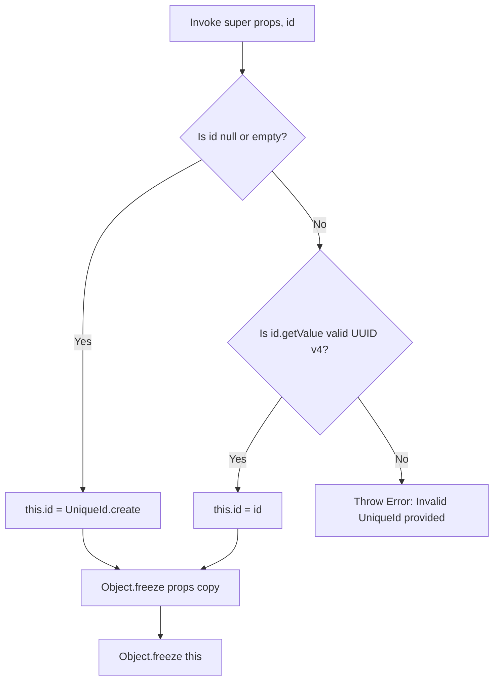

# Entities & Unique Identifiers

A **Domain Entity** is a domain object whose identity is defined by a stable,
unique identifier rather than by its attribute values. Properties may change
throughout the entity lifecycle; the identifier does not.

Xeno provides the abstract `Entity<T>` base class as the foundational primitive
for all domain entities and aggregate roots. It pairs with the `UniqueId` value
type to enforce nominal identity at compile time and prevent raw-string
identifier usage within domain boundaries.

---

## The `Entity<T>` Base Class

`Entity<T>` is an abstract class that encapsulates domain state, enforces
immutability at both the property and instance level, and exposes identity
through the `UniqueId` type wrapper. Concrete entity classes extend it and
cannot be instantiated directly.

```typescript
import type { Optional } from '@/shared'
import { Guards, GuidHelper } from '@/shared'

import { UniqueId } from '../unique_id/unique-id'
import type { IEntity } from './ientity.contracts'

export abstract class Entity<T> implements IEntity<T> {
  public readonly id: UniqueId
  private readonly props: T

  protected constructor(props: T, id: Optional<UniqueId> = undefined) {
    if (Guards.isNullOrEmpty(id)) {
      this.id = UniqueId.create()
    } else if (GuidHelper.isValid(id.getValue())) {
      this.id = id
    } else {
      throw new Error('Invalid UniqueId provided.')
    }
    this.props = Object.freeze({ ...props })
    Object.freeze(this)
  }

  public getProps(): T {
    return structuredClone(this.props)
  }

  public getId(): UniqueId {
    return this.id
  }
}
```

### Behavioral Characteristics

- **Nominal Identity Protection:** The entity identifier is encapsulated within
  the `UniqueId` type wrapper. This prevents raw string values from being used
  as identifiers within domain boundaries and enables compile-time validation.
- **Two-Phase Immutability:** The constructor applies `Object.freeze` to a
  shallow copy of `props` before assigning it, then calls `Object.freeze(this)`
  on the entity instance. This isolates the property state from external
  mutation and prevents post-construction field assignment.
- **State Isolation via Deep Clone:** `getProps()` returns a deep copy of the
  internal state using `structuredClone()`. Callers cannot mutate the entity
  state by modifying the returned object.

---

## Implementation Guide

A concrete entity defines a typed `Props` interface and extends `Entity<T>`.
Because the base constructor seals the instance, state transitions are expressed
as copy-on-write operations that return a new entity instance.

### Defining an Entity

```typescript
import { Entity, Optional, UniqueId } from '@xeno/core'

export interface ProductProps {
  name: string
  sku: string
  priceInCents: number
  isAvailable: boolean
}

export class ProductEntity extends Entity<ProductProps> {
  private constructor(props: ProductProps, id?: Optional<UniqueId>) {
    super(props, id)
  }

  public static create(
    name: string,
    sku: string,
    priceInCents: number,
  ): ProductEntity {
    return new ProductEntity({
      name,
      sku,
      priceInCents,
      isAvailable: true,
    })
  }

  public static reconstitute(id: UniqueId, props: ProductProps): ProductEntity {
    return new ProductEntity(props, id)
  }

  public get name(): string {
    return this.getProps().name
  }

  public get sku(): string {
    return this.getProps().sku
  }

  public get priceInCents(): number {
    return this.getProps().priceInCents
  }

  public updatePrice(newPriceInCents: number): ProductEntity {
    if (newPriceInCents < 0) {
      throw new Error('[Domain Violation] Product price cannot be negative.')
    }

    return new ProductEntity(
      {
        ...this.getProps(),
        priceInCents: newPriceInCents,
      },
      this.getId(),
    )
  }
}
```

### Accessing Identity in Handlers

Handlers interact with entity identity through the `getId()` and `getProps()`
getters defined on the base class contract.

```typescript
import { UniqueId } from '@xeno/core'
import { ProductEntity } from './product.entity'

export class ProductService {
  public async applyDiscount(product: ProductEntity): Promise<ProductEntity> {
    const productId: UniqueId = product.getId()
    const rawId: string = productId.getValue()

    console.info(`Applying discount to product: ${rawId}`)

    return product.updatePrice(Math.round(product.priceInCents * 0.9))
  }
}
```

---

## Constructor Invariants

On each call to `super(props, id)`, the constructor enforces the following
initialization sequence:



---

## Constraints & Limitations

- **Direct property mutation is not supported.** Assignments such as
  `this.getProps().name = 'New Name'` will fail silently or throw at runtime
  because the internal `props` reference is frozen. State transitions must be
  expressed as copy-on-write operations that return a new entity instance.
- **Raw string identifiers are not accepted.** Entity identifiers must be
  declared using the `UniqueId` type wrapper. Passing a plain `string` where a
  `UniqueId` is expected will produce a compile-time error.
- **Shallow freeze on `props`.** The constructor applies a shallow
  `Object.freeze` to the props copy. Nested objects within `props` are not
  deeply frozen; `getProps()` compensates for this by returning a deep clone via
  `structuredClone()`.

---

## Related

- [Value Objects & Defensive Immutability](./value-objects-defensive-immutability):
  Encapsulating attribute-level validation and immutability without identity
  constraints.
