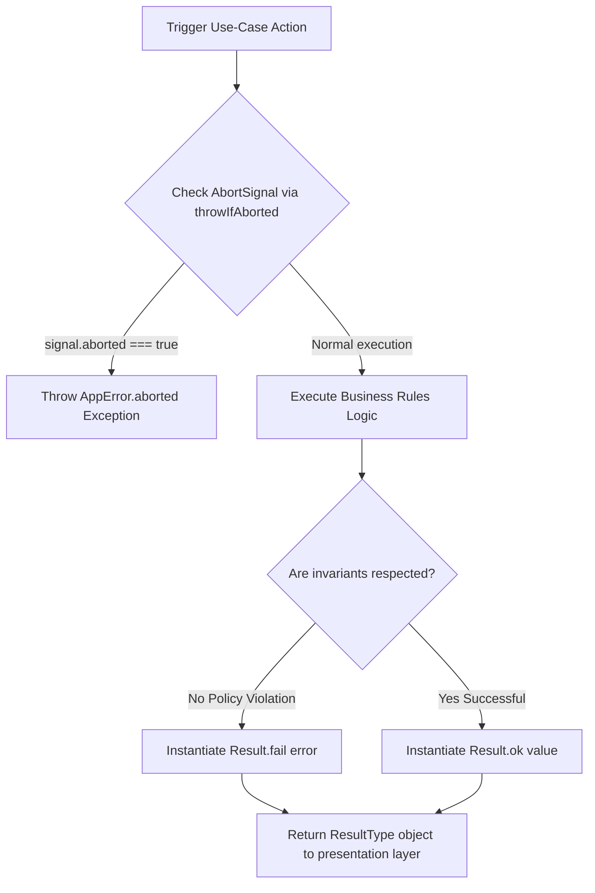

# Functional Monads & Core Errors

## What is it?

Graviton5 replaces traditional JavaScript exception throwing patterns with
explicit, type-safe functional error handling. The framework introduces the
**Result Monad** pattern via the `Result<TValue, TError>` class and standardizes
cross-cutting system faults through the **`AppError`** execution envelope.

---

## Why does it exist?

In standard Node.js applications, errors are typically handled by scattering
`throw new Error()` statements across different layers. This approach introduces
multiple architectural problems:

- **Hidden Break Points:** A thrown exception immediately breaks the current
  execution stack, creating unexpected exit paths that are difficult to trace
  static-analytically.
- **Loss of Type Safety:** The native JavaScript `catch (error)` block forces
  the error variable type to be `any` or `unknown`, losing all autocomplete and
  validation properties during compilation.
- **Layer Leakage:** Raw database exceptions or network timeout errors are
  frequently returned directly to user presentation interfaces, exposing
  internal security credentials and data structures.

By encapsulating both successful payloads and business rule violations inside an
immutable object wrapper, Graviton5 forces developers to declare error
boundaries explicitly. This guarantees that layer communications remain fully
type-safe.

---

## The `AppError` Architectural Envelope

The `AppError` class extends the native JavaScript `Error` primitive, enriching
it with machine-readable error codes, metadata context tracking, and HTTP status
codes ready for delivery.

### Internal Code Blueprint

```typescript
import type { Maybe, Optional } from '@/shared'
import {
  ERROR_CODE_MESSAGES,
  ERROR_CODES,
  Guards,
  STATUS_CODES,
} from '@/shared'

interface ErrorPayload {
  message: string
  code: string
  status: number
  name: string
  cause: Optional<unknown>
}

export class AppError extends Error {
  public readonly code: string
  public readonly status: number

  private constructor(payload: ErrorPayload) {
    super(payload.message)
    this.name = payload.name
    this.code = payload.code
    this.status = payload.status
    this.cause = payload.cause
  }

  public static create(payload: ErrorPayload): AppError {
    return new AppError(payload)
  }

  public static throw(payload: ErrorPayload): never {
    throw new AppError(payload)
  }

  public static aborted(name: string): AppError {
    return new AppError({
      code: ERROR_CODES.ABORTED,
      message: ERROR_CODE_MESSAGES[ERROR_CODES.ABORTED],
      status: STATUS_CODES.ABORTED,
      name,
      cause: new Error(
        'The client closed the connection before the server finished responding.',
      ),
    })
  }

  public static throwIfAborted(signal: Maybe<AbortSignal>, name: string): void {
    if (Guards.isDefined(signal) && signal.aborted) {
      throw AppError.aborted(name)
    }
  }
}
```

---

## The `Result` Monad Mechanics

The `Result<TValue, TError>` block encapsulates the status of an active
operation. It cannot be instantiated via direct assignment; developers must use
the explicit static factory methods `Result.ok()` or `Result.fail()`.

### The `ResultType` Alias

To simplify typical code declarations, Graviton5 exposes a clean utility type
mapping `TError` to an `AppError` fallback by default:

```typescript
export type ResultType<T, E = AppError> = Result<T, E>
```

---

## Practical Implementation Guide

### 1. Returning a Result from a Domain Service

This example demonstrates how to encapsulate business rules within a banking
transfer scenario without throwing native exceptions:

```typescript
import {
  STATUS_CODES,
  ERROR_CODES,
  Result,
  ResultType,
  AppError,
} from '@graviton5/core'

export interface TransferReceipt {
  transactionId: string
  processedAt: Date
}

export class BankAccount {
  private _balanceInCents: number = 50000 // €500.00 baseline

  /**
   * @description Processes a debit transaction safely via the Result monad.
   */
  public executeDebit(amountInCents: number): ResultType<TransferReceipt> {
    // 1. Invariant check: Domain Policy violation (Not an infrastructure crash)
    if (amountInCents > this._balanceInCents) {
      return Result.fail(
        AppError.create({
          name: 'InsufficientFundsException',
          code: ERROR_CODES.BAD_REQUEST,
          status: STATUS_CODES.BAD_REQUEST,
          message:
            'Operation rejected: Account holds insufficient funds to complete transfer.',
          cause: undefined,
        }),
      )
    }

    // 2. State Mutation execution
    this._balanceInCents -= amountInCents

    const receipt: TransferReceipt = {
      transactionId:
        'TXN-' + Math.random().toString(36).substring(7).toUpperCase(),
      processedAt: new Date(),
    }

    // 3. Return sealed success channel
    return Result.ok(receipt)
  }
}
```

### 2. Consuming and Processing Results in the Application Layer

When your application workflows receive a `Result` output, use the descriptive
access properties to unwrap the payload safely:

```typescript
import { BankAccount } from './bank-account.entity.js'

export class TransferUseCaseHandler {
  public async handle(
    command: { amount: number },
    signal?: AbortSignal,
  ): Promise<any> {
    // 1. Defensive Guard check: Stop execution instantly if client dropped connection
    AppError.throwIfAborted(signal, 'TransferUseCaseHandler.handle')

    const account = new BankAccount()
    const result = account.executeDebit(command.amount)

    // 2. Evaluate outcome path branching safely without try/catch blocks
    if (!result.isOk()) {
      const error = result.getErrorOrThrow()
      console.warn(
        `[Transfer Blocked] Code: ${error!.code}. Reason: ${error!.message}`,
      )

      return {
        success: false,
        error: { code: error!.code, message: error!.message },
      }
    }

    // 3. Unwrap the success payload securely
    const successReceipt = result.getValueOrThrow()
    return {
      success: true,
      data: successReceipt,
    }
  }
}
```

---

## Operational Lifecycle Topologies

The flowchart below visualizes how requests move through functional verification
checking blocks before mapping final structural responses:



---

## Technical Pitfalls to Avoid

- ❌ **Do not call `getValueOrThrow()` without checking `isOk()`:** Invoking
  property unwrapping parameters blindly on a failed execution outcome path will
  cause the internal container logic to throw a raw JavaScript exception,
  breaking runtime execution.
- ❌ **Do not use `Result` for catastrophic infrastructure failures:**
  Predictable domain rule violations (e.g., "SKU out of stock") belong inside a
  returned `Result.fail()`. Catastrophic, unexpected runtime infrastructure
  issues (such as an unreachable database pool or socket network loss) should be
  thrown as an actual `AppError.throw()` to let the framework exception pipeline
  catch and log it globally.

---

## Next Architecture Layer

Now that the core domain primitives, entities, value types, and monads are
established, progress to the execution environment mechanics:

- **[The Request-Identity Storage Lifecycle](../execution-context-middleware/request-identity-storage-lifecycle.md)**:
  Explore how authentication states and metadata are propagated safely across
  asynchronous thread continuations.
