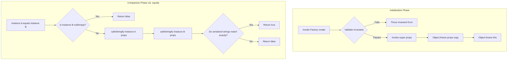

# Value Objects & Defensive Immutability

## What is it?

A **Value Object** is a structural building block in Domain-Driven Design (DDD)
that represents a descriptive aspect, measurement, or concept within the domain.
Unlike an Entity, a Value Object has no conceptual identity or unique
identifier. It is defined entirely by the combination of its properties; if two
separate Value Object instances hold the exact same attributes, they are
considered completely interchangeable and structurally equal.

## Why does it exist?

In complex business domains, primitives (such as raw `string` or `number`
variables) fail to encapsulate business invariants. For example, a raw number
cannot enforce that a financial balance cannot have a negative currency value,
and a raw string cannot guarantee that an email address matches required
internet formatting standards.

Leaking validation and comparison logic into application services causes code
duplication and bugs. The **`ValueObject<T>`** base class solves this by
wrapping raw values into rich, self-validating, and structurally immutable
domain primitives. This ensures that an invalid Value Object can never exist
within the system memory.

---

## Technical Specifications: The `ValueObject<T>` Base Class

The abstract `ValueObject<T>` class handles two main technical needs for value
types: **defensive immutability** and **structural equality comparison**.

```typescript
import type { Optional } from '@/shared'
import { Guards, StringHelper } from '@/shared'

import type { IValueObject } from './ivalue-object.contracts'

/**
 * The ValueObject class is an abstract implementation of the IValueObject interface, providing a base class for creating value objects in the domain. A value object is an immutable type that represents a concept or measurement in the domain, and its equality is based on its properties rather than its identity. The ValueObject class includes a constructor that initializes the properties of the value object and an equals method that compares two value objects for equality based on their properties.

   * 
   * @author XenoJS
   * @version 1.0.0
   * @since 2025-09-30
   * @link https://github.com/Mattia-Carcione/XenoJS 
   */
export abstract class ValueObject<T extends object> implements IValueObject<T> {
  /** @description The properties of the value object, which are immutable and define the value represented by the value object.
   *
   * @author XenoJS
   * @version 1.0.0
   * @since 2025-09-30
   * @link https://github.com/Mattia-Carcione/XenoJS
   */
  protected readonly _props: T

  protected constructor(props: T) {
    this._props = Object.freeze({ ...props })
    Object.freeze(this)
  }

  public equals(vo: Optional<IValueObject<T>> = undefined): boolean {
    if (Guards.isNullOrEmpty(vo) || Guards.isNullOrEmpty(vo.getValue())) {
      return false
    }

    return (
      StringHelper.safeStringify(this._props) ===
      StringHelper.safeStringify(vo.getValue())
    )
  }

  public getValue(): T {
    return { ...this._props }
  }

  public toString(): string {
    return StringHelper.safeStringify(this._props)
  }
}
```

### 1. Two-Tier Defensive Freezing

To prevent accidental state modification after instantiation, the base
constructor locks down both the properties shape and the instance surface area:

- It shallow-copies the incoming properties and immediately applies
  `Object.freeze()` to them.
- It freezes the entire execution interface of the instance via
  `Object.freeze(this)`.

### 2. Deterministic Structural Equality

Because Value Objects lack an internal ID tracking pointer, checking for
equality requires analyzing every underlying field. The framework optimizes this
by converting the frozen data shapes into deterministic strings using
`StringHelper.safeStringify()` and comparing them.

---

## Practical Implementation Guide

To create a Value Object, define its internal property shape interface and
extend `ValueObject<T>`. All validation rules must be executed within a static
factory method before invoking the private constructor.

### 1. Implementing a Multi-Property Value Object (`Money`)

```typescript
import { Guards, Optional, ValueObject } from '@graviton5/core'

// 1. Define the internal property signature
export interface MoneyProps {
  amountInCents: number
  currency: string
}

export class MoneyValueObject extends ValueObject<MoneyProps> {
  // 2. Hide constructor to enforce the use of the static factory method
  private constructor(props: MoneyProps) {
    super(props)
  }

  /**
   * @description Explicit factory method implementing validation invariants.
   */
  public static create(
    amountInCents: number,
    currency: string,
  ): MoneyValueObject {
    if (amountInCents < 0) {
      throw new Error('[Domain Violation] Monetary values cannot be negative.')
    }

    if (Guards.isNullOrEmpty(currency) || currency.trim().length !== 3) {
      throw new Error(
        '[Domain Violation] Currency must be a valid 3-letter ISO code.',
      )
    }

    return new MoneyValueObject({
      amountInCents,
      currency: currency.toUpperCase().trim(),
    })
  }

  // 3. Expose specific read-only accessors
  public get amountInCents(): number {
    return this._props.amountInCents
  }

  public get currency(): string {
    return this._props.currency
  }

  /**
   * @description Example business logic operation.
   * Modifying state requires returning a completely new instance copy.
   */
  public add(other: MoneyValueObject): MoneyValueObject {
    if (this.currency !== other.currency) {
      throw new Error(
        '[Domain Mismatch] Cannot add monetary values with different currencies.',
      )
    }

    return new MoneyValueObject({
      amountInCents: this.amountInCents + other.amountInCents,
      currency: this.currency,
    })
  }
}
```

### 2. Comparing and Consuming Value Objects

This example demonstrates how Value Objects are passed into domain entities and
checked for equality using the native `.equals()` interface:

```typescript
import { MoneyValueObject } from './money.value-object'

export class WalletEntity {
  private _balance: MoneyValueObject

  constructor(initialBalance: MoneyValueObject) {
    this._balance = initialBalance
  }

  public deposit(amount: MoneyValueObject): void {
    // Business operation returning a clean, immutable copy
    this._balance = this._balance.add(amount)
  }

  public hasSameBalanceAs(otherWallet: WalletEntity): boolean {
    const primaryBalance = this._balance.getValue() // { amountInCents: X, currency: 'Y' }

    // 1. Execute deep structural verification natively via stringification matching
    return this._balance.equals(otherWallet._balance)
  }
}

// Operational Usage Evaluation:
const priceA = MoneyValueObject.create(1500, 'EUR')
const priceB = MoneyValueObject.create(1500, 'EUR')
const priceC = MoneyValueObject.create(2500, 'EUR')

console.log(priceA.equals(priceB)) // Returns true (Structural attributes match perfectly)
console.log(priceA.equals(priceC)) // Returns false (Values differ)
```

---

## Internal Workflow Architecture

The diagram below outlines the runtime lifecycle of a Value Object from
initialization through structural string verification:



---

## Architectural Pitfalls to Avoid

- ❌ **Never embed identifier lookup coordinates:** If a class requires an
  `.id`, a `.getId()`, or a `UniqueId` instance tracker, it is **not** a Value
  Object—it belongs to the Entity layer. Value Objects must remain fully
  replaceable.
- ❌ **Do not bypass the static initialization factory:** Never expose public
  constructors that allow direct instantiation without executing business
  invariant checks. The instantiation loop must act as a strict guard boundary.
- ❌ **Avoid direct mutation hacks:** Do not attempt to dynamically alter
  properties via assignments like `this.getValue().amountInCents = 20`. The
  `.getValue()` method returns a fresh object copy `{ ...this._props }`, so any
  direct modifications will modify the copy and fail to apply to the actual
  domain value type.

---

## Next Steps

Now that you have implemented entity mapping tracking and value-type validation
primitives, complete your domain layer knowledge by reviewing how execution
results are propagated safely:

- **[Functional Monads & Core Errors](./functional-monads-core-errors.md)**:
  Master the framework's native `Result` monad and unified error-handling
  patterns.
