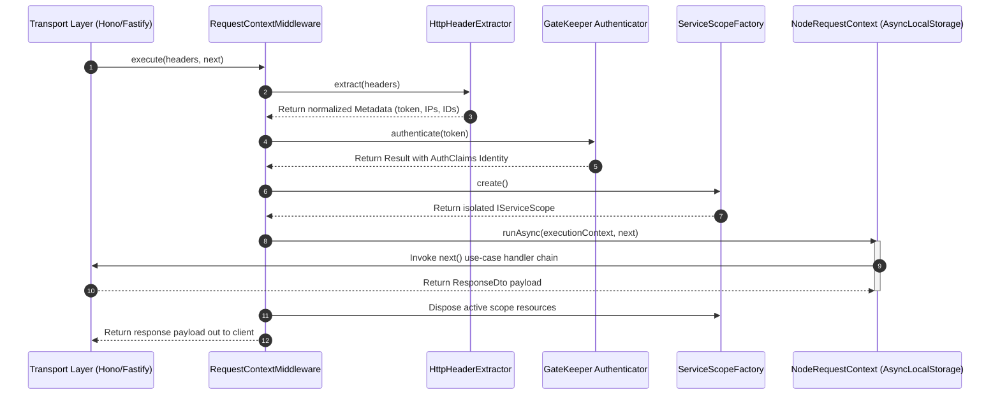

# Execution Context & Middleware Layer

This chapter documents the internal mechanisms that Graviton5 uses to capture,
isolate, and propagate operational state vectors—including multi-tenant
boundaries, security identities, and diagnostic tracing codes—down a concurrent
asynchronous execution thread without coupling application logic to raw HTTP
payloads.

---

## Chapter Summary

In a cloud-native or serverless ecosystem, tracking a request across decoupled
layers requires absolute context isolation. Graviton5 achieves this by using an
asynchronous storage boundary wrapper powered by Node.js `AsyncLocalStorage`.

Instead of passing an HTTP request or connection reference parameter through
every service constructor, the presentation transport layer uses specialized
middleware to capture metadata headers early. This data is formalized into an
immutable context envelope and injected into an isolated execution thread
sandbox, making it globally accessible but safely isolated from adjacent
requests.

---

## Document Directory

Navigate through the execution context and storage mechanics sequentially:

### 1. [The Request-Identity Storage Lifecycle](https://www.google.com/search?q=./request-identity-storage-lifecycle.md)

- **What it covers:** An exploration of how `RequestContextMiddleware`
  intercepts incoming header maps, invokes the authentication gatekeeper, wraps
  the operation within a scoped container boundary, and leverages
  `IRequestContext` to drive state transitions across asynchronous task
  sequences safely.

### 2. [ExecutionContext Composition](https://www.google.com/search?q=./execution-context-composition.md)

- **What it covers:** An anatomical breakdown of the `ExecutionContext`
  structural data shape, analyzing its three core sub-contexts: `identity` (user
  claims and tenant IDs), `network` (client IP addresses and unique request
  tracking tokens), and `tracing` (correlation IDs and execution start
  timestamps).

### 3. [Transportation Contract Metadata & Headers Extraction](https://www.google.com/search?q=./transportation-contract-metadata-headers.md)

- **What it covers:** A code-first operational guide to the agnostics extractor
  ecosystem. This section reviews how the framework splits extraction duties
  between `BearerTokenExtractor` and `HttpHeaderExtractor` to cleanly normalize
  raw string or array header definitions into a unified `Metadata` object model.

---

## The Request Isolation & Storage Sequence

The diagram below details the operational path an incoming transport payload
follows as it is parsed, authenticated, and bound into an isolated thread
context:

---

## Operational Best Practices

:::info Context Encapsulation Never store request-specific information inside
global singleton variables or class properties. Always interact with request
state using the thread-safe `IRequestContext` API instance to avoid
cross-request data leaks. :::

:::tip Telemetry Injection Always utilize the `tracing.correlationId` field
captured by this layer when executing external HTTP calls or outputting
structured log strings. This maintains complete execution traceability across
distinct distributed network services. :::

---

## Next Step

Review the core lifecycle orchestrator responsible for compiling request
environments:

- 👉
  **[Proceed to The Request-Identity Storage Lifecycle](./request-identity-storage-lifecycle.md)**
