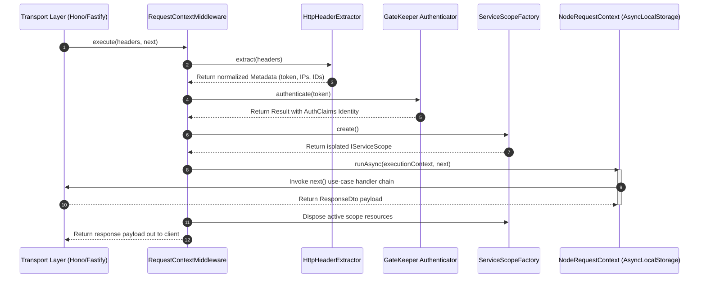

# Execution Context & Middleware Layer

## Definition

This chapter documents how Xeno captures request metadata, authenticates the
caller, and propagates a request-scoped ExecutionContext through asynchronous
operations.

## What It Is

Definition: The Execution Context and Middleware layer is the boundary between
incoming transport headers and request-scoped runtime state.

Behavior:

- RequestContextMiddleware reads headers through HttpHeaderExtractor
- Authentication is delegated to the GateKeeper
- A new IServiceScope is created per request
- ExecutionContext is executed through IRequestContext.runAsync
- Scope disposal is enforced in finally

Effect: Application code accesses request identity, network, and tracing
metadata without passing raw HTTP objects through each service and Handler.

## How It Works

Definition: The current implementation composes and propagates request context
in a strict sequence.

Behavior:

- Metadata extraction:
  - Correlation ID and Request ID are parsed from headers
  - Missing IDs are generated
  - Token, client IP, and span ID are normalized
- Authentication:
  - GateKeeper.authenticate evaluates the extracted token
  - Failed authentication returns an error response envelope
- Context composition:
  - identity comes from authentication result
  - network contains requestId and clientIp
  - tracing contains correlationId, spanId, and startTime
  - scope is created via the scope factory
- Context propagation:
  - IRequestContext.runAsync stores ExecutionContext for the async flow
  - NodeRequestContext uses AsyncLocalStorage for store isolation
  - getContext returns a frozen shallow copy of the current store

Effect: Concurrent requests remain isolated while downstream components resolve
scoped dependencies and read contextual metadata.

## Why It Exists

Definition: The layer is designed to isolate request state and make it available
across asynchronous boundaries.

Behavior: Instead of propagating raw headers manually across constructors and
method signatures, the framework centralizes extraction and storage at
middleware entry.

Effect: This reduces parameter coupling and helps keep Domain, Application,
Infrastructure, and Presentation responsibilities separated.

## Document Directory

Read the chapter in this order:

### 1. [The Request-Identity Storage Lifecycle](./request-identity-storage-lifecycle)

Definition: Details the middleware orchestration from metadata extraction to
scope disposal.

Behavior: Focuses on RequestContextMiddleware, authentication flow, and
request-scoped execution.

Effect: Clarifies where context enters the pipeline and how it is kept isolated.

### 2. [ExecutionContext Composition](./execution-context-composition)

Definition: Describes the ExecutionContext shape.

Behavior: Breaks down identity, network, tracing, and scope components.

Effect: Helps Command and Query handlers consume context consistently.

### 3. [Transportation Contract Metadata & Headers Extraction](./transportation-contract-metadata-headers)

Definition: Documents the header extraction contract.

Behavior: Covers BearerTokenExtractor and HttpHeaderExtractor normalization
rules.

Effect: Ensures stable metadata mapping from transport headers to internal
models.

## Example

The sequence below summarizes the request isolation flow:

## Constraints / Limitations

Definition: The current implementation provides request isolation with explicit
operational boundaries.

Behavior:

- Store snapshots are shallow-frozen copies
- Error responses in middleware use fallback system codes on unexpected
  exceptions
- Correct behavior depends on executing request flows through middleware entry
  points

Effect: Custom integrations should keep middleware ordering intact and avoid
bypassing RequestContextMiddleware for request-handling paths.

## Next Step

Continue with
[The Request-Identity Storage Lifecycle](./request-identity-storage-lifecycle).
