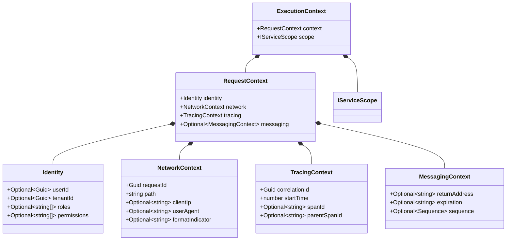

# ExecutionContext Composition

The ExecutionContext Composition page provides the programmatic layout, property
composition models, and mapper mechanics that govern the structured assembly of
request context variables within the core framework.

---

## Definition

`ExecutionContext` is the request-scoped data container used in Xeno to
encapsulate and propagate user identity parameters, network primitives,
distributed tracing spans, asynchronous messaging metadata, and isolated
container scope lifetimes across concurrent thread operations.

---

## What It Is

Definition: `ExecutionContext` is a core domain contract comprising two
top-level property nodes: `context` and `scope`.

Behavior:

- **`context`**: An explicit `RequestContext` structure that contains the
  following sub-contexts:
  - `identity`: Encapsulates authenticated claims, identifiers, roles, and
    fine-grained permissions.
  - `network`: Records transport boundary definitions, client network origins,
    and execution tracking route paths.
  - `tracing`: Manages correlation IDs and high-precision timing benchmarks
    across application boundaries.
  - `messaging`: Captures transient queue metrics, message lifetimes, and
    sequencing arrays for message-based workflows.
- **`scope`**: An active `IServiceScope` instance initialized per transaction to
  manage request-scoped dependency lifecycles.

Effect: Use-case command handlers, query handlers, logging drivers, idempotency
stores, and authorization boundaries consume identical metadata states without
direct dependencies on transport layer primitives.

---

## How It Works

Definition: The context is programmatically assembled at the presentation
ingress tier and bound to the thread via an explicit storage boundary.

Behavior:

- The `RequestContextMiddleware` intercepts inbound traffic, resolves security
  credentials, and calls the frozen `ContextMapper.map()` engine to compile
  metadata arrays into an integrated `ExecutionContext` instance.
- `Identity` variables are mapped directly from the post-authentication claims
  provided by the `GateKeeper` utility.
- `NetworkContext` variables extract the transactional `requestId`, along with
  `clientIp`, `userAgent`, `formatIndicator`, and the targeting endpoint `path`.
- `TracingContext` variables compute the precise initialization microsecond
  (`startTime: Date.now()`) while carrying the active `spanId` and
  `parentSpanId` descriptors.
- `MessagingContext` is conditionally appended by evaluate checks inside
  `_buildMessagingContext` if the incoming payload carries sequence keys, data
  expirations, or return addresses.
- The compiled object is passed into `IRequestContext.runAsync()`, storing the
  reference inside `AsyncLocalStorage` across asynchronous V8 runtime execution
  blocks.

Effect: Downstream use cases lookup thread-isolated state parameters
deterministically, protecting adjacent parallel requests from data pollution or
memory crossing.

---

## Structural Anatomy

Definition: The structural layout below models the explicit contract-level
relationships and property constraints governing the runtime context types:



Effect: The type anatomy establishes a structured contract, rendering system
metadata fully predictable and mockable across testing layers.

---

## Why It Exists

Definition: The composition tier isolates business use cases and application
modules from low-level network transport protocols and framework-specific
request structures.

Behavior: Rather than leaking library-dependent routing parameters deep into the
core layers, presentation mappers extract and freeze primitive metadata
variables into domain-compliant sub-types immediately upon request ingress.

Effect: The core application retains pure, transport-agnostic business
operations, allowing the underlying transport driver to transition seamlessly
between HTTP daemons and distributed message brokers without breaking use-case
interfaces.

---

## Example

Definition: The following blueprint details programmatic context registration
alongside use-case context state resolution:

### 1. Context Infrastructure Registration

The storage provider is mounted into the container graph during the early
bootstrap sequence by invoking the `.addContext()` configuration macro:

```typescript
// src/bootstrap.ts
import { AppBuilder } from '@xeno/core'

export async function bootstrap() {
  const builder = new AppBuilder()

  // Hydrates the service container with context parsing and storage factory components
  builder.addContext()

  return await builder.build()
}
```

### 2. Consuming Context-Aware Sub-Types within Handlers

Downstream handlers or repository classes inject the type-safe `IRequestContext`
wrapper to parse context properties seamlessly during execution:

```typescript
// src/application/queries/get-tenant-analytics.handler.ts
import { IRequestContext, ExecutionContext } from '@xeno/core'

export class GetTenantAnalyticsQueryHandler {
  // Inject the request-scoped storage manager into the constructor
  constructor(
    private readonly _contextAccessor: IRequestContext<ExecutionContext>,
  ) {}

  public async handle(): Promise<{
    tenantPartition: string
    clientPath: string
  }> {
    // 1. Unwrapt the active thread-local storage data cell
    const threadContext = this._contextAccessor.getContext()

    if (!threadContext) {
      throw new Error(
        'Execution context is missing in the active request flow.',
      )
    }

    // 2. Extrapolate structured metadata blocks cleanly
    const { identity, network } = threadContext.context

    if (!identity.tenantId) {
      throw new Error(
        'Tenant context metadata is required to evaluate analytics records.',
      )
    }

    return {
      tenantPartition: identity.tenantId,
      clientPath: network.path, // Access route path agnostically
    }
  }
}
```

---

## Constraints & Limitations

- **Shallow-Frozen Invariant Objects**: Context objects returned by the storage
  manager are shallow-frozen configurations. Attempting to overwrite properties
  or dynamically re-assign permission values during active execution loops is
  prohibited.
- **Dependency Scope Invariants**: Scoped container services (`scope`) are
  tightly bound to the lifecycle of the active request thread. Storing
  references to scoped containers or request contexts inside long-lived
  Singleton components causes memory crossover faults and data leakage across
  threads.
- **Asynchronous Loop Boundary Deadlines**: Metadata properties remain
  tracking-active exclusively for call stacks running inside the `runAsync()`
  middleware closure. Spawning unawaited, detached asynchronous logic escapes
  the storage wireframe, meaning detached sub-threads lose access to context
  mappings.

---

## Next Step

Continue with
[Transportation Contract Metadata & Headers Extraction](./transportation-contract-metadata-headers)
to discover how transport blocks map raw network packets into standardized
system metadata.
