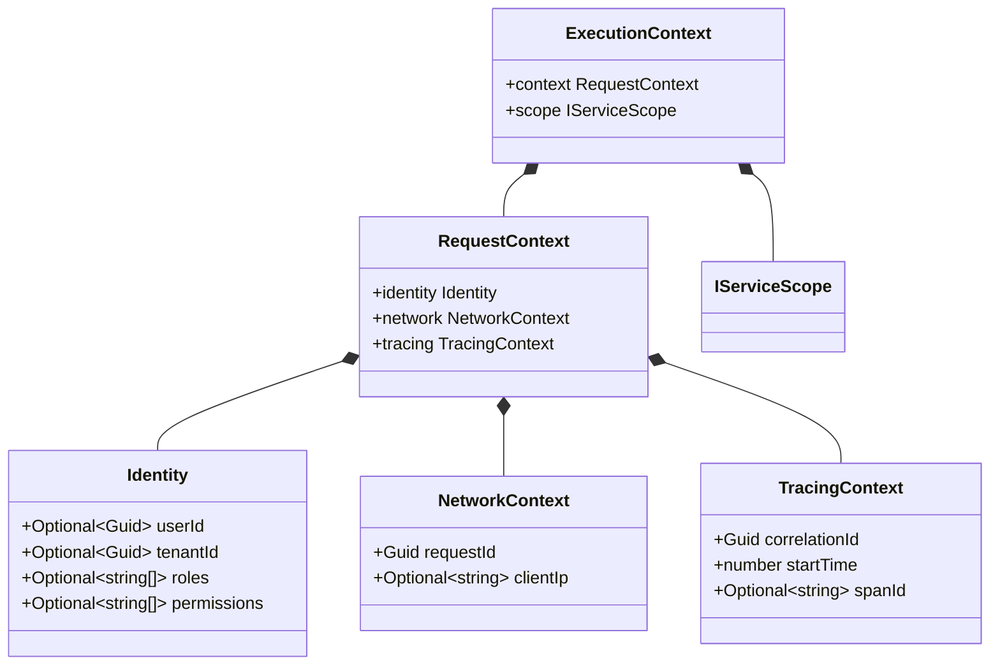

# ExecutionContext Composition

## Definition

ExecutionContext is the request-scoped container used in Xeno to propagate
identity, network, tracing, and scoped dependencies across asynchronous
operations.

## What It Is

Definition: ExecutionContext is a Domain contract with two top-level fields:
`context` and `scope`.

Behavior:

- `context` is a RequestContext that includes:
  - `identity` (Identity)
  - `network` (NetworkContext)
  - `tracing` (TracingContext)
- `scope` is an IServiceScope created per request

Effect: Command Handler, Query Handler, logging, idempotency, and authorization
flows can consume the same request metadata and scoped dependencies without
transport coupling.

## How It Works

Definition: ExecutionContext is created in middleware and propagated through
IRequestContext.runAsync.

Behavior:

- RequestContextMiddleware composes ExecutionContext after header extraction and
  authentication
- Identity is provided by GateKeeper authentication output
- Network includes requestId and clientIp
- Tracing includes correlationId, startTime, and spanId
- A new IServiceScope is attached and disposed when request processing ends
- NodeRequestContext stores the context through AsyncLocalStorage

Effect: Each asynchronous request chain resolves isolated context data and
scoped services.

## Structural Anatomy

Definition: The diagram reflects the current contract-level composition.

Behavior: ExecutionContext contains RequestContext and IServiceScope.
RequestContext is split into Identity, NetworkContext, and TracingContext.

Effect: The type model makes request metadata explicit and testable.



## Why It Exists

Definition: The contract is designed to decouple Application and Domain logic
from raw transport objects.

Behavior: Instead of passing framework-specific request models through every
layer, middleware maps and stores only the fields required by business and
observability flows.

Effect: Code remains transport-agnostic and easier to validate in unit tests.

## Example

Definition: The following snippets show context registration and context
consumption.

Behavior:

- Registration enables context services in the container
- Consumption reads the active context through IRequestContext

Effect: Handlers can enforce tenant, role, and tracing-aware behavior.

### Context Registration

```typescript
import { AppBuilder } from '@xeno/core'

export async function bootstrap() {
  const builder = new AppBuilder()

  builder.addContext()

  return await builder.build()
}
```

### Consuming Context Data

```typescript
import { IRequestContext, ExecutionContext } from '@xeno/core'

export class GetTenantAnalyticsQueryHandler {
  constructor(
    private readonly _contextAccessor: IRequestContext<ExecutionContext>,
  ) {}

  public async handle(): Promise<{
    tenantPartition: string
    processedAt: number
  }> {
    const threadContext = this._contextAccessor.getContext()

    if (!threadContext) {
      throw new Error(
        'Execution context is missing in the active request flow.',
      )
    }

    const { identity } = threadContext.context

    if (!identity.tenantId) {
      throw new Error('Tenant context is required for this query.')
    }

    const activeTenantId = identity.tenantId

    return {
      tenantPartition: activeTenantId,
      processedAt: Date.now(),
    }
  }
}
```

## Constraints / Limitations

Definition: ExecutionContext composition has explicit operational constraints in
the current implementation.

Behavior:

- Context snapshots returned by NodeRequestContext are shallow-frozen copies
- Mutable nested objects are not deeply frozen by default
- Context is available only when code executes inside runAsync middleware flow
- Scope lifecycle is request-bound and should not be reused across requests

Effect: Services should read context on demand and avoid persisting
request-scoped state in Singleton components.

## Next Step

Continue with
[Transportation Contract Metadata & Headers Extraction](./transportation-contract-metadata-headers.md).
