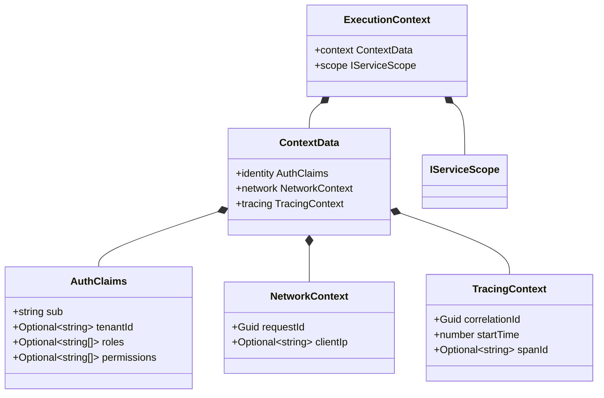

# ExecutionContext Composition

## Introduction

The **`ExecutionContext`** is the strongly-typed structural data model that
encapsulates the complete runtime state of an active asynchronous request thread
within Graviton5. It serves as a unified container combining security clearance
profiles, network topology attributes, transaction tracing tokens, and the
localized dependency injection scope.

---

## Why it Exists: Contextual Decoupling

Downstream software layers (such as application use-case handlers or
infrastructure repositories) frequently require access to environmental
indicators to enforce operational boundaries. Examples include:

- Verifying a caller's permissions during command dispatching.

- Segmenting multi-tenant database transactions.

- Appending a correlation ID to distributed logging outputs.

Instead of exposing raw presentation layer models (such as Express requests or
Fastify context properties) to the core domain, Graviton5 normalizes these
variables into an agnostically structured object. This isolation allows your
core application logic to remain fully operational and testable outside of
network delivery grids.

---

## Structural Anatomy of `ExecutionContext`

The `ExecutionContext` object is composed of a nested `context` record and an
operational `scope` reference:



### 1. The Core Composition Object

The primary wrapper layout exposed across thread boundaries contains two fields:

- **`context`**: Holds the structured tracking details (Identity, Network,
  Tracing).

- **`scope`**: Refers to the isolated `IServiceScope` instance generated for the
  request.

### 2. The Identity Sub-Context (`AuthClaims`)

Extracted from validated authorization tokens, this sub-context models the
security permissions of the caller:

- **`sub`**: The unique identifier string representing the authenticated subject
  or user.

- **`tenantId`**: An optional identifier used to implement data separation in
  multi-tenant software systems.

- **`roles`**: An array listing the authorization roles assigned to the subject.

- **`permissions`**: An array listing the fine-grained operational permissions
  granted to the subject.

### 3. The Network Sub-Context (`NetworkContext`)

Captures volatile transmission criteria from the presentation layer:

- **`requestId`**: A unique, cryptographically random `Guid` tracking token
  assigned to the physical request.

- **`clientIp`**: An optional string tracking the source IP address, parsed from
  headers like `X-Forwarded-For`.

### 4. The Tracing Sub-Context (`TracingContext`)

Manages distributed telemetry metrics across microservices:

- **`correlationId`**: A shared `Guid` sequence that persists across network
  boundaries to group related operations.

- **`startTime`**: A high-precision Unix epoch millisecond timestamp capturing
  exactly when the request entered the middleware boundary.

- **`spanId`**: An optional distributed tracking identifier used to integrate
  with external telemetry aggregators.

---

## Practical Implementation Guide: Consuming Context Data

Downstream components can safely access the active `ExecutionContext` by
injecting the `IRequestContext` wrapper token. The following blueprint
demonstrates how a query handler can leverage this to enforce tenant isolation
rules:

```typescript
import { IRequestContext, ExecutionContext } from '@graviton5/core'
import { INJECTION_TOKENS } from '@graviton5/core'

export class GetTenantAnalyticsQueryHandler {
  // 1. Inject the agnostics context accessor token
  constructor(
    private readonly _contextAccessor: IRequestContext<ExecutionContext>,
  ) {}

  public async handle(query: any): Promise<any> {
    // 2. Safely extract the active execution context block
    const threadContext = this._contextAccessor.getContext()

    if (!threadContext) {
      throw new Error(
        '[Context Fault] Execution context is missing in the active thread.',
      )
    }

    // 3. Extract the isolated identity properties
    const { identity } = threadContext.context

    // 4. Enforce strict multi-tenant boundary checks
    if (!identity.tenantId) {
      throw new Error(
        '[Security Fault] Multi-tenant queries require a valid tenant context identifier.',
      )
    }

    const activeTenantId: string = identity.tenantId
    console.log(
      `[Query Dispatched] Fetching data partition for tenant keyspace: ${activeTenantId}`,
    )

    // Execute tenant-isolated business operations...
    return {
      tenantPartition: activeTenantId,
      processedAt: Date.now(),
    }
  }
}
```

---

## Technical Pitfalls to Avoid

- ❌ **Do not cache context states inside Singleton scopes:** Never assign the
  output of `_contextAccessor.getContext()` to a local class property inside a
  service configured with a Singleton lifetime. Doing so locks that specific
  request's context in memory globally, exposing subsequent requests to data
  corruption and cross-tenant security leaks.

- ❌ **Do not modify context properties inline:** The sub-contexts managed
  within `ExecutionContext` should be treated as immutable read-only records.
  Altering variables like `identity.tenantId` dynamically during a request
  breaks auditing guarantees and can destabilize downstream pipeline components.

---

## Next Steps

Now that you understand the internal composition of the execution context,
explore the mechanisms used to parse and extract these fields from raw transport
requests:

- 👉
  **[Proceed to Transportation Contract Metadata & Headers Extraction](./transportation-contract-metadata-headers.md)**
