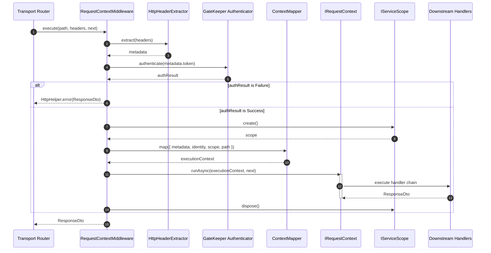

# The Request-Identity Storage Lifecycle

## Definition

The Request-Identity Storage Lifecycle is the request-scoped flow that extracts
metadata parameters, authenticates system identity signatures, constructs an
integrated `ExecutionContext`, runs the pipeline within isolated asynchronous
thread storage (`IRequestContext`), and programmatically disposes of scoped
container dependencies.

## What It Is

Definition: This lifecycle is implemented by the `RequestContextMiddleware` and
is backed by a local `AsyncLocalStorage` isolation model (`NodeRequestContext`).

Behavior:

- Incoming HTTP or message headers are parsed and normalized into a unified
  `Metadata` layout.
- The `GateKeeper` authenticator validates the extracted bearer token (if it was
  provided).
- An immutable `ExecutionContext` object is assembled, aggregating segregated
  `identity`, `network`, `tracing`, and `messaging` context blocks along with
  the active container `scope`.
- The `IRequestContext.runAsync()` block propagates the context reference safely
  across asynchronous V8 event-loop ticks.
- The request-scoped container reference (`IServiceScope`) is explicitly cleaned
  up within a structural `finally` guard.

Effect: Each execution track preserves strict data isolation across concurrent
multi-tenant transaction streams, providing downstream handlers and core
behaviors with uniform context lookup primitives.

---

## How It Works

Definition: The middleware follows a deterministic, sequential control loop to
parse and handle request execution configurations safely.

Behavior:

1. **Initialize Fallback Identifiers**: Generates a default `correlationId`,
   `requestId`, and initial tracking `spanId`, while assigning the standard
   format indicator to `application/json`.
2. **Extract Metadata Primitives**: Invokes `HttpHeaderExtractor` to parse
   correlation, request, span, and parent span identifiers, while extracting the
   bearer token, client IP address, user-agent string, asynchronous return
   address, sequence metadata, and expiration timestamps.
3. **Authenticate Session Credentials**: If the token was provided, Forwards it
   string to `GateKeeper.authenticate()`. On authentication failure, execution
   short-circuits, returning a standardized `HttpHelper.error()` payload
   accompanied by the specific error status and matching `Content-Type` format
   indicator. Alternatevly, if the token wasn't provided the GateKeeper returns
   a user Guest.
4. **Compose the Execution Context**: Initializes a new transient request
   container scope (`this._factoryScope.create()`) and maps the aggregated
   variables into a structured `ExecutionContext` instance using
   `ContextMapper.map()`. This automatically populates the `network` block
   (including the execution route `path`), the `tracing` layer (storing
   high-precision `startTime`), and conditional `messaging` parameters.
5. **Run the Asynchronous Request Chain**: Executes the downstream handler or
   route handler closure encapsulated safely within the
   `IRequestContext.runAsync()` storage boundary.
6. **Finalize and Eject Resources**: Traps unexpected infrastructure crashes,
   mapping them into a uniform `SYSTEM_ERROR` `ResponseDto` containing the raw
   error message string. It then executes an explicit `scope.dispose()` routine
   inside a mandatory `finally` block to protect memory pools from resource
   leaks.

Effect: The pipeline preserves absolute request thread isolation, enforces clean
dependency boundary lifecycles, and standardizes outbound content negotiations
across all execution paths.

---

## Example

Definition: The diagram below reflects the detailed execution sequence and
dependency interactions managed by the middleware subsystem:



---

## Why It Exists

Definition: The lifecycle decouples request state evaluation from primary
business domain logic, abstracting transport and communication protocol
mechanics.

Behavior: Context parsing and security checks run once at the presentation
boundary, utilizing thread-local storage primitives to pass state variables
invisibly instead of polluting class constructors or method arguments.

Effect: This eliminates structural parameter coupling, allowing Application,
Domain, Infrastructure, and Presentation layers to evolve independently with
clean architectural boundaries.

---

## Registration Example

Definition: Context mapping and middleware interceptors must be programmatically
enabled within the application bootstrap manifest.

Behavior: Invoking `.addContext()` populates the container registry with the
`IRequestContext` storage engine, while `.addMiddlewares()` mounts the required
transport processing components.

Effect: Request-handling routes execute with context propagation enabled.

```typescript
import { AppBuilder } from '@xeno/core'

export async function bootstrap() {
  const builder = new AppBuilder()

  // Registers ContextModule and MiddlewareModule sequentially into the IoC container
  builder.addContext().addMiddlewares()

  return await builder.build()
}
```

---

## Usage Example

Definition: HTTP endpoints or message routing adapters execute use-case
boundaries by passing headers and context variables directly through the
resolved middleware instance.

Behavior: The transport layer invokes `middleware.execute(path, headers, next)`,
enabling the middleware to build and attach the execution sandbox prior to
computing any controller logic.

Effect: Controllers and handlers run with access to request identity and tracing
state.

```typescript
import { INJECTION_TOKENS } from '@xeno/core'

const middleware = container.resolve(INJECTION_TOKENS.MIDDLEWARE)
const statusController = container.resolve(STATUS_CONTROLLER_TOKEN)

app.get('/api/status', async (request, reply) => {
  // Pass the target route path and raw request headers into the middleware ring
  const responseDto = await middleware.execute(
    request.routerPath ?? request.url,
    request.headers as any,
    async () => {
      const qs = request.query as { verbose?: string }
      const payload = { verbose: qs.verbose === 'true' }
      return await statusController.handle(payload)
    },
  )

  reply.status(responseDto.status).send(responseDto.data)
})
```

---

## Constraints & Limitations

- **Middleware-Owned Request Container Lifecycles**: Container scope allocation
  and teardown parameters are managed strictly by the middleware loop.
  Downstream handlers or individual services must never invoke disposal commands
  on the active `IServiceScope` instance.
- **Context Availability Restricted to Asynchronous Storage Boundaries**:
  Context parameters are accessible exclusively inside paths wrapped by the
  `runAsync()` control loop. Firing unawaited or detached asynchronous
  operations (e.g., ad-hoc background logging macros) bypasses storage tracking,
  resulting in unresolved or undefined context profiles.
- **Shallow-Frozen Invariant Copies**: Metadata snapshots mapped into storage
  structures are shallow-frozen configurations. Attempting to dynamically alter
  metadata keys or swap identity permissions during a request lifecycle is
  prohibited and will result in runtime exceptions.

---

## Next Step

Continue with [Execution Context Composition](./execution-context-composition)
to discover how metadata maps onto structural domain context sub-types.
