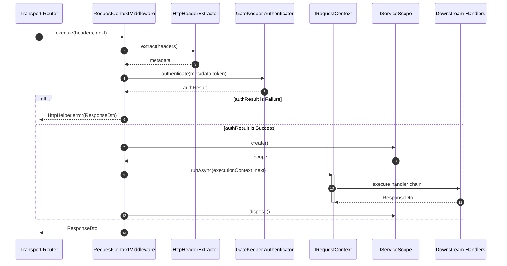

# The Request-Identity Storage Lifecycle

## Definition

The Request-Identity Storage Lifecycle is the request-scoped flow that extracts
metadata, authenticates identity, creates ExecutionContext, runs the pipeline
inside IRequestContext storage, and disposes scoped dependencies.

## What It Is

Definition: This lifecycle is implemented by RequestContextMiddleware and backed
by NodeRequestContext (AsyncLocalStorage).

Behavior:

- Request headers are normalized into Metadata
- GateKeeper authenticates the extracted token
- ExecutionContext is composed with identity, network, tracing, and scope
- IRequestContext.runAsync propagates the context across async calls
- IServiceScope is disposed in finally

Effect: Each request keeps isolated identity and tracing data while downstream
Command and Query handlers access consistent context.

## How It Works

Definition: The middleware follows a deterministic control flow with success,
auth-failure, and exception paths.

Behavior:

1. Initialize fallback identifiers:

- `correlationId = GuidHelper.generate()`
- `requestId = GuidHelper.generate()`

2. Extract metadata from headers:

- Override generated IDs when metadata includes valid values
- Extract token, client IP, and span ID

3. Authenticate:

- Call `GateKeeper.authenticate(meta.token)`
- On failure, return `HttpHelper.error(...)` with error code and status

4. Compose context:

- Build `network` with `requestId` and `clientIp`
- Build `tracing` with `correlationId`, `startTime`, and `spanId`
- Resolve authenticated `identity`
- Create request `scope` through scope factory
- Assemble `ExecutionContext`

5. Run request chain:

- Execute `IRequestContext.runAsync(executionContext, next)`

6. Finalize:

- On unexpected exceptions, return system error response
- In `finally`, dispose scope when defined

Effect: The pipeline preserves request isolation, provides consistent telemetry
fields, and enforces scope lifecycle boundaries.

## Example

Definition: The diagram below reflects the middleware lifecycle in the current
implementation.

Behavior: Metadata extraction, authentication, context composition, asynchronous
propagation, and scope disposal occur in sequence.

Effect: Request-specific state stays isolated and available to downstream
handlers.



## Why It Exists

Definition: The lifecycle isolates request state from transport payloads and
from parallel requests.

Behavior: Context capture happens once at middleware entry and is propagated
through AsyncLocalStorage instead of being passed through every constructor and
method.

Effect: This reduces parameter coupling and keeps Application, Domain,
Infrastructure, and Presentation boundaries cleaner.

## Registration Example

Definition: Context and middleware registration must be enabled at bootstrap.

Behavior: `addContext()` registers IRequestContext services; `addMiddlewares()`
registers middleware components including RequestContextMiddleware.

Effect: Request-handling routes execute with context propagation enabled.

```typescript
import { AppBuilder } from '@xeno/core'

export async function bootstrap() {
  const builder = new AppBuilder()

  builder.addContext().addMiddlewares()

  return await builder.build()
}
```

## Usage Example

Definition: Routes execute business handlers through the resolved middleware.

Behavior: `middleware.execute(headers, next)` composes context before invoking
`next`.

Effect: Controllers and handlers run with access to request identity and tracing
state.

```typescript
const middleware = container.resolve(INJECTION_TOKENS.MIDDLEWARE)
const statusController = container.resolve(STATUS_CONTROLLER_TOKEN)

app.get('/api/status', async (request, reply) => {
  const responseDto = await middleware.execute(
    request.headers as any,
    async () => {
      const qs = request.query as { verbose?: string }
      const payload = { verbose: qs.verbose === 'true' }
      return await statusController.handle(payload)
    },
  )

  console.log(responseDto)
})
```

## Constraints / Limitations

Definition: The current implementation has explicit lifecycle constraints.

Behavior:

- Scope disposal is middleware-owned; handlers should not dispose request scope
- Context availability depends on execution inside `runAsync`
- Unawaited detached async work may not observe the active request context
- NodeRequestContext snapshots are shallow-frozen copies

Effect: Handlers should read context on demand and avoid persisting
request-scoped state in Singleton services.

## Next Step

Continue with
[ExecutionContext Composition](./execution-context-composition.md).
