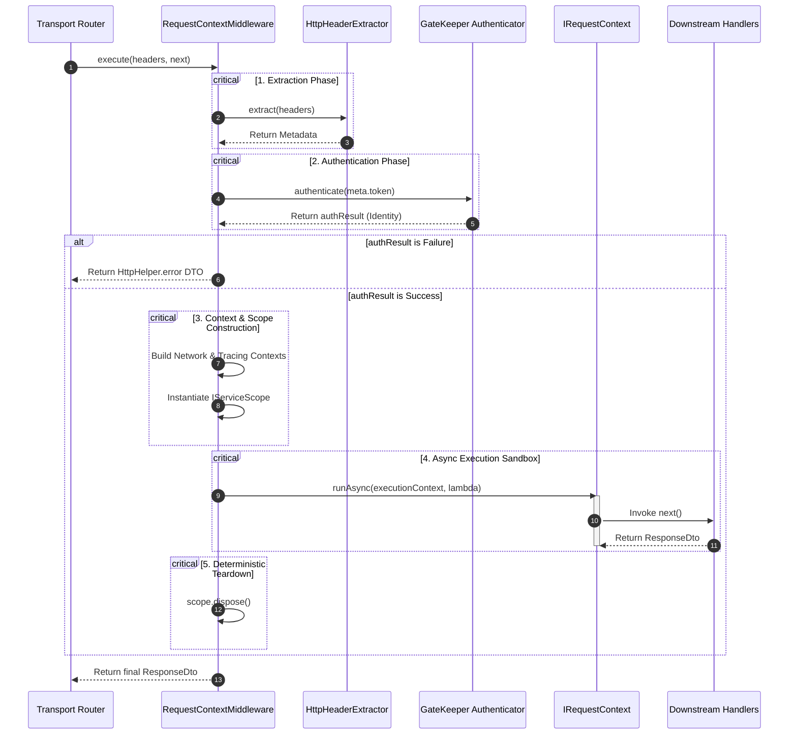

# The Request-Identity Storage Lifecycle

## What is it?

The **Request-Identity Storage Lifecycle** is the continuous process through
which an incoming transport request's metadata, network tracing parameters, and
user identity credentials are parsed, verified, isolated, and destroyed. This
execution flow is managed directly by the framework's
**`RequestContextMiddleware`**.

## Why does it exist?

In a high-throughput multi-tenant system, business logic must remain isolated
from concurrent requests executing on the same event loop. Passing
authentication headers, diagnostic tracing tokens, and multi-tenant keys as
explicit function parameters across layers causes tight coupling and introduces
severe data leak risks.

The identity storage lifecycle abstracts this concern. It intercepts the raw
transport data early, creates an isolated sandboxed execution zone via
`AsyncLocalStorage`, handles authentication, and ensures that resources are
deterministically garbage-collected when the operation finishes.

---

## Detailed Lifecycle Workflow

The lifecycle of an execution context progresses through six distinct
operational phases within the execution boundary of the
`RequestContextMiddleware`:



---

## Technical Source Code Deep Dive

The architectural implementation within
`presentation/middlewares/request.middleware.ts` outlines the exact
implementation mechanics governing this lifecycle loop:

```typescript
import type {
  ExecutionContext,
  IFactory,
  IGateKeeper,
  IMiddleware,
  IRequestContext,
  IServiceExtractor,
  IServiceScope,
  NetworkContext,
  TracingContext,
} from '@/domain'
import type { HttpHeaders, Metadata, Optional, ResponseDto } from '@/shared'
import {
  ERROR_CODE_MESSAGES,
  ERROR_CODES,
  Guards,
  GuidHelper,
  HttpHelper,
  STATUS_CODES,
} from '@/shared'

export class RequestContextMiddleware implements IMiddleware<HttpHeaders> {
  constructor(
    private readonly _requestContext: IRequestContext<ExecutionContext>,
    private readonly _extractor: IServiceExtractor<HttpHeaders, Metadata>,
    private readonly _gateKeeper: IGateKeeper,
    private readonly _factoryScope: IFactory<void, IServiceScope>,
  ) {}

  public async execute<T>(
    headers: HttpHeaders,
    next: () => Promise<ResponseDto<T>>,
  ): Promise<ResponseDto<T>> {
    // 1. Pre-allocation of tracking metrics
    let correlationId = GuidHelper.generate()
    let requestId = GuidHelper.generate()
    let scope: Optional<IServiceScope> = undefined

    try {
      // 2. Metadata Extraction Phase
      const meta = this._extractor.extract(headers)
      correlationId = meta.correlationId ?? correlationId
      requestId = meta.requestId ?? requestId

      // 3. Secure Gatekeeper Authentication Check
      const authResult = await this._gateKeeper.authenticate(meta.token)
      if (!authResult.isOk()) {
        const error = authResult.getErrorOrThrow()
        return HttpHelper.error({
          code: error.code,
          message: error.message,
          status: error.status,
          details: undefined,
          correlationId,
          requestId,
          customHeaders: undefined,
        })
      }

      // 4. Data Shape Compilation
      const network: NetworkContext = {
        requestId,
        clientIp: meta.clientIp,
      }
      const tracing: TracingContext = {
        correlationId,
        startTime: Date.now(),
        spanId: meta.spanId,
      }
      const identity = authResult.getValueOrThrow()

      // 5. Inversion of Control (IoC) Scope Provisioning
      scope = this._factoryScope.create()

      const executionContext: ExecutionContext = {
        context: {
          identity: identity!,
          network,
          tracing,
        },
        scope,
      }

      // 6. Async Execution Sandboxing
      return this._requestContext.runAsync(executionContext, async () => {
        return next()
      })
    } catch (error) {
      // 7. Disaster Recovery System Mapping
      return HttpHelper.error({
        code: ERROR_CODES.SYSTEM_ERROR,
        message: ERROR_CODE_MESSAGES[ERROR_CODES.SYSTEM_ERROR],
        status: STATUS_CODES.INTERNAL_SERVER_ERROR,
        details: error instanceof Error ? error.message : String(error),
        correlationId,
        requestId,
        customHeaders: undefined,
      })
    } finally {
      // 8. Deterministic Teardown Phase
      if (Guards.isDefined(scope)) {
        scope.dispose()
      }
    }
  }
}
```

---

## Detailed Step-by-Step Analysis

### Phase 1: Extraction & Invariant Normalization

The middleware generates fallback unique tracking variables using
`GuidHelper.generate()`. It then passes the raw `HttpHeaders` payload to the
injected `IServiceExtractor`. If the request contains existing tracing headers
(e.g., `X-Correlation-Id`, `X-Request-Id`), they override the defaults to
maintain end-to-end tracing across distributed microservices.

### Phase 2: Zero-Trust Authentication

The extracted token is passed to `_gateKeeper.authenticate(meta.token)`. If the
authentication check fails, the handler execution path is blocked, and the
middleware immediately short-circuits the request, returning a structured error
object. Downstream business code is completely inaccessible to unauthenticated
requests.

### Phase 3: Contextual Isolation Mapping

Once authenticated, the middleware builds the immutable sub-context boundaries
(`NetworkContext` and `TracingContext`) and triggers the scope factory to
provision an isolated `IServiceScope` for the execution thread.

### Phase 4: Thread Execution via `.runAsync()`

The completed `ExecutionContext` is mounted into the storage engine using
`_requestContext.runAsync()`. This ensures that any downstream database queries,
use-case commands, or telemetry logging operations can safely retrieve
request-specific properties without referencing raw transport layers.

### Phase 5: Deterministic Teardown Block

The complete sequence is wrapped inside a rigid `try/catch/finally` control
structure. Regardless of whether the execution chain completes successfully or
throws a catastrophic runtime exception, the `finally` block activates. It
checks if the `scope` variable was successfully initialized and executes
`scope.dispose()`, freeing up nested resources and preventing memory leaks.

---

## Common Architectural Pitfalls to Avoid

- ❌ **Manually Triggering Scope Disposals:** Do not invoke `.dispose()`
  manually on the active request scope inside your command or query handlers.
  The resource lifecycle is owned exclusively by the `RequestContextMiddleware`.
  Manually tearing down the scope will cause subsequent downstream pipeline
  behaviors to fail.

- ❌ **Losing Async Storage Across Unawaited Paths:** When invoking asynchronous
  operations inside your business handlers, always use the `await` keyword.
  Firing an unawaited floating Promise breaks the asynchronous execution stack
  continuation context, detaching the operation from its thread context and
  causing `_requestContext.getContext()` to return `undefined`.

---

## Next Architecture Layer

Now that the request context initialization and identity lifecycle mechanics are
established, explore how the context payload data is structured internally:

- 👉
  **[Proceed to ExecutionContext Composition](./execution-context-composition.md)**
