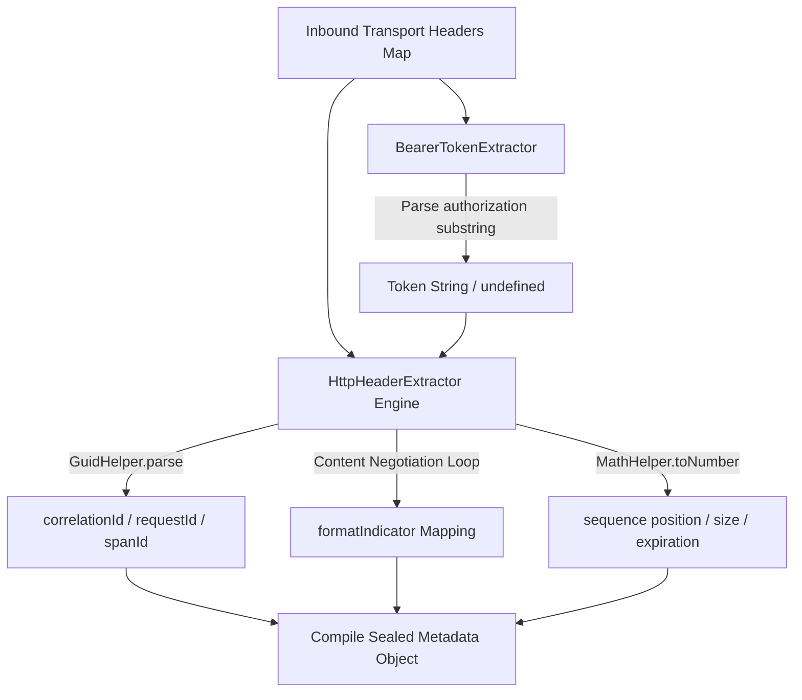

# Transportation Contract Metadata & Headers Extraction

The Transportation Contract Metadata & Headers Extraction documentation defines
the transport boundary rules, network packet parsing routines, and protocol
normalization matrices managed by the application entry adapters.

---

## Direct Definition Block

The metadata extraction layer normalizes raw inbound transport layer headers
into type-safe, system-compliant application metadata objects via the core
`IServiceExtractor` contract. By separating stream parsing rules from
application use cases, it ensures that transport anomalies or web client
specifications are fully abstracted at the network edge.

---

## The Network Normalization Paradigm

### What it is

The network normalization paradigm is an automated presentation-layer boundary
designed to strip transport protocol specifics and format variance from client
header configurations.

### How it works

The extraction infrastructure maps key-value dictionary records using
specialized extraction components. The engine evaluates string primitives or
string arrays uniformly, converting volatile wire-level information into frozen
data structures prior to route execution or authentication checking.

### Why it exists

Incoming network headers are notoriously irregular: keys deviate across
lowercase or title-case representations, token formats require complex substring
splitting, and tracking properties (such as sequence positions or execution
deadlines) arrive as plain strings rather than structural types. Scattering
ad-hoc parsing rules (`headers['x-request-id']`) inside use-case components
blocks unit testing, creates tight coupling to unique web frameworks, and
exposes the kernel to initialization faults if header vectors omit crucial keys.

---

## Subsystem Execution Flow

### What it is

The subsystem execution flow represents the sequential runtime checkpoints and
casting routines managed by the extractor drivers to compile a complete request
footprint.

### How it works

The extraction lifecycle processes incoming dictionary maps across a multi-stage
compilation track:

1. **Token Extraction Layer**: The `BearerTokenExtractor` queries the
   `authorization` index via `StringHelper.getSingleValue()`. If present, it
   checks for a case-insensitive prefix match using
   `.toLowerCase().startsWith('bearer ')` and cuts the authenticated substring
   via `.substring(7)`.
2. **Nominal ID Parsing**: The `HttpHeaderExtractor` reads tracking fields,
   casting `x-correlation-id`, `x-request-id`, and `x-span-id` values to valid
   unique identifiers using `GuidHelper.parse()`.
3. **Content Format Negotiation**: Evaluates the `accept` parameter. If it
   equals `*/*`, it drops the marker; otherwise, it computes the final system
   `formatIndicator` by applying a fallback evaluation loop:
   `accept ?? contentTypeHeader ?? 'application/json'`.
4. **Messaging Sequence Casting**: Inspects the presence of sequence metadata
   properties (`x-sequence-id`, `x-sequence-position`, `x-sequence-size`) and
   the timeout boundary header (`x-expiration`). If these text strings are
   defined, the engine programmatically maps them using `MathHelper.toNumber()`
   to assemble safe, structured numeric blocks.



### Why it exists

Enforcing explicit primitive validations and sub-type abstractions prevents
malformed or malicious network fields from interacting with deep domain models,
keeping error handling predictable and structured.

---

## Contract Definitions

### 1. Agnostic Extraction Interface

The foundation interface defines a singular execution contract, decoupling data
parsing from specific web libraries:

```typescript
export interface IServiceExtractor<TRequest, TResponse = unknown> {
  extract(headers: TRequest): TResponse
}
```

### 2. Concrete Bearer Client implementation

```typescript
import type { IServiceExtractor } from '@/domain'
import { Guards, type HttpHeaders, type Optional, StringHelper } from '@/shared'

export class BearerTokenExtractor implements IServiceExtractor<
  HttpHeaders,
  Optional<string>
> {
  public extract(headers: HttpHeaders): Optional<string> {
    const authHeader = StringHelper.getSingleValue(headers['authorization'])
    if (!Guards.isDefined(authHeader)) {
      return undefined
    }

    if (authHeader.toLowerCase().startsWith('bearer ')) {
      return authHeader.substring(7)
    }

    return undefined
  }
}
```

---

## Practical Implementation: Integrating a Custom Transport

The example below maps how a custom transport adapter or message queue
subscriber resolves the core extractor module from the service container to
normalize payloads agnostically:

```typescript
// src/presentation/adapters/custom-queue.adapter.ts
import type { HttpHeaders, IServiceContainer } from '@xeno/core'
import { INJECTION_TOKENS } from '@xeno/core'

export class CustomQueueAdapter {
  constructor(private readonly _container: IServiceContainer) {}

  /**
   * @description Intercepts amqp/kafka message properties and converts them to standard Metadata.
   */
  public async onMessageReceived(message: {
    properties: { headers: Record<string, any> }
  }): Promise<void> {
    // 1. Resolve the core extractor component using its nominal token
    const extractor = this._container.resolve(
      INJECTION_TOKENS.SERVICE_EXTRACTOR,
    )

    // 2. Cast raw message properties to the framework's compliant HttpHeaders layout
    const normalizedHeaders = message.properties.headers as HttpHeaders

    // 3. Extract the metadata footprint uniformly
    // Automatically handles token parsing, tracing boundaries, and sequence numbers
    const metadata = extractor.extract(normalizedHeaders)

    console.info(`Processed Inbound Intent. Request ID: ${metadata.requestId}`)
  }
}
```

---

## Architectural Constraints & Trade-offs

- **Array Header Value Collapse Invariants**: The underlying payload extraction
  helper (`StringHelper.getSingleValue()`) operates under strict array
  collapsing constraints. If a network client transmits an array of values for a
  unique header tracking key, the extraction driver selects and returns only the
  first index primitive, discarding subsequent fields.
- **Strict 7-Character Substring Authorization Rule**: The token extraction
  engine parses auth tokens strictly by evaluating the exact `"bearer "`
  character sequence. Custom tokens that deviate from this design pattern or
  prepend distinct identifiers (such as `"ApiKey "` prefixes) fail the
  validation branch and return `undefined`, requiring independent custom
  strategy extensions.

---

## Next Step

Continue with the core execution engine documentation:

- **[Proceed to CQRS Pipeline Architecture Index](../cqrs-pipeline-architecture/README)**
