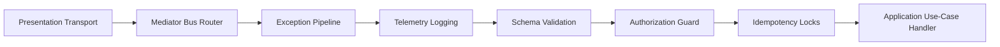

# Getting Started

The Getting Started documentation provides the foundational installation steps,
architectural principles, and entry-point configurations required to initialize
a Xeno application.

---

## What it is

The `Getting Started` module is the entry point to the Xeno framework ecosystem.
It establishes the configuration patterns, dependency structures, and CLI
commands needed to scaffold and run a decoupled TypeScript enterprise backend
application.

## How it works

The execution sequence initiates via the CLI scaffolding tool, which generates a
pre-configured directory structure separated into explicit architectural layers.
Applications boot linearly through a programmatic `AppBuilder` instance in the
entry module without relying on runtime decorator metadata analysis or
reflection scanning.

## Why it exists

This initialization strategy isolates business logic from infrastructure
concerns from the first line of code. By enforcing compile-time validation of
boundaries and programmatic dependency graphs, the system eliminates hidden
configuration side-effects and reduces runtime cold-start latency.

---

## Directory Overview

The introductory documentation is divided into separate, atomic modules
targeting specific operational phases:

### 1. [Introduction & Philosophy](./introduction-philosophy)

- **Definition:** A conceptual overview of the core architectural goals of the
  Xeno framework.
- **Behavior:** Explains the zero-reflection engine mechanics and
  peer-dependency lazy-loading execution model.
- **Effect:** Minimizes memory consumption and optimizes cold-start times within
  containerized and serverless environments.

### 2. [Architectural Layers & Boundaries](./architectural-layers-boundaries)

- **Definition:** A structural specification detailing the framework's
  concentric isolation onion model.
- **Behavior:** Defines the boundaries across the five distinct layers:
  `Shared`, `Domain`, `Application`, `Infrastructure`, and `Presentation`.
- **Effect:** Enforces strict code segregation verified at build time through
  static analysis (`eslint.config.mjs`) to eliminate layer bleeding.

### 3. [Why Choose Xeno? An Architectural Deep-Dive](./why-this-framework)

- **Definition:** A technical comparison analyzing the design trade-offs and
  structural choices implemented in the framework.
- **Behavior:** Outlines the native integration of CQRS pipelines, functional
  error handling, and `AsyncLocalStorage` request sandboxing.
- **Effect:** Displaces framework-specific runtime coupling with standard
  TypeScript design patterns.

### 4. [Quick Start Guide](https://www.google.com/search?q=./quick-start-guide)

- **Definition:** A step-by-step operational implementation manual for initial
  environment setup.
- **Behavior:** Guides the user through the `@xeno/create` interactive CLI
  wizard, `bootstrap.ts` setup, and programmatic module registration.
- **Effect:** Delivers a functional development environment with an operational
  CQRS execution path.

---

## Request Execution Flow

The flowchart below traces the sequential path an incoming transport payload
takes through the framework cross-cutting pipelines before reaching the
designated application handler:

> **Note on Core Pipeline Components:** Every component in this execution path
> executes sequentially. If a layer fails (e.g., Schema Validation fails or
> Idempotency Lock is active), the pipeline halts execution and returns the
> boundary error back to the Presentation Transport layer.

---

## Support and Open Source

Xeno is an MIT-licensed open-source project. Contributions, feature requests,
and community support guidelines are maintained within our dedicated
[Community and Open Source Support section](../community-open-source/support-appreciation).

## Next Steps

To begin implementation, proceed to the first core conceptual module:

- **[Proceed to Introduction & Philosophy](./introduction-philosophy)**
