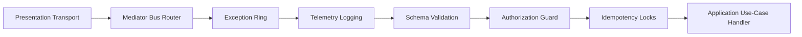

# Getting Started

Welcome to the official **Gantry5 Architecture and Operational Manual**. This
chapter introduces the core conceptual layout, engineering philosophy,
structural layers, and quick-scaffolding processes required to construct
ultra-high-performance, decoupled TypeScript enterprise services.

---

## Chapter Summary

The _Getting Started_ module establishes the fundamental technical and
philosophical pillars of the framework. By entirely bypassing runtime decorator
magic and metadata reflection scanning, Gantry5 aligns itself directly with
high-efficiency cloud-native and serverless paradigms, offering sub-millisecond
start sequences. Here, you will learn how the kernel structures business logic,
handles layer isolation via automated static analysis lint tooling, and compiles
the dependency graph linearly through a fluent configuration API.

---

## Document Directory

Navigate through the introductory path sequentially to understand how to design,
boot, and run your first domain-driven application:

### 1. [Introduction & Philosophy](./getting_started_introduction_philosophy.md)

- **What it covers:** An extensive review of why Gantry5 exists, its core
  zero-magic design principles, serverless/cloud cold-start performance
  benchmarks, and the optional peer dependency lazy-loading memory model.
- **Target Audience:** Solutions architects, technical leads, and software
  engineers evaluating the framework's runtime performance characteristics,
  transparent debugging capabilities, and trade-offs compared to traditional
  decorator-heavy node engines.

### 2. [Architectural Layers & Boundaries](./getting_started_architectural_layers_boundaries.md)

- **What it covers:** An anatomical breakdown of the five strictly isolated
  directory layers (`shared`, `domain`, `application`, `infrastructure`,
  `presentation`) that form the framework's concentric onion model. This
  document outlines the exact technical constraint rules checked at build-time
  via `eslint.config.mjs` to block architectural decay.
- **Target Audience:** Engineering leads and core developers who need to master
  import boundaries, directional data flows, and how to maintain absolute
  isolation between core business logic blueprints and concrete database/network
  drivers.

### 3. [Quick Start Guide](./getting_started_quick_start_guide.md)

- **What it covers:** A hands-on, code-first operational setup guide. It details
  how to scaffold a new application repository using the `@gantry5/create`
  interactive CLI wizard, organize separate `bootstrap.ts` and `main.ts` entry
  modules, assemble modules using the fluent `AppBuilder` instance, and dispatch
  secure transactions through the agnostics CQRS `Mediator` bus.
- **Target Audience:** Developers ready to spin up their local development
  environments, synchronize their IoC containers, and handle runtime command
  payloads using the functional `Result` monad flow.

---

## Core Pipeline Flow Map

Before diving into individual deep dives, familiarize yourself with the path an
incoming transport payload transits through the framework's sequential
cross-cutting behavior behaviors until it reaches your final handler:

---

## Support us

Nest is an MIT-licensed open source project. It can grow thanks to the support
of these awesome people. If you'd like to join them, please read more
[here](../community-open-source/support-appreciation.md).

## Next Step

Begin by exploring the core architectural motives and compilation benefits that
govern the system kernel:

- 👉
  **[Proceed to Introduction & Philosophy](./getting_started_introduction_philosophy.md)**
