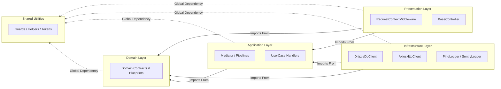

# Architectural Layers & Boundaries

The Architectural Layers & Boundaries documentation defines the structural
partitions, technical responsibilities, and directional dependency rules
governing code organization within a Xeno application workspace.

---

## Direct Definition Block

Architectural Layers & Boundaries define the static code isolation constraints
that separate pure business rules from volatile technical infrastructure and
network transport systems. These boundaries force dependencies to flow
exclusively from external presentation and data access layers inward toward the
abstract application and domain kernels.

---

## Directional Dependency Flow

### What it is

The directional dependency flow is a concentric architectural layout where inner
business cores remain entirely oblivious to external subsystems, frameworks,
databases, or transport mechanisms.

### How it works

The codebase is structured into five distinct concentric partitions. Code
components within an outer layer are permitted to import definitions from inner
rings, whereas inner components are completely restricted from referencing files
located in any outer ring.



### Why it exists

Allowing cross-layer leakage or bidirectional imports leads to tight coupling,
cascades compilation failures, and prevents infrastructure components from being
replaced without modifying business use cases. Enforcing an unyielding inward
flow guarantees that the core engineering logic remains decoupled and
independently testable.

---

## Layer Definitions & Technical Responsibilities

### 1. Shared Layer (`src/shared/`)

#### Definition

The Shared Layer is a global utility repository containing core code primitives,
algorithmic helpers, and technical types that are completely devoid of
domain-specific business policies.

#### Behavior

This ring provides low-level software utilities including type assertions
(`Guards`), timezone-agnostic calendar operations (`DateHelper`), unique
identifier creation utilities (`GuidHelper`), network protocol types
(`HttpHelper`), and explicit nominal identification utilities (`TokenHelper`).
All utility namespaces exported from this ring are structurally locked using
`Object.freeze`.

#### Effect

This isolation mechanism supplies stable, runtime-frozen primitives across the
entire application workspace while ensuring that low-level helpers cannot
introduce circular references or reference business rules.

### 2. Domain Layer (`src/domain/`)

#### Definition

The Domain Layer acts as the absolute source of truth for the software
ecosystem, encapsulating pure corporate policies, abstract contracts, and
foundational entity models.

#### Behavior

This ring defines domain structures, value-object structures, state-event
specifications, persistence boundaries (`IDbClient`, `IWriteDataSource`),
external connection blueprints (`IHttpClient`), and core security signatures
(`IAuthService`). It rejects any concrete infrastructure implementations or
runtime orchestration modules.

#### Effect

This isolates the core enterprise logic from external technology modifications,
ensuring that updates to third-party node packages do not compromise or require
modifications to core domain rules.

### 3. Application Layer (`src/application/`)

#### Definition

The Application Layer orchestrates transactional use cases and channels
execution payloads through decoupled message-routing abstractions.

#### Behavior

This layer incorporates command and query dispatch protocols, the central core
`Mediator` bus, the abstract `BaseHandler` that provides the current user in the
thread context, cross-cutting interceptor rings (`CompositePipeline`,
`ValidationPipeline`, `IdempotencyPipeline`), and structural object mapping
systems (`ClaimsIdentityMapper`). It coordinates technical actions exclusively
by interacting with abstract domain interfaces.

#### Effect

This decouples the system use cases from the network entry points that trigger
them, enabling identical command workflows to run interchangeably via HTTP,
message queues, or CLI interfaces.

### 4. Infrastructure Layer (`src/infrastructure/`)

#### Definition

The Infrastructure Layer maps the abstract application requirements and domain
boundaries onto physical hardware drivers, third-party libraries, and concrete
persistence engines.

#### Behavior

This ring implements operational data mappers, relational database drivers
(`DrizzleDbClient`, `Repository`, `ReadDao`), concrete network handlers
(`AxiosHttpClient`), telemetry and log exporters (`SentryLogger`, `PinoLogger`),
and the inversion-of-control container layout script (`AppBuilder`).

#### Effect

This encapsulates all volatile, external platform changes inside the outer rim
of the application, keeping technology selection changes from bleeding into
internal business-logic rings.

### 5. Presentation Layer (`src/presentation/`)

#### Definition

The Presentation Layer acts as the initial network transport entry gate that
receives external payload streams and deserializes them into internal execution
models.

#### Behavior

This layer hosts transport-specific base controllers (`BaseController`) and
state-extraction filters (`RequestContextMiddleware`). It intercepts incoming
raw headers, generates correlation tracking states, and translates HTTP or event
structures into secure application execution packets.

#### Effect

This design prevents client-facing communication networks from interacting
directly with database engines, enforcing a pattern where all client
interactions transit uniformly through the Mediator bus.

---

## Automated Boundary Enforcement via ESLint

### Definition

Automated Boundary Enforcement is a static analysis compile-time barrier that
programmatically intercepts and blocks architectural layer violations before
compilation.

### Behavior

The build process invokes native lint regulations using specific glob patterns
configured inside the `eslint.config.mjs` matrix. If an export statement
introduces an unauthorized layer cross-cut, the parser aborts immediately.

#### Prohibited Import Matrix

| Target File Location                | Forbidden Import Grids                                            | Architectural Guard Rationale                                                      |
| ----------------------------------- | ----------------------------------------------------------------- | ---------------------------------------------------------------------------------- |
| **`src/shared/**/\*.ts`\*\*         | `@/domain`, `@/application`, `@/infrastructure`, `@/presentation` | System utilities must operate independently of business context rules.             |
| **`src/domain/**/\*.ts`\*\*         | `@/application`, `@/infrastructure`, `@/presentation`             | Core business logic blueprints must remain insulated from frameworks.              |
| **`src/application/**/\*.ts`\*\*    | `@/infrastructure`, `@/presentation`                              | Core application use cases must rely on abstract contracts instead of tech stacks. |
| **`src/infrastructure/**/\*.ts`\*\* | `@/presentation`                                                  | Data adapters must remain oblivious to delivery mechanisms or route handlers.      |
| **`src/presentation/**/\*.ts`\*\*   | `@/infrastructure`                                                | Network transport endpoints are blocked from executing direct database operations. |

### Effect

This compile-time protection structure prevents structural decay and human
coding errors from degrading the architecture over time, guaranteeing complete
enforcement during continuous integration (CI) pipelines.

```javascript
// eslint.config.mjs excerpt enforcing layered isolation
{
  files: ['src/domain/**/*.ts'],
  rules: {
    'no-restricted-imports': [
      'error',
      {
        patterns: [
          {
            group: [
              '@/application', '@/application/**',
              '@/infrastructure', '@/infrastructure/**',
              '@/presentation', '@/presentation/**',
            ],
            message: 'Domain can only import from domain, shared, and external libraries.',
          },
        ],
      },
    ],
  },
}

```

---

## Architectural Constraints & Trade-offs

- **Obligatory Object Mapping Overhead**: To preserve layer purity, database
  record models cannot pass directly into application use cases. Infrastructure
  schemas must map explicitly into domain entities via programmatic
  `.toEntity()` conversions, introducing slight runtime allocation and
  translation code overhead.
- **Strict Command Path Redirection**: The presentation layer is prevented from
  calling infrastructure functions directly. Even simplistic, read-only
  telemetry or dashboard operations must navigate through a dedicated Query
  handler via the Mediator bus, increasing file counts for minimal query
  pathways.

---

## Next Steps

To proceed with application implementation, navigate to the following resources:

- **[Getting Started](./quick-start-guide)**: Initialize a new execution project
  workspace using the interactive CLI generator.
- **[CQRS System](../cqrs-pipeline-architecture/README)**: Construct decoupled
  Command and Query pipelines using the explicit Mediator abstraction layer.
- **[Dependency Injection Container](../core-architecture/README)**: Configure
  dependency token registration profiles inside the explicit `AppBuilder`
  workspace.
