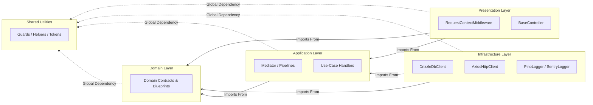

# Architectural Layers & Boundaries

## Introduction

Gantry5 enforces a strict **Clean Architecture** and **Domain-Driven Design
(DDD)** topology to ensure business logic remains isolated, highly testable, and
completely independent of third-party frameworks, delivery mechanisms, or
database engines.

Unlike frameworks that allow indiscriminate cross-layer importing, Gantry5
relies on directional code dependency boundaries. Dependencies flow exclusively
from the outside inward: outer infrastructural layers depend on inner abstract
application and domain layers, but the inner core remains entirely oblivious to
the infrastructure.

---

## The Directional Dependency Flow

The layout forms a concentric structural onion where the innermost ring
represents the absolute source of truth for business rules, and the outermost
ring handles volatile environment systems (I/O, web servers, transport
adapters).



---

## Layer Definitions & Technical Responsibilities

### 1. Shared Layer (`src/shared/`)

The `shared` folder contains globally accessible utilities, types, and constants
that are completely agnostics of business logic rules.

- **Contents:** Type guards (`Guards`), timezone-agnostic date manipulation
  (`DateHelper`), random ID generators (`GuidHelper`), HTTP normalization
  contracts (`HttpHelper`), mathematical tools (`MathHelper`), and Nominal Type
  Factory utilities (`TokenHelper`).
- **Immutability:** To secure runtime safety, every utility namespace within
  this layer is completely frozen via `Object.freeze`.
- **Strict Constraint:** This layer must remain completely isolated. It is
  banned from importing any file belonging to `domain`, `application`,
  `infrastructure`, or `presentation` .

### 2. Domain Layer (`src/domain/`)

The `domain` layer defines the business architecture, model abstractions, and
structural interfaces. It represents the core blueprint of the software
ecosystem.

- **Contents:** Entity definitions, Value Objects, Domain Events, abstract
  contracts for databases and clients (`IDbClient`, `IWriteDataSource`,
  `IHttpClient`), operational service signatures (`IAuthService`, `ILogger`),
  and specifications (`Specification`).
- **Strict Constraint:** The domain layer can only import from itself or from
  the `shared` utility layer . It is completely insulated from concrete
  infrastructure libraries like Knex, Drizzle, Axios, or Pino.

### 3. Application Layer (`src/application/`)

The `application` layer orchestrates use cases and directs data flow through the
CQRS Mediator pattern.

- **Contents:** Command and Query dispatch logs, the central `Mediator`
  coordinator, sequential Cross-Cutting behaviors (`CompositePipeline`,
  `LoggingPipeline`, `ValidationPipeline`, `IdempotencyPipeline`), and
  structural object data translation maps (`ClaimsIdentityMapper`).
- **Strict Constraint:** The application layer coordinates use cases by
  referencing `domain` interfaces, but it is strictly forbidden from referencing
  concrete `infrastructure` implementations .

### 4. Infrastructure Layer (`src/infrastructure/`)

The `infrastructure` layer bridges the framework kernel to concrete technical
execution tools and databases.

- **Contents:** Direct implementation maps targeting third-party
  software—including database orchestration adapters (`DrizzleDbClient`,
  `Repository`, `ReadDao`, `HardDeleteDataSource`), HTTP engine drivers
  (`AxiosHttpClient`), telemetry agents (`SentryLogger`, `PinoLogger`), and IoC
  system wire factories (`AppBuilder`, `INJECTION_TOKENS`).
- **Strict Constraint:** This layer is a service consumer to `application` and
  `domain`, implementing their technical needs while preventing technology
  choices from leaking into business-logic scopes .

### 5. Presentation Layer (`src/presentation/`)

The `presentation` layer acts as the initial boundary receiving external
operational context vectors.

- **Contents:** Abstract routing targets (`BaseController`) and state parsing
  orchestrators (`RequestContextMiddleware`) [cite: 1]. It handles input
  serialization and maps raw incoming headers into secure, managed execution
  thread storage scopes [cite: 1, 9].
- **Strict Constraint:** The presentation layer is strictly forbidden from
  importing components directly from the `infrastructure` layer, forcing all
  execution commands to transit uniformly through the `application` Mediator
  bus.

---

## Automated Boundary Enforcement via ESLint

To prevent developer human error from compromising these boundaries over time,
Gantry5 implements explicit static analysis constraints inside
`eslint.config.mjs` . If a developer attempts an illegal cross-layer import
statement, the build fails instantly during continuous integration.

Here is the exact architectural boundary map implemented via
`no-restricted-imports` :

| Target File Location        | Forbidden Import Grids                                            | Architectural Guard Rationale                                             |
| --------------------------- | ----------------------------------------------------------------- | ------------------------------------------------------------------------- |
| **`src/shared/**/\*.ts`\*\* | `@/domain`, `@/application`, `@/infrastructure`, `@/presentation` | Core system primitives must not depend on business logic context arrays . |

| |
**`src/domain/**/_.ts`** | `@/application`, `@/infrastructure`, `@/presentation` | Enterprise business specifications must remain free of frameworks or volatile delivery setups. | | **`src/application/\*\*/_.ts`** | `@/infrastructure`, `@/presentation` | Application orchestration must use interfaces, remaining isolated from specific tech stacks. | | **`src/infrastructure/**/\*.ts`**
| `@/presentation` | Data access adapters should be oblivious to web delivery
modes or controller routers . | |
**`src/presentation/**/\*.ts`** | `@/infrastructure` | Transport delivery layers
must not directly call database or caching services. |

### ESLint Configuration Code Blueprint

The underlying constraint grid configuration from `eslint.config.mjs` maps these
strict isolation boundaries using specific glob matching rules :

```javascript
// eslint.config.mjs excerpt enforcing layered isolation
{
  files: ['src/domain/**/*.ts'],
  rules: {
    'no-restricted-imports': [
      'error',
      {
        patterns: [
          {
            group: [
              '@/application', '@/application/**',
              '@/infrastructure', '@/infrastructure/**',
              '@/presentation', '@/presentation/**',
            ],
            message: 'domain can only import from domain, shared, and external libraries.',
          },
        ],
      },
    ],
  },
}

```

---

## Architectural Trade-offs & Best Practices

### What to Avoid ❌

- **Do not bypass the Mediator:** Never inject an infrastructure repository
  provider or read data access object directly into a `BaseController` subclass.
  All operations must transit through a use-case command or query via the
  Mediator [cite: 9].
- **Do not leak external database shapes:** Infrastructure DTO definitions
  (e.g., Drizzle schema items) must remain inside the infrastructure layer. The
  application must receive agnostically translated domain entities mapped via
  explicit `IMapper` components.
- **Do not use decorators for dependency mapping:** Avoid using
  reflection-driven annotations for IoC bindings. Rely exclusively on nominal
  symbols via `TokenHelper` to register services inside the `AppBuilder`
  configuration script.

### Recommended Patterns ✅

- **Eager Mapping via DTOs:** Ensure that when reading data through a `ReadDao`
  or updating through a `Repository`, database items are immediately converted
  to isolated models using `.toEntity()` transformations.
- **Strict Asynchronous Storage Safety:** Leverage `RequestContextMiddleware` to
  wrap incoming network profiles safely inside context thread scopes. Downstream
  handlers can then query tracing or multi-tenant variables through
  `IRequestContext` without breaking interface segregation.

---

## Next Steps

Now that the core architectural boundaries and automated lint restrictions are
clarified, explore how to assemble these modules at runtime:

- **[Quick Start Guide](./quick-start-guide.md)**: Master the composition
  mechanics of the fluent `AppBuilder` API engine. """
