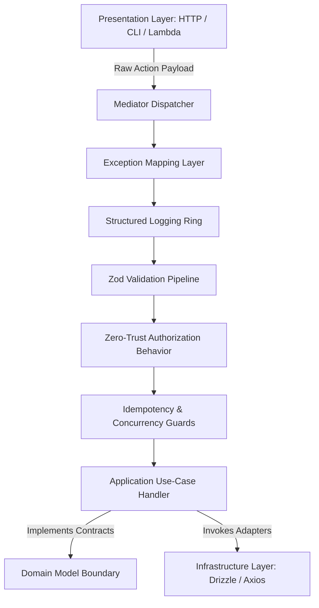

# Introduction & Philosophy

The Introduction & Philosophy page defines the core architectural principles,
runtime constraints, and design justifications governing the development of
applications built with the Xeno framework.

---

## Direct Definition Block

Xeno is an enterprise-grade architectural accelerator and agnostically decoupled
execution kernel for Node.js and TypeScript. It enforces the strict structural
boundaries of Domain-Driven Design (DDD), Command Query Responsibility
Segregation (CQRS), and Layered Clean Architecture at compile time without
relying on runtime metadata reflection.

---

## The Framework Paradigm

### What it is

The design paradigm of Xeno is a programmatic, compile-time-safe configuration
layout that completely rejects metadata reflection and decorator-driven
meta-programming (`@Module`, `@Injectable`, `@Param`).

### How it works

The system initializes linearly through an explicit, fluent `AppBuilder`
instance. Every service descriptor, dependency token, and command/query handler
configuration must be explicitly registered within the dependency injection
container during the application boot phase.

### Why it exists

Traditional runtime meta-programming introduces ambient side effects, high
computational overhead during reflection scanning, and severe cold-start latency
in serverless or edge environments. By implementing an explicit initialization
paradigm, Xeno isolates core business execution tracks from framework magic,
resulting in predictable stack traces and deterministic application startup
times.

---

## Core Engineering Principles

### 1. Zero-Decorator Runtime Execution

#### Definition

Zero-decorator runtime execution refers to an execution pipeline where the
application code contains no framework annotations or abstract reflection loops.

#### Behavior

The execution kernel relies strictly on native TypeScript interfaces and
explicit programmatic composition to resolve dependency trees and route commands
or queries to their designated handlers.

#### Effect

This eliminates runtime reflection scanning cycles entirely, reducing memory
allocation patterns during initialization and minimizing cold-start latency in
serverless environments such as AWS Lambda, Cloudflare Workers, or Vercel Edge.

### 2. Transparent DDD-First Layering

#### Definition

Transparent DDD-first layering is a structural organization pattern that divides
the codebase into four strictly isolated concentric rings.

#### Behavior

The framework segregates execution responsibility across the following specific
architectural boundaries:

- **Domain**: Houses pure business entities, value objects, domain events, and
  abstract repository boundaries.
- **Application**: Coordinates operational use cases, Command/Query handlers,
  Data Transfer Objects (DTOs), and Mediator pipelines.
- **Infrastructure**: Implements concrete database mappings (e.g., Drizzle ORM
  adapters), external HTTP network clients, caching drivers, and telemetry
  loggers.
- **Presentation**: Handles raw entry-point network protocols, including HTTP
  REST controllers, Hono/Fastify routing matrices, CLI entry targets, or cloud
  message brokers.

#### Effect

This design model isolates core business domains from infrastructure
modifications, ensuring that changes to technical layers do not degrade the
integrity of application use cases.

### 3. Agnostic Transport Abstraction

#### Definition

Agnostic transport abstraction is a framework detachment strategy that isolates
the core request execution pipeline from underlying HTTP or RPC communication
networks.

#### Behavior

Xeno functions exclusively as an internal processing node, communicating with
external delivery mechanisms solely via standard input/output payloads handled
by the internal Mediator dispatcher.

#### Effect

This enables software engineers to bind the framework core to any networking
library—such as Express, Fastify, Hono, or custom CLI daemons—without forcing
code updates within the internal application or domain layers.

### 4. Lazy-Loaded Peer Dependencies

#### Definition

Lazy-loaded peer dependencies represent a packaging pattern that isolates
external third-party utility components from the core framework package size.

#### Behavior

External framework integrations (including `drizzle-orm`, `zod`, `cockatiel`, or
`pino`) are defined as optional peer dependencies and are resolved via dynamic
`import()` statements executed only when explicitly activated in the
`AppBuilder` fluid configuration script.

#### Effect

This approach reduces package bloat and deployment weight by ensuring that
unused infrastructure drivers are never compiled or loaded into the active
memory runtime.

---

## Internal Runtime Pipeline Architecture

The lifecycle of an operational payload passing through the framework execution
sequence is represented below:

Every phase in this pipeline is sequential. If any middleware layer encouters a
validation error or processing restriction, execution aborts immediately and
routes the resulting structured failure payload directly back to the active
transport interface.

---

## Architectural Constraints & Trade-offs

- **Manual Configuration Over Automated Scanning**: Since Xeno completely
  rejects ambient directory scanning, every service handler and dependency
  container layout must be declared explicitly via the `AppBuilder` API. This
  results in verbose setup files compared to reflection-heavy frameworks.
- **Beta Lifecycle Contract Volatility**: The framework is in a public beta
  release track (`@xeno/core@1.0.0-beta.0`). Although core runtime structures
  are stable, specific public interface contracts remain subject to refinement
  before the final `v1.0.0` stabilization milestone.

---

## Next Steps

To proceed with application implementation, navigate to the following resources:

- **[Getting Started](./quick-start-guide.md)**: Initialize a new execution
  project workspace using the interactive CLI generator.
- **[Architecture Layers](./architectural-layers-boundaries.md)**: Review code
  isolation constraints and compilation policies enforced across domain
  boundaries.
- **[CQRS System](../cqrs-pipeline-architecture/README.md)**: Construct
  decoupled Command and Query pipelines using the explicit Mediator abstraction
  layer.
