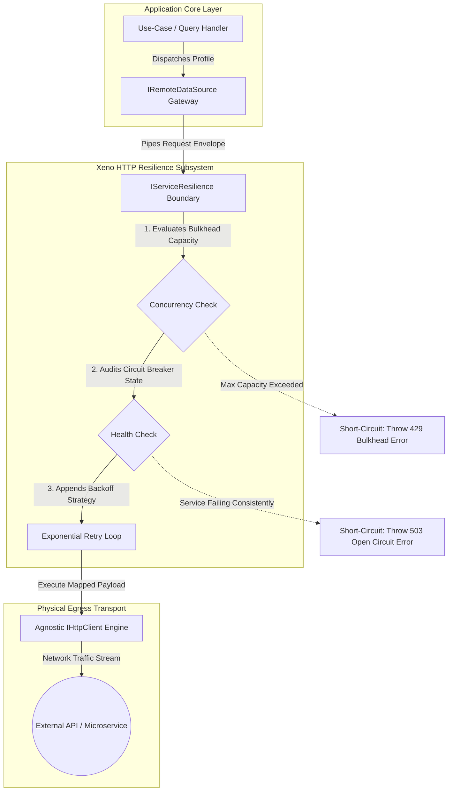

# HTTP Requests & Resilience Subsystem

The HTTP Requests & Resilience Subsystem documentation defines the
out-of-process communication frameworks, transaction interceptor configurations,
and automated self-healing policies managed by the egress communication ring.

---

## Direct Definition Block

The HTTP Requests & Resilience Subsystem is the central out-of-process
communication engine of Xeno. Integrated through the declarative
`HttpCoreModule`, it wraps external microservices, cloud targets, and
third-party REST API interactions inside a type-safe abstraction matrix,
applying policy-driven resilience guards (circuit breakers, exponential
backoffs, bulkhead quotas) to safeguard local process execution from remote
network degradation.

---

## The Remote Integration Paradigm

### What it is

The remote integration paradigm is a network isolation tier that detaches core
business domains from underlying physical transport libraries and volatile
external network states.

### How it works

The subsystem coordinates network requests across three specialized abstraction
layers:

1. **Agnostic HTTP Clients (`IHttpClient`)**: Handles communication properties
   (headers, body elements, socket deadlines) cleanly, remaining decoupled from
   concrete runtime drivers (such as Axios).
2. **Resilience Policies (`ResilienceConfig`)**: Wraps network communication
   streams inside policy state machines driven by Cockatiel primitives.
3. **Remote Data Sources (`IRemoteDataSource`)**: Normalizes outbound request
   actions into structured, fault-tolerant use-case data profiles.

### Why it exists

In distributed application environments, remote endpoints are naturally
untrusted, exposed to transit anomalies, and susceptible to severe performance
degradation. Scattering unmanaged clients or raw fetching code across use cases
causes boilerplate clutter, tightly couples the system to transient third-party
node modules, and introduces severe cascading failure vectors. If an external
system encounters severe lag, an unprotected local container blocks its
event-loop socket thread pools, leading to application crashes.

---

## Technical Architectural Topology

### What it is

The Technical Architectural Topology is the sequential interceptor chain that an
outbound payload navigates, checking bulkhead capacity limits and circuit status
matrices before invoking the physical network card.

### How it works

Outbound operations transit through a sequential multi-tier firewall sequence:

1. **Bulkhead Capacity Check**: Verifies active transaction allocations,
   preventing resource depletion by immediately short-circuiting requests if
   concurrent volume limits are crossed.
2. **Circuit Breaker Status Check**: Audits the dependency health record window.
   If failures cross threshold maps, the breaker changes state to Open,
   short-circuiting execution with an immediate failure monad.
3. **Exponential Retry Interception**: Wraps operations in backoff loops
   featuring randomized mathematical jitter to smooth out connection drops
   before delegating the payload to the concrete `IHttpClient` driver.



---

## Subsystem Document Directory

Navigate through the HTTP and resilience components sequentially:

### 1. [HTTP Client Configuration](./http-client-configuration)

- **What it covers:** Customizing baseline transport parameters, setting up
  default request headers, assigning base URLs, and wiring custom injection
  tokens for multi-service mapping.

### 2. [Resilience & Fault-Tolerance Policies](./resilience-policies)

- **What it covers:** Tuning backoff retry attempts, configuring circuit breaker
  consecutive failure thresholds, and establishing bulkhead concurrent isolation
  boundaries.

### 3. [Remote Data Source Gateways](./remote-data-source-gateways)

- **What it covers:** Consuming the integrated `IRemoteDataSource` wrapper to
  decouple outgoing requests from low-level infrastructure drivers.

---

## Core Bootstrapping Setup at a Glance

Because Xeno constructs graphs explicitly, multi-service connections and network
resilience traits are mapped programmatically via the fluent `.addHttpCore()`
initialization block inside `src/bootstrap.ts`:

```typescript
// src/bootstrap.ts
import { AppBuilder, TokenHelper } from '@xeno/core'
import type {
  IHttpClient,
  IRemoteDataSource,
  IServiceContainer,
} from '@xeno/core'

export const INVOICE_API_TOKEN =
  TokenHelper.createToken<IHttpClient>('InvoiceHttpClient')
export const INVOICE_DATA_SOURCE_TOKEN =
  TokenHelper.createToken<IRemoteDataSource>('InvoiceRemoteDataSource')

export async function bootstrap(): Promise<IServiceContainer> {
  const builder = new AppBuilder()

  builder
    // Wire the integrated HTTP Core Module into the dependency graph
    .addHttpCore((opts) => {
      // Assign the token key used to identify the gateway inside the container
      opts.dataSourceToken = INVOICE_DATA_SOURCE_TOKEN

      // Configure your connection properties
      opts.http.client.token = INVOICE_API_TOKEN
      opts.http.client.baseURL = 'https://api.enterprise-billing.internal/v1'
      opts.http.client.timeoutMs = 5000
      opts.http.client.defaultHeaders = { 'Content-Type': 'application/json' }

      // Layer self-healing resilience strategies around your client connections
      opts.resilience.retry.attempts = 3 // Retry transient failures up to 3 times
      opts.resilience.baseDelayMs = 200 // Initial backoff pause unit
      opts.resilience.maxDelayMs = 1000 // Cap exponential delay scaling at 1 second

      opts.resilience.circuitBreaker.consecutiveFailures = 5 // Trip breaker open after 5 consecutive crashes
      opts.resilience.circuitBreaker.halfOpenTimeoutMs = 30000 // Keep breaker open for 30 seconds before testing recovery

      opts.resilience.bulkhead.maxConcurrent = 10 // Limit concurrent connection streams to isolate capacity
    })

  return await builder.build()
}
```

---

## Architectural Constraints & Trade-offs

- **Mandatory Isolated Token Configurations Rules**: Every execution call to
  `.addHttpCore()` aggregates a distinct sub-container state mapping. Developers
  must declare fully unique and descriptive string IDs inside both
  `dataSourceToken` and `http.client.token` parameters. Reusing generic keys
  across distinct APIs creates dependency mapping collisions, corrupting
  container graph compilation.
- **Overhead of Dual Timeout Synchronization**: Setting tight global network
  socket timeouts requires synchronization with individual use-case deadlines.
  If an individual request descriptor timeout configuration is structured longer
  than the primary mediator execution window, parent thread cancellation fires
  first, generating mismatched telemetry warning logs.

---

## Next Steps

Learn how to define, secure, and specialize outgoing HTTP transport connections:

- **[Proceed to HTTP Client Configuration](./http-client-configuration)**
