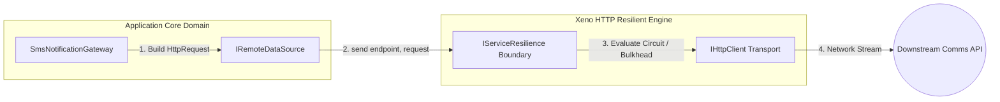

# Remote Data Source Gateways

The Remote Data Source Gateways documentation defines the outbound egress
interfaces, payload descriptor contracts, and programmatic bootstrap
registration rules managed by the egress communication ring.

---

## Direct Definition Block

The `IRemoteDataSource` gateway represents the outermost egress interface within
the Xeno HTTP subsystem. Operating as an anti-corruption layer within the
infrastructure ring, it intercepts standardized `HttpRequest<TBody>` descriptors
and coordinates execution over physical networks, routing every transaction
through the configured Cockatiel resilience engine prior to invoking transport
libraries.

---

## The Anti-Corruption Paradigm

### What it is

The anti-corruption paradigm is a structural design wrapper that prevents
external API data contracts and third-party transport details from bleeding into
the core codebase.

### How it works

Rather than allowing application services or use-case handlers to invoke direct
network transport libraries, communication is routed through a uniform `.send()`
gateway abstraction method. Handlers pass a decoupled request envelope, treating
out-of-process fetches as an asynchronous input/output driver that automatically
inherits configured fault-tolerance guards.

### Why it exists

Directly injecting low-level HTTP transport clients into business components
presents severe engineering and maintainability hurdles. Exposing third-party
client method exceptions, network connection failures, or payload serialization
hooks pollutes upper application layer contracts. Furthermore, relying on
developers to manually wrap each fetching lifecycle inside a custom
error-handling loop means endpoints inevitably omit retry blocks, bulkhead
quotas, or fallback limits, introducing cascading resource starvation.

---

## The Remote Data Source Topology

### What it is

The Technical Architectural Topology is the execution sequence mapping out how
an outbound transaction passes through the core gateway to the resilient
execution engine.

### How it works

The execution infrastructure processes data flows via a multi-tier decoupling
loop:

1. **Payload Compilation**: The application service creates a structural request
   wrapper, passing parameters to the `IRemoteDataSource` contract interface.
2. **Resilience Routing**: The gateway maps the endpoint and pipes the request
   envelope to the `IServiceResilience` boundary.
3. **Transport Execution**: The resilience block evaluates circuit breakers and
   bulkhead slot allocations before forwarding the traffic to the physical
   `IHttpClient` driver.



### Why it exists

Centralizing outbound data propagation inside a structured, non-reflective
gateway separates business intention from communication network constraints,
enabling developers to modify or swap low-level transport drivers without
modifying core domain use cases.

---

## The `HttpRequest<TBody>` Contract

When making calls through the remote data source gateway, you pack your payload
into a structured `HttpRequest<TBody>` descriptor object. This contract exposes
several flexible properties to override or extend client settings on a
per-request basis:

- **`body`**: The request payload data object sent along with state-mutating
  operations (`POST`, `PUT`, `PATCH`).
- **`method`**: The targeting HTTP verb string identifier
  (`'GET' | 'POST' | 'PUT' | 'PATCH' | 'DELETE'`).
- **`signal`**: An optional `AbortSignal` token to enable early request
  cancellation if a client connection drops.
- **`query`**: An optional key-value dictionary map used to compile URL query
  parameters dynamically (e.g., `?page=1&status=active`).
- **`timeoutMs`**: An optional request-specific timeout override to enforce
  stricter thresholds for volatile execution paths.
- **`headers`**: An optional dictionary map to supply specialized query headers
  without touching global client presets.

---

## Practical Implementation: Writing an Outbound Gateway

The following class demonstrates how a developer writes an infrastructure data
access gateway, injecting the type-safe `IRemoteDataSource` instance and
utilizing the `HttpRequest` signature contract to send payloads out safely:

```typescript
// src/infrastructure/gateways/sms-notification.gateway.ts
import type { IRemoteDataSource, HttpRequest } from '@xeno/core'

interface SmsPayload {
  recipient: string
  body: string
}

export class SmsNotificationGateway {
  constructor(private readonly _notificationDataSource: IRemoteDataSource) {}

  /**
   * @description Dispatches an outbound SMS payload using the isolated notification client.
   */
  public async dispatchSmsAlert(
    phoneNumber: string,
    message: string,
    signal?: AbortSignal,
  ): Promise<void> {
    const payload: SmsPayload = { recipient: phoneNumber, body: message }

    const request: HttpRequest<SmsPayload> = {
      body: payload,
      signal,
      method: 'POST',
    }

    // Executes a POST request to: [https://push.comms-cluster.internal/sms/send](https://push.comms-cluster.internal/sms/send)
    // Automatically inherits default headers, timeout constraints, and resilience blocks
    await this._notificationDataSource.send('/sms/send', request)
  }
}
```

---

## Bootstrapping Configuration Loop

To register multiple isolated remote data source gateways alongside their
respective transport clients and resilience limits, execute the `.addHttpCore()`
setup method within `src/bootstrap.ts`. Each distinct block pairs a
`dataSourceToken` to its private `http.client.token` handle smoothly:

```typescript
// src/bootstrap.ts
import { AppBuilder, TokenHelper } from '@xeno/core'
import type {
  IServiceContainer,
  IHttpClient,
  IRemoteDataSource,
} from '@xeno/core'

export const PAYMENT_CLIENT_TOKEN =
  TokenHelper.createToken<IHttpClient>('PaymentHttpClient')
export const NOTIFICATION_CLIENT_TOKEN = TokenHelper.createToken<IHttpClient>(
  'NotificationHttpClient',
)

export const PAYMENT_DATA_SOURCE_TOKEN =
  TokenHelper.createToken<IRemoteDataSource>('PaymentRemoteDataSource')
export const NOTIFICATION_DATA_SOURCE_TOKEN =
  TokenHelper.createToken<IRemoteDataSource>('NotificationRemoteDataSource')

export async function bootstrap(): Promise<IServiceContainer> {
  const builder = new AppBuilder()

  builder
    .addContext()
    .addLogger()

    // 1. Configure the Isolated Payment Gateway Connection Channel
    .addHttpCore((opts) => {
      opts.dataSourceToken = PAYMENT_DATA_SOURCE_TOKEN
      opts.http.client.token = PAYMENT_CLIENT_TOKEN
      opts.http.client.baseURL =
        '[https://api.stripe-mock.internal/v2](https://api.stripe-mock.internal/v2)'
      opts.http.client.timeoutMs = 3000 // Short timeout for critical transactional paths
      opts.http.client.defaultHeaders = {
        'Accept': 'application/json',
        'X-Provider-Key': process.env.PAYMENT_PROVIDER_SECRET ?? 'secret-key',
      }
      opts.resilience.retry.attempts = 3
      opts.resilience.circuitBreaker.consecutiveFailures = 5
    })

    // 2. Configure the Isolated Notification Service Channel
    .addHttpCore((opts) => {
      opts.dataSourceToken = NOTIFICATION_DATA_SOURCE_TOKEN
      opts.http.client.token = NOTIFICATION_CLIENT_TOKEN
      opts.http.client.baseURL =
        '[https://push.comms-cluster.internal](https://push.comms-cluster.internal)'
      opts.http.client.timeoutMs = 8000 // Longer timeout allowed for background notifications
      opts.http.client.defaultHeaders = {
        'Content-Type': 'application/json',
        'X-Application-Identifier': 'XenoCoreApp',
      }
      opts.resilience.retry.attempts = 3
      opts.resilience.circuitBreaker.consecutiveFailures = 5
    })

  return await builder.build()
}
```

---

## Architectural Constraints & Trade-offs

- **Strict Requirement for Explicit `HttpRequest` Wrap Matrices**: The gateway
  implementation requires an absolute `HttpRequest` structural wrapper object
  inside the second argument slot of the `.send()` action. Attempting to feed
  raw body data maps directly (e.g., `await gateway.send('/route', payload)`)
  breaks compilation layouts or throws runtime mapping exceptions, as parameters
  cannot be extrapolated without an explicit descriptor object.
- **Compulsory Cancellation Token Propagation**: Application services must
  programmatically append the operational thread cancel token to the
  `request.signal` field inside the gateway call layers. Neglecting explicit
  forward propagation deactivates cancellation listeners inside underlying
  transport adapters, causing stale or detached external connections to consume
  network sockets long after client threads drop off.

---

## Next Steps

You have completed the **Xeno HTTP Architecture Layer** guide suite. Return to
the main architecture dashboard index or explore caching configurations:

- **[Return to Subsystem Architecture Index](./README.md)**
- **[Proceed to Caching Configurations](../caching-idempotency-store/README.md)**
