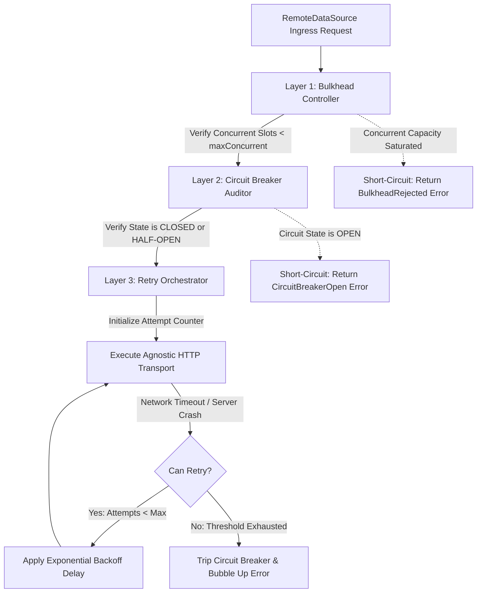

# Resilience & Fault-Tolerance Policies

The Resilience & Fault-Tolerance Policies documentation defines the programmatic
retry loops, failure state machines, and concurrency limits managed by the
out-of-process egress protection layer.

---

## Direct Definition Block

The Resilience Subsystem is a policy-driven fault-handling matrix embedded
within Xeno's outbound communication infrastructure. Handled globally via the
programmatic `.addHttpCore()` bootstrap method, it utilizes Cockatiel engine
configurations to wrap external network connections inside isolated runtime
guards—combining exponential backoff retries, stateful circuit breakers, and
bulkhead quotas into an integrated transaction interceptor sequence.

---

## The Distributed Stability Paradigm

### What it is

The distributed stability paradigm is an architectural defense-in-depth layout
designed to intercept transient network failures and isolate downstream
degradation from the local core application.

### How it works

The architecture applies three concentric policy rings around outgoing HTTP
transport requests, evaluating remote server responses against rigid state
machines before letting traffic interact with local processes:

- **Bulkhead Isolation**: Restricts concurrent connection streams, preventing
  resource exhaustion from compromising independent container components.
- **Circuit Breaker Tracking**: Monitors outbound exception thresholds, opening
  its state to block traffic completely if a service fails consistently.
- **Exponential Retry Loops**: Catches transient network dropouts and
  reschedules transmission attempts using staggered delay scaling.

### Why it exists

External microservices, third-party REST APIs, and remote cloud dependencies are
naturally untrusted environments prone to abrupt partitions, server timeouts,
and socket crashes. Making unmanaged connections inside application use cases
introduces cascading thread pool starvation: if a single remote system
encounters severe latency, an unprotected local host blocks its event-loop
socket thread pools waiting for dead streams, leading to application crashes.

---

## The Resilience Execution Topology

### What it is

The Technical Architectural Topology is the deterministic, top-down routing
order that outbound payload envelopes navigate prior to physical network
dispatch.

### How it works

Outbound operations transit through a sequential multi-tier firewall sequence:

1. **Layer 1: Bulkhead Controller**: Validates active asynchronous transaction
   slots. If concurrent volume limits are crossed, it immediately returns a
   `BulkheadRejected` failure monad.
2. **Layer 2: Circuit Breaker Auditor**: Assesses target host health. If the
   circuit state matches `OPEN`, it short-circuits execution with a
   `CircuitBreakerOpen` error envelope, preventing useless traffic from hitting
   the failing dependency.
3. **Layer 3: Retry Orchestrator**: Triggers an execution retry control loop. If
   a call encounters a timeout or server drop, it calculates an exponential
   pause unit, applying randomized mathematical jitter to stagger retry waves
   before invoking the physical `IHttpClient` driver.



---

## Canonical Policy Defaults Reference

Xeno utilizes a convention-over-configuration model. Activating an external HTTP
channel via `.addHttpCore()` without parameter extensions automatically
initializes baseline fault-tolerance settings structured around the canonical
`RESILIENCE_DEFAULTS` dictionary:

| Resilience Policy Domain | Parameter Configuration Field                        | Canonical Framework Default Value | Operational Purpose                                                                                 |
| ------------------------ | ---------------------------------------------------- | --------------------------------- | --------------------------------------------------------------------------------------------------- |
| **`RETRY`**              | `opts.resilience.retry.attempts`                     | **`3`**                           | Maximum number of execution attempts to make before failing the transaction.                        |
| **`RETRY`**              | `opts.resilience.retry.baseDelayMs`                  | **`100` ms**                      | The baseline delay duration applied for the first retry backoff pause.                              |
| **`RETRY`**              | `opts.resilience.retry.maxDelayMs`                   | **`1000` ms**                     | The maximum backoff delay cap applied to exponential scaling cycles.                                |
| **`CIRCUIT_BREAKER`**    | `opts.resilience.circuitBreaker.consecutiveFailures` | **`5`**                           | The consecutive failure count required to trip the breaker state from closed to open.               |
| **`CIRCUIT_BREAKER`**    | `opts.resilience.circuitBreaker.halfOpenTimeoutMs`   | **`30,000` ms** (30s)             | Cool-down time the breaker remains fully open before testing recovery with a partial canary stream. |
| **`BULKHEAD`**           | `opts.resilience.bulkhead.maxConcurrent`             | **`10`**                          | Caps the maximum number of concurrent requests allowed through this specific connection channel.    |

---

## Tuning Resilience Policies in the Bootstrap Loop

Because Xeno completely rejects automated directory crawling, fault-tolerance
parameters and custom service SLAs must be explicitly declared inside the
`AppBuilder` configuration script:

```typescript
// src/bootstrap.ts
import { AppBuilder, TokenHelper } from '@xeno/core'
import type { IServiceContainer } from '@xeno/core'

export const INVENTORY_API_CLIENT_TOKEN = TokenHelper.createToken(
  'InventoryHttpClient',
)
export const INVENTORY_GATEWAY_TOKEN = TokenHelper.createToken(
  'InventoryRemoteDataSource',
)

export async function bootstrap(): Promise<IServiceContainer> {
  const builder = new AppBuilder()

  builder
    .addContext()
    .addLogger()

    // Wire the outbound HTTP connection and supply customized resilience boundaries
    .addHttpCore((opts) => {
      opts.dataSourceToken = INVENTORY_GATEWAY_TOKEN
      opts.http.client = {
        token: INVENTORY_API_CLIENT_TOKEN,
        baseURL:
          '[https://inventory.production-mesh.internal/api](https://inventory.production-mesh.internal/api)',
        timeoutMs: 4000,
        defaultHeaders: {
          'Accept': 'application/json',
          'X-Provider-Key': process.env.PAYMENT_PROVIDER_SECRET ?? 'secret-key',
        },
      }

      // Explicitly adjust default resilience values to match custom service SLAs
      opts.resilience = {
        retry: {
          attempts: 5, // Increase retries to 5 for transient catalog synchronization
          baseDelayMs: 250, // Stagger initial backoff to 250ms
          maxDelayMs: 2000, // Allow delay scaling up to 2 seconds max
        },
        circuitBreaker: {
          consecutiveFailures: 3, // Aggressive tripping: open circuit after 3 straight crashes
          halfOpenTimeoutMs: 15000, // Attempt canary testing sooner (after 15 seconds)
        },
        bulkhead: {
          maxConcurrent: 25, // Increase concurrent slot size for heavy parallel processing workloads
        },
      }
    })

  return await builder.build()
}
```

---

## Architectural Constraints & Trade-offs

- **Compulsory Socket Deadline and Retry Delay Alignment Invariants**: Network
  configurations must coordinate deadline metrics across all integrated layers.
  Setting a tight client transport socket threshold
  (`opts.http.client.timeoutMs`) that is lower than the initial retry backoff
  value (`baseDelayMs`) causes retransmissions to overlap and collide, leading
  to premature socket depletion within connection pools.
- **Shared Configuration Overuse Vulnerabilities**: Reusing a generic, unified
  resilience template across highly varied remote communication workloads
  creates system bottlenecks. High-volume background database synch tasks call
  for broad bulkhead allocations and generous retry limits, whereas user
  authentication lookups require strict failure boundaries and low timeout
  thresholds to fail fast, necessitating separate container mappings.

---

## Next Steps

Now that your HTTP clients are secured with comprehensive fault-tolerance and
self-healing resilience wrappers, explore how to route outbound payloads
smoothly through the Remote Data Source gateway:

- **[Proceed to Remote Data Source Gateways](./remote-data-source-gateways.md)**
