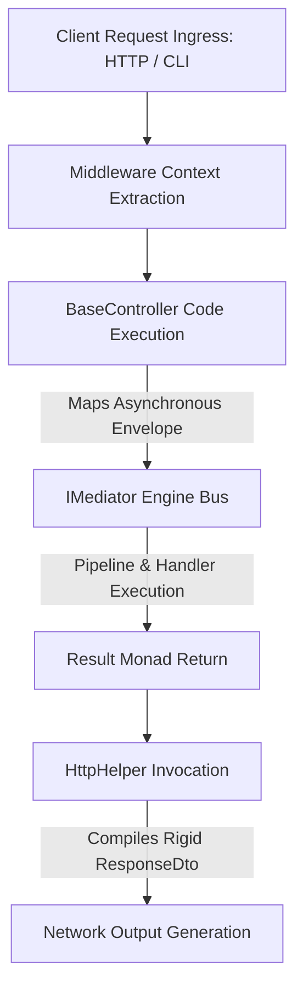

# Presentation Layer

The Presentation Layer defines the application entry boundary that receives
external context vectors, deserializes network payloads, and isolates the
application kernel from communication protocols.

---

## Direct Definition Block

The Presentation Layer is the outermost architectural ring of the Xeno
framework, designed to intercept requests originating from clients, message
queues, or CLI interfaces. It converts raw transport protocol data into
strongly-typed request contracts (`ICommand` or `IQuery`), delegating execution
exclusively to the centralized `IMediator` bus and standardizing outbound
payloads via uniform `ResponseDto` structures.

---

## Architectural Layer Analysis

### 1. Inbound Interception and Context Extraction

#### Definition

Inbound interception is the initial phase of the request lifecycle where
transport components extract network metadata and application payloads from
client connections.

#### Behavior

Components at this layer analyze network headers (such as authorization tokens
or tenant identifiers), instantiating an isolated `ExecutionContext` via
tracking middlewares. Extracted parameters are mapped into agnostic request
objects before being forwarded to internal execution channels.

#### Effect

This process completely isolates the application business logic and use cases
from the physical details of the web server (e.g., Fastify, Hono, or Express) or
the underlying serverless runtime environment.

### 2. Disabling Framework Magic via BaseController

#### Definition

Abstraction of entry points represents the elimination of configurations based
on dynamic proxies or automatic directory scanning for controller management.

#### Behavior

Each entry point explicitly implements the `BaseController` abstract class.
Controllers receive the `IMediator` engine instance via Inversion of Control
(IoC) and explicitly map actions by invoking the `.send()` or `.query()`
interfaces of the messaging bus, without using runtime decorators.

#### Effect

This architecture guarantees transparent and deterministic stack traces during
request execution, eliminating file scanning cycles at startup and optimizing
cold-start times in edge or serverless runtimes.

### 3. Outbound Payload Standardization

#### Definition

Payload standardization is the deterministic normalization of data structures
returned to external clients, regardless of the operation outcome.

#### Behavior

The layer processes the `Result` monads returned by handlers and uses the frozen
`HttpHelper` utility to encapsulate the data into rigid `ResponseDto` contracts.
This includes predefined schemas for success responses, protected error
payloads, or paginated collections.

#### Effect

It provides a consistent and predictable communication protocol for API
consumers, preventing the leakage of internal infrastructure details (such as
ORM SQL syntax errors) to the outside.

---

## Request Propagation Flow

The following diagram traces the sequential path that a data vector takes from
the moment of ingress into the Presentation Layer until the generation of the
normalized response:

---

## Document Directory

Navigate through the Presentation Layer modules to learn about their
implementation and contracts:

### 1. [Base Controller](./base-controller)

- **Content:** Technical analysis of the `BaseController` abstract class,
  cancellation signal management (`AbortSignal`), and explicit message routing
  to the Mediator.

### 2. [Standardize HTTP Response](./standardize-http-response/README)

- **Content:** General index of standardized response contracts and the
  philosophy of network DTO immutability.

### 3. [Success Response](./standardize-http-response/success-response)

- **Content:** Specifications for compiling standard success payloads and status
  code mapping.

### 4. [Error Response](./standardize-http-response/error-response)

- **Content:** Structure of error vectors and techniques for scrubbing internal
  crash details using typed error keys.

### 5. [Paginated Response](./standardize-http-response/paginated-response)

- **Content:** Data segmentation contracts for page-limit or cursor-based
  responses and control metadata.

### 6. [HTTP Helper](./standardize-http-response/http-helper)

- **Content:** Guide to using frozen `HttpHelper` methods for automated response
  DTO generation.

---

## Architectural Constraints & Trade-offs

- **Compulsory Verbosity in Response Structures**: Since Xeno rejects automatic
  response generation based on directly returning primitive objects from use
  cases, every controller must explicitly map results using the `HttpHelper`
  wrapper. This introduces additional translation code at the API exit points.
- **Rigid Separation Between Controllers and Infrastructure**: It is prohibited
  to inject database instances (such as Drizzle ORM clients) or caching services
  directly into Presentation Layer controllers. All interactions must transit
  uniformly through the Mediator bus, increasing the number of required files
  even for simple telemetry reads or secondary view paths.

---

## Next Steps

Begin by examining the structure and operation of the API entry point
abstraction component:

- **[Proceed to Base Controller documentation](./base-controller)**
